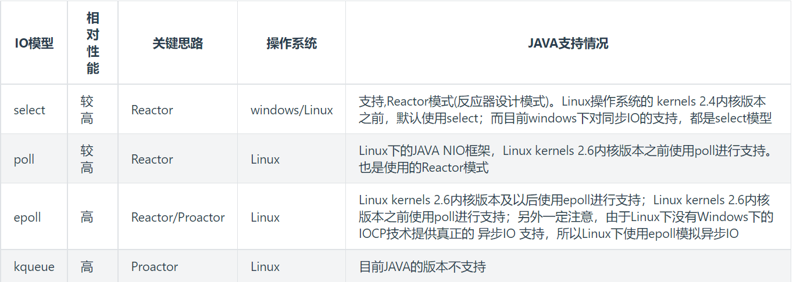
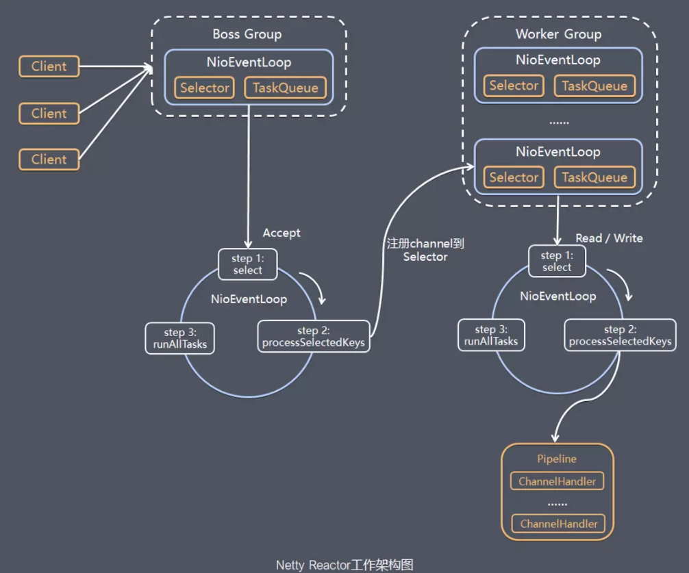
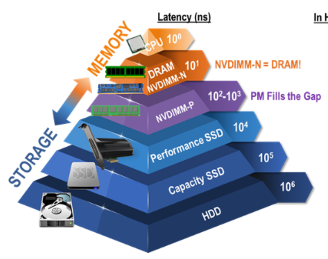
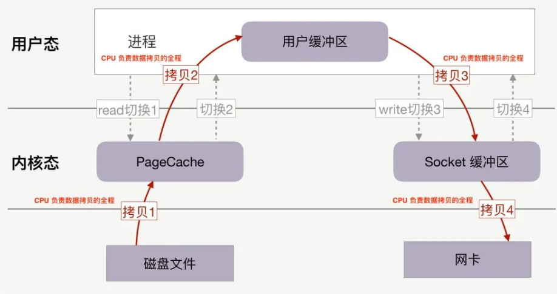

# IO/NIO/AIO

---

### 1. 序列化

* 可以实现Serializable接口。

* 序列化和反序列化过程中serialVersionUID需要保持一致，不然会反序列化失败。

* 静态变量不会序列化，transient字段修饰的变量不会序列化。

* 序列化子类时父类如果没有实现Serializable接口不会序列化，反序列化时设值为默认值。

* 序列化时调用writeReplace方法可以将另外一个实例写入流中。

* 反序列化时调用readResolve方法对反序列化的对象进行修改后返回，在 readObject 调用之后自动调用。

---

### 2. IO


##### 2.1 字节流和字符流的区别：

- 字节流读取单个字节，字符流读取单个字符(一个字符根据编码的不同，对应的字节也不同，如 UTF-8 编码中文汉字是 3 个字节，GBK编码中文汉字是 2 个字节。)
- 字节流用来处理二进制文件(图片、MP3、视频文件)，字符流用来处理文本文件(可以看做是特殊的二进制文件，使用了某种编码，人可以阅读)。

##### 2.2 字节转字符Input/OutputStreamReader/Writer

编码就是把字符转换为字节，而解码是把字节重新组合成字符。

##### 2.3 从操作类型上分类IO

* 文件(file)：FileInputStream、FileOutputStream、FileReader、FileWriter

* 数组([])：
  
  - 字节数组(byte[]): ByteArrayInputStream、ByteArrayOutputStream
  - 字符数组(char[]): CharArrayReader、CharArrayWriter

* 管道操作：PipedInputStream、PipedOutputStream、PipedReader、PipedWriter

* 基本数据类型：DataInputStream、DataOutputStream

* 缓冲操作：BufferedInputStream、BufferedOutputStream、BufferedReader、BufferedWriter

* 打印：PrintStream、PrintWriter

* 对象序列化反序列化：ObjectInputStream、ObjectOutputStream

* 转换：InputStreamReader、OutputStreamWriter

##### 2.4 装饰器模式下的IO流

原始流：

* 字节流：ByteArrayInputStream，PipedInputStream，FileInputStream，StringBufferInputStream，ByteArrayOutputStream，PipedOutputStream，FileOutputStream

* 字符流：CharArrayReader，InputStreamReader，FileReader，PipedReader，StringReader，CharArrayWriter，OutputStreamWriter，FileWriter，PipedWriter，StringWriter

链接流：

* FilterInputStream，BufferInputStream，DateInputStream，LineNumberInputStream，PushbackInputStream，ObjectInputStream，SequenceInputStream，FilterOutputStream，BufferedOutputStream，DataOutputStream，PrintStream，ObjectOutputStream

* BufferedReader，FilterReader，PushbackReader，BufferedWriter，FilterWriter，PrintWriter

---

### 3. Unix IO 模型

##### 3.1 IO模型简介

一个输入操作通常包括两个阶段:

- 等待数据准备好
- 从内核向进程复制数据

对于一个套接字上的输入操作，第一步通常涉及等待数据从网络中到达。当所等待分组到达时，它被复制到内核中的某个缓冲区。第二步就是把数据从内核缓冲区复制到应用进程缓冲区。

Unix 下有五种 I/O 模型:

- 同步阻塞 I/O
- 同步非阻塞式 I/O
- I/O 复用(select 和 poll)
- 信号驱动式 I/O(SIGIO)
- 异步 I/O(AIO)

##### 3.2 同步阻塞 I/O

应用进程被阻塞，直到数据复制到应用进程缓冲区中才返回。在阻塞的过程中，其它程序还可以执行，因此阻塞不意味着整个操作系统都被阻塞。因为其他程序还可以执行，因此不消耗 CPU 时间，这种模型的执行效率会比较高。


当用户进程调用了recv()/recvfrom()这个系统调用，`kernel就开始了IO的第一个阶段：准备数据`等待数据复制到内核缓冲区中，用户进程阻塞中。`第二个阶段：当kernel一直等到数据准备好了，它就会将数据从kernel中拷贝到用户内存`，然后kernel返回结果，用户进程才解除阻塞的状态，重新运行起来。所以，blocking IO的特点就是在IO执行的两个阶段都被block了。

##### 3.3 同步非阻塞 IO

应用进程执行系统调用之后，内核返回一个错误码。应用进程未被阻塞，但是需要不断的执行系统调用来获知 I/O 是否完成，这种方式称为轮询(polling)。


当用户进程调用了recv()/recvfrom()这个系统调用，`进程并没有被阻塞，内核马上返回给进程，如果数据还没准备好，此时会返回一个error`。`进程在返回之后，可以干点别的事情，然后再发起recvform系统调用。重复上面的过程，循环往复的进行recvform系统调用。`这个过程通常被称之为轮询。轮询检查内核数据，直到数据准备好，再拷贝数据到进程，进行数据处理。拷贝数据整个过程，进程仍然是属于阻塞的状态。nonblocking IO的特点是用户进程需要不断的主动询问kernel数据好了没有。

##### 3.4 IO 多路复用

由于同步非阻塞方式需要不断主动轮询，轮询占据了很大一部分过程，轮询会消耗大量的CPU时间。UNIX/Linux 下的 select、poll、epoll支持当有数据通知用户线程。select或poll调用之后，会阻塞进程，与blocking IO阻塞不同在于，`此时的select不是等到socket数据全部到达再处理, 而是有了一部分数据就会调用用户进程来处理`。


`当用户进程调用了select，那么整个进程会被block`，而同时，kernel会“监视”所有select负责的socket，`当任何一个socket中的数据准备好了，select就会返回`。这个时候用户进程再调用read操作，将数据从kernel拷贝到用户进程。`IO多路复用是阻塞在select，epoll这样的系统调用之上，而没有阻塞在真正的I/O系统调用如recvfrom之上。`

select，poll，epoll区别：select和poll需要传入文件描述符，select有1024个文件描述符的限制，epoll不需要传入文件描述符。

##### 3.5 信号驱动式IO

应用进程使用 sigaction 系统调用，内核立即返回，应用进程可以继续执行，也就是说等待数据阶段应用进程是非阻塞的。内核在数据到达时向应用进程发送 SIGIO 信号，应用进程收到之后在信号处理程序中调用 recvfrom 将数据从内核复制到应用进程中。


##### 3.6 异步非阻塞 IO

相对于同步IO，异步IO不是顺序执行。`用户进程进行aio_read系统调用之后，无论内核数据是否准备好，都会直接返回给用户进程，然后用户态进程可以去做别的事情`。等到socket数据准备好了，内核直接复制数据给进程，`然后从内核向进程发送通知`。`IO两个阶段，进程都是非阻塞的`。


用户进程发起aio_read操作之后，立刻就可以开始去做其它的事。而另一方面，从kernel的角度，当它受到一个asynchronous read之后，`首先它会立刻返回，所以不会对用户进程产生任何block`。然后，kernel会等待数据准备完成，然后将数据拷贝到用户内存，`当这一切都完成之后，kernel会给用户进程发送一个signal或执行一个基于线程的回调函数来完成这次 IO 处理过程`，告诉它read操作完成了。

##### 3.7 五大 I/O 模型比较

前四种 I/O 模型的主要区别在于第一个阶段，而第二个阶段是一样的: 将数据从内核复制到应用进程过程中，应用进程会被阻塞。


---

### 4. NIO

##### 4.1 通道

通道 Channel 是对原 I/O 包中的流的模拟，可以通过它读取和写入数据。

通道与流的不同之处在于，流只能在一个方向上移动(一个流必须是 InputStream 或者 OutputStream 的子类)，而通道是双向的，可以用于读、写或者同时用于读写。

通道包括以下类型：

- FileChannel: 从文件中读写数据；
- DatagramChannel: 通过 UDP 读写网络中数据；
- SocketChannel: 通过 TCP 读写网络中数据；
- ServerSocketChannel: 可以监听新进来的 TCP 连接，对每一个新进来的连接都会创建一个 SocketChannel。

##### 4.2 缓冲区

发送给一个通道的所有数据都必须首先放到缓冲区中，同样地，从通道中读取的任何数据都要先读到缓冲区中。也就是说，不会直接对通道进行读写数据，而是要先经过缓冲区。

缓冲区实质上是一个数组，但它不仅仅是一个数组。缓冲区提供了对数据的结构化访问，而且还可以跟踪系统的读/写进程。

缓冲区包括以下类型:

- ByteBuffer
- CharBuffer
- ShortBuffer
- IntBuffer
- LongBuffer
- FloatBuffer
- DoubleBuffer

缓冲区状态：

* capacity: 最大容量；

* position: 当前已经读写的字节数；

* limit: 还可以读写的字节数。

##### 4.3 选择器

一个线程 Thread 使用一个选择器 Selector 通过轮询的方式去监听多个通道 Channel 上的事件。

##### 4.4 多路复用IO实现

目前流程的多路复用IO实现主要包括四种: `select`、`poll`、`epoll`、`kqueue`。



---

### 5. Reactor和Proactor模型

##### 5.1 传统IO模型


特点：

- 每个客户端连接到达之后，服务端会分配一个线程给该客户端，该线程会处理包括读取数据，解码，业务计算，编码，以及发送数据整个过程；
- 同一时刻，服务端的吞吐量与服务器所提供的线程数量是呈线性关系的。

问题：

- 服务器的并发量对服务端能够创建的线程数有很大的依赖关系，但是服务器线程却是不能无限增长的；
- 服务端每个线程不仅要进行IO读写操作，而且还需要进行业务计算；
- 服务端在获取客户端连接，读取数据，以及写入数据的过程都是阻塞类型的，在网络状况不好的情况下，这将极大的降低服务器每个线程的利用率，从而降低服务器吞吐量。

##### 5.2 单Reactor单线程模型

Jdk 1.4中就提供了一套非阻塞IO的API。该API本质上是以事件驱动来处理网络事件的，而Reactor是基于该API提出的一套IO模型。


流程：

- Reactor对象通过select监控客户端请求事件，收到事件后通过Dispatch进行分发；
- 如果是建立连接请求事件，则由Acceptor通过accept处理连接请求，然后创建Handler对象处理连接完成后的后续业务处理；
- 如果不是建立连接请求事件，则Reactor则会分发调用连接对应的Handler来响应；
- Handler会完成Read->业务处理->Send的完整业务逻辑。

优点：

- 模型简单，没有多线程、进程通信、竞争的问题；
- Reactor模型是异步非阻塞模型，工作线程在没有网络事件时可以处理其他的任务，而不用像传统IO那样必须阻塞等待。

缺点：

* 性能问题，只有一个线程，无法发挥多核CPU的性能；

* 可靠性问题，线程意味终止或者进入死循环，会导致整个系统不可用。

##### 5.3 单Reactor多线程模型

在单线程Reactor模型的基础上提出了使用线程池的方式处理业务操作的模型。


流程：

- Reactor对象通过select监控客户端请求，当请求事件达到后，通过dispatch分发请求；
- 若是建立连接的事件，则通过Acceptor的accept处理连接请求，然后创建Handler事件来处理后续逻辑；
- 如果不是建立连接事件，则通过Reactor分发到连接对应的handler来处理；
- handler只负责响应事件，不做具体的业务处理，通过read读取数据后，分发给worker线程池去处理业务；
- worker线程池会分配独立的线程去完成真正的业务，并将结果返回给handler；
- handler收到响应后，通过send方法将结果返回给client。

优点：可以充分利用多核CPU的能力。

缺点：多线程数据共享和访问比较复杂，reactor依旧是单线程去处理所有的事件监听和响应，在高并发下依旧存在性能问题。

##### 5.4 主从reactor多线程

对于使用线程池处理业务操作的模型，由于网络读写在高并发情况下会成为系统的一个瓶颈，因而针对该模型这里提出了一种改进后的模型，即使用线程池进行网络读写，而仅仅只使用一个线程专门接收客户端连接。


流程：

- Reactor主线程MainReactor对象通过select监听连接事件，收到事件后，通过Acceptor处理事件；
- 当Accept处理连接事件后，MainReactor将连接分配给SubReactor；
- SubReactor将连接加入到连接队列进行监听，并创建handler进行各种事件处理；
- 当有新事件发生时，subReactor将调用对应的handler处理；
- handler通过read读取数据，分发给后面的worker线程进行处理；
- handler收到响应结果后，通过send发送给client。

优点：

- 响应快，不必为单个同步事件所阻塞，虽然Reactor本身依然是同步的；
- 可以最大程度避免复杂的多线程及同步问题，并且避免多线程/进程的切换；
- 扩展性好，可以方便通过增加Reactor实例个数充分利用CPU资源；
- 复用性好，Reactor模型本身与具体事件处理逻辑无关，具有很高的复用性。

---

### 6. AIO

异步IO则是采用“订阅-通知”模式: 即应用程序向操作系统注册IO监听，然后继续做自己的事情。当操作系统发生IO事件，并且准备好数据后，在主动通知应用程序，触发相应的函数。

##### 6.1 操作系统支持

* windows系统提供了一种异步IO技术: IOCP(I/O Completion Port，I/O完成端口)

* Linux下由于没有这种异步IO技术，所以使用的是epoll对异步IO进行模拟。

##### 6.2 Java实现

* 在JAVA NIO框架中，我们说到了一个重要概念“selector”(选择器)。它负责代替应用查询中所有已注册的通道到操作系统中进行IO事件轮询、管理当前注册的通道集合，定位发生事件的通道等操操作；但是在JAVA AIO框架中，由于应用程序不是“轮询”方式，而是订阅-通知方式，所以不再需要“selector”(选择器)了，改由channel通道直接到操作系统注册监听。

* JAVA AIO框架中，只实现了两种网络IO通道“AsynchronousServerSocketChannel”(服务器监听通道)、“AsynchronousSocketChannel”(socket套接字通道)。但是无论哪种通道他们都有独立的fileDescriptor(文件标识符)、attachment(附件，附件可以使任意对象，类似“通道上下文”)，并被独立的SocketChannelReadHandle类实例引用。

---

### 7. Netty

Netty 是一个异步事件驱动的网络应用框架，用于快速开发可维护的高性能服务器和客户端。Netty 对 JDK 自带的 NIO 的 API 进行了封装。

##### 7.1 netty特点

1. 高性能
   
   1. 采用异步非阻塞的IO类库，基于Reactor模式实现，解决了传统同步阻塞IO模式
   
   2. TCP接收和发送缓冲区使用直接内存代替堆内存，避免了内存复制，提升了IO读取和写入的性能
   
   3. 支持内存池的方式循环利用ByteBuf，避免了频繁插件和销毁ByteBuf带来的性能消耗
   
   4. 可配置的IO线程数、TCP参数等，为不同的用户场景提供定制化的调优参数，满足不同的性能场景
   
   5. 采用环形数组缓冲区实现无锁化并发编程，代替传统的线程安全或锁。
   
   6. 合理使用线程安全容器，原子类，提升系统的并发处理能力
   
   7. 关键资源的处理使用单线程串行化的方式，避免多线程并发访问带来的锁竞争和cpu资源消耗
   
   8. 通过引用计数法及时地申请释放不再被引用的对象，细粒度的内存管理降低了GC的频率，减少了频繁GC带来的时延增大和CPU损耗

2. 可靠性
   
   1. 链路有效监测（心跳和空闲检测）
      
      * 读空闲超时机制
      
      * 写空闲超时机制
   
   2. 内存保护机制
      
      * 通过对象引用计数法对Netty的ByteBuf等内置对象进行细粒度的内存申请和释放，对非法的对象引用进行检测和保护
      * 通过内存池来重用ByteBuf，节省内存
      * 可设置的内存容量上限，包括ByteBuf、线程池线程数  
   
   3. 优雅停机
      
      * 优雅停机需要设置最大超时时间，如果达到该时间系统还没退出，则通过Kill -9 pid强杀当前线程。
      * JVM通过注册的Shutdown Hook拦截到退出信号量，然后执行退出操作

3. 可定制性
   
   1. 责任链模式：channelPipeline基于责任链模式开发，便于业务逻辑的拦截、定制和扩展
   
   2. 基于接口的开发：关键的类库都提供了接口或者抽象类，用户可以自定义实现相关接口
   
   3. 提供了大量工厂类，通过重载这些工厂类可以按需创建出用户实现的对象
   
   4. 提供大量的系统参数供用户按需设置，增强系统的场景定制

4. 可扩展性
   
   可以方便进行应用层协议定制，比如Dubbo、RocketMQ

##### 7.2 netty的线程模型



Netty 的线程模型并不是一成不变的。它通常采用一主多从，但是也可以根据实际需要配置启动参数，通过设置不同的启动参数，Netty 可以同时支持 “多主多从”。

一主多从 Netty 模型 详解

1. Netty 抽象出两组线程池 BossGroup 和 WorkerGroup，BossGroup 专门负责接收客户端的连接，WorkerGroup 专门负责网络的读写和逻辑的处理。
2. BossGroup 和 WorkerGroup 类型都是 NioEventLoopGroup。
3. NioEventLoopGroup 相当于一个事件循环线程组，这个组中含有多个事件循环线程，每一个事件循环线程是 NioEventLoop。
4. 每个 NioEventLoop 都有一个 selector，用于监听注册在其上的 socketChannel 的网络通讯。
5. 每个 Boss NioEventLoop 线程内部循环执行的步骤有 3 步：处理accept事件，与 client 建立连接，生成 NioSocketChannel；将NioSocketChannel 注册到某个 worker NioEventLoop 上的 selector；处理任务队列的任务，即runAllTasks。
6. 每个 worker NIOEventLoop线程循环执行的步骤：轮询注册到最近的 selector 上所有的 NioSocketChannel 的 read、write 事件；处理 I/O 事件，即 read、write事件，在对应的NioScoketChannel 处理业务；runAllTask 处理任务队列 TaskQueue 的任务。
7. 每个 worker NIOEventLoop 处理 NioSocketChannel 业务时，会使用 pipeline （管道），管道中维护来很多 channelHandler 处理器用来处理 channel 中的数据。

##### 7.3 netty模块组件

* Bootstrap、ServerBootstrap
  
  一个 Netty 应用通常由一个 Bootstrap 开始，主要作用是配置整个 Netty程序，通过链式调用串联各个组件。Netty 中 Bootstrap 类是客户端程序的启动引导类，ServerBootstrap 是服务端 启动引导类。

* Future、ChannelFuture
  
  Future 和 ChannelFutures，可以注册一个监听，当操作执行成功或失败时监听会自动触发注册的监听事件。

* Channel
  
  一个Channel绑定一个NioEventLoop，相当于一个连接绑定一个线程，这个连接所有的ChannelHandler都是在一个线程中执行的，避免了多线程干扰。更重要的是ChannelPipline链表必须严格按照顺序执行的。单线程的设计能够保证ChannelHandler的顺序执行。
  
  常用的 Channel 类型：
  
  ```
  NioSocketChannel，异步的客户端 TCP Socket 连接。（最常用）
  NioServerSocketChannel，异步的服务器端 TCP Socket 连接
  NioDatagramChannel，异步的 UDP 连接
  NioSctpChannel，异步的客户端 Sctp 连接
  NioSctpServerChannel，异步的 Sctp 服务器端连接，这些通道涵盖了 UDP 和 TCP 网络 IO 以及文件 IO。
  ```

* Selector
  
  Netty 基于 Selector 对象实现 I/O 多路复用，通过 Selector 一个线程可以监听多个连接的 Channel 事件。当向一个 Selector 中注册 Channel 后，Selector 内部的机制就可以自动不断地查询(Select) 这些注册的 Channel 是否有已就绪的 I/O 事件（例如可读，可写，网络连接完成等），这样程序就可以很简单地使用一个线程高效地管理多个 Channel 。

* NioEventLoop
  
  NioEventLoop 中维护了一个线程和任务队列，支持异步提交执行任务，线程启动时会调用 NioEventLoop 的 run 方法，执行 I/O 任务和非 I/O 任务：
  
  1. I/O 任务即 selectionKey 中 ready 的事件，如 accept、connect、read、write 等，由 processSelectedKeys 方法触发。
  2. 非 IO 任务，添加到 taskQueue 中的任务，如 register0、bind0 等任务，由 runAllTasks 方法触发。

* NioEventLoopGroup
  
  NioEventLoopGroup，主要管理 eventLoop 的生命周期，可以理解为一个线程池，内部维护了一组线程，每个线程(NioEventLoop)负责处理多个 Channel 上的事件，而一个 Channel 只对应于一个线程。

* ChannelHandler
  
  ChannelHandler 是一个接口，处理 I/O 事件或拦截 I/O 操作，并将其转发到其 ChannelPipeline(业务处理链)中的下一个处理程序。
  
  ```
  ChannelInboundHandler 用于处理入站 I/O 事件
  ChannelOutboundHandler 用于处理出站 I/O 操作
  ChannelInboundHandlerAdapter 用于处理入站 I/O 事件。
  ChannelOutboundHandlerAdapter 用于处理出站 I/O 操作。
  ```

* ChannelHandlerContext
  
  保存 Channel 相关的所有上下文信息，同时关联一个 ChannelHandler 对象。

* ChannelPipline
  
  在 Netty 中每个 Channel 都有且仅有一个 ChannelPipeline 与之对应，ChannelPipeline提供了 ChannelHandler 链的容器。如果是写操作，那么我们称这些事件为出站的，通过 pipeline 中的一系列ChannelOutboundHandler(ChannelOutboundHandler 调用是从tail到head方向逐个调用每个 handler 的逻辑)，并被这些 Hadnler 处理，反之称为入站的，入站只调用 pipeline 里的 ChannelInboundHandler 逻辑（ChannelInboundHandler 调用是从 **head** 到 **tail** 方向 逐个调用每个 handler 的逻辑。）

* ByteBuf
  
  ByteBuf 由一串字节数组构成。数组中每个字节用来存放信息。ByteBuf 提供了两个索引，一个用于读取数据，一个用于写入数据。这两个索引通过在字节数组中移动，来定位需要读或者写信息的位置。
  
  - 当从 ByteBuf 读取时，它的 readerIndex(读索引)将会根据读取的字节数递增。
  - 同样，当写 ByteBuf 时，它的 writerIndex 也会根据写入的字节数进行递增。 

##### 7.4 netty编解码器

* 解码器：
  
  解码器负责 解码“入站”数据从一种格式到另一种格式，解码器处理入站数据是抽象ChannelInboundHandler的实现。实践中使用解码器很简单，就是将入站数据转换格式后传递到ChannelPipeline中的下一个ChannelInboundHandler进行处理；这样在处理时很灵活的，我们可以将解码器放在ChannelPipeline中，重用逻辑。对于解码器，Netty中提供了抽象基类ByteToMessageDecoder和MessageToMessageDecoder。
  
  1. ByteToMessageDecoder
     
     用于将接收到的二进制数据(Byte)解码，得到完整的请求报文(Message)。
     
     ByteToMessageDecoder的decode方法：
     
     ```java
     /**
      * 这个方法是唯一的一个需要自己实现的抽象方法，
      * 作用是将ByteBuf数据解码成其他形式的数据。
      * decode 会根据接收的数据，被调用多次, 直到确定没有新的元素被添加到list
      * 或者是ByteBuf 没有更多的可读字节为止
      * 如果list不为空，就会将list的内容传递给下一个channelinboundhandler处理
      */
     protected abstract void decode(ChannelHandlerContext ctx, 
                  ByteBuf in, List<Object> out);
     ```
     
     常见的实现类：
     
     * FixedLengthFrameDecoder：定长协议解码器，我们可以指定固定的字节数算一个完整的报文。
     
     * LineBasedFrameDecoder：行分隔符解码器，遇到\n或者\r\n，则认为是一个完整的报文。
     
     * DelimiterBasedFrameDecoder：分隔符解码器，与LineBasedFrameDecoder类似，只不过分隔符可以自己指定。
     
     * LengthFieldBasedFrameDecoder：长度编码解码器，将报文划分为报文头/报文体，根据报文头中的Length字段确定报文体的长度，因此报文提的长度是可变的。
     
     * JsonObjectDecoder：json格式解码器，当检测到匹配数量的"{" 、”}”或”[””]”时，则认为是一个完整的json对象或者json数组。
  
  2. ReplayingDecoder
     
     ReplayingDecoder扩展了ByteToMessageDecoder类，使用这个类，我们不必调用readableBytes()方法。ReplayingDecoder无需自己检查缓冲区是否有足够的字节，若ByteBuf中有足够的字节，则会正常读取，若没有足够的字节则会停止解码。
  
  3. MessageToMessageDecoder
     
     ByteToMessageDecoder是将二进制流进行解码后，得到有效报文。而MessageToMessageDecoder则是将一个本身就包含完整报文信息的对象转换成另一个Java对象。
     
     MessageToMessageDecoder的decode方法：
     
     ```java
     /**
      * 参数msg：需要进行解码的参数。
      * 例如ByteToMessageDecoder解码后的得到的包含完整报文信息ByteBuf
      * 参数out：将msg经过解析后得到的java对象，添加到放到List<Object> out中
      */
     protected abstract void decode(ChannelHandlerContext ctx, 
                  I msg, List<Object> out);
     ```
  
  通常使用一个ByteToMessageDecoder进行粘包、拆包处理，得到完整的有效报文的ByteBuf实例，然后交由之后的一个或者多个MessageToMessageDecoder对ByteBuf实例中的数据进行解析，转换成POJO类。

* 编码器：
  
  Netty提供了对应的编码器实现MessageToByteEncoder和MessageToMessageEncoder，二者都实现ChannelOutboundHandler接口。编码器比解码器的实现要更加简单，原因在于解码器除了要按照协议解析数据，还要要处理粘包、拆包问题；而编码器只要将数据转换成协议规定的二进制格式发送即可。
  
  1. MessageToByteEncoder
     
     MessageToByteEncoder的encode方法：
     
     ```java
     /**
      * 泛型参数I表示将需要编码的对象的类型，
      * 编码的结果是将信息转换成二进制流放入ByteBuf中
      **/
     protected abstract void encode(ChannelHandlerContext ctx, 
                  I msg, ByteBuf out) throws Exception;
     ```
  
  2. MessageToMessageEncoder
     
     MessageToMessageEncoder的encode方法：
     
     ```java
     /**
      * 将I类型的对象编码后的结果放到的out参数类型是一个List中
      * 可以将多个消息放入List中
      **/
     protected abstract void encode(ChannelHandlerContext ctx, 
                  I msg, List<Object> out) throws Exception;
     ```
     
     常见的实现类：
     
     * LineEncoder：按行编码，给定一个CharSequence(如String)，在其之后添加换行符\n或者\r\n，并封装到ByteBuf进行输出，与LineBasedFrameDecoder相对应。
     
     * Base64Encoder：给定一个ByteBuf，得到对其包含的二进制数据进行Base64编码后的新的ByteBuf进行输出，与Base64Decoder相对应。
     
     * LengthFieldPrepender：给定一个ByteBuf，为其添加报文头Length字段，得到一个新的ByteBuf进行输出。Length字段表示报文长度，与LengthFieldBasedFrameDecoder相对应。
     
     * StringEncoder：给定一个CharSequence(如：StringBuilder、StringBuffer、String等)，将其转换成ByteBuf进行输出，与StringDecoder对应。
  
  3. codec
     
     ```
     netty-codec
     netty-codec-http
     netty-codec-http2
     netty-codec-memcache
     netty-codec-redis
     netty-codec-socks
     netty-codec-stomp
     netty-codec-mqtt
     netty-codec-haproxy
     netty-codec-dns
     ```
     
     netty中基本的codec有base64、bytes、compression、json、marshalling、protobuf、serialization、string和xml这几种。

##### 7.5 netty粘包拆包

---

### 8. OS IO原理

##### 8.1 存储介质的性能

当前主流存储介质的读写性能，从磁盘到内存、内存到缓存、缓存到寄存器，每上一个台阶，性能就提升10倍。



##### 8.2 内核态和用户态

* 内核态：也称为内核空间。cpu可以访问内存的所有数据，还控制着外围设备的访问，例如硬盘、网卡、鼠标、键盘等。cpu也可以将自己从一个程序切换到另一个程序。

* 用户态：也称为用户空间。只能受限的访问内存地址，cpu资源可以被其他程序获取。

从用户态到内核态切换可以通过三种方式：

1. 系统调用，其实系统调用本身就是中断，但是软件中断，跟硬中断不同。0x80软中断，用户调用系统函数是将函数名和参数传给cpu，然后cpu中断，内核找到0x80对应的是系统调用执行传入的函数。
2. 异常：如果当前进程运行在用户态，如果这个时候发生了异常事件，就会触发切换。例如：缺页异常。
3. 外设中断：当外设完成用户的请求时，会向CPU发送中断信号。

##### 8.3 DMA

所谓的 DMA（Direct Memory Access，即直接存储器访问）其实是一个硬件技术，其主要目的是减少大数据量传输时的 CPU 消耗，从而提高 CPU 利用效率。其本质上是一个主板和 IO 设备上的 DMAC 芯片。CPU 通过调度 DMAC 可以不参与磁盘缓冲区到内核缓冲区的数据传输消耗，从而提高效率。DMA技术就是释放了CPU的占用时间，它只做事件通知，数据拷贝完全由DMA完成。

##### 8.4 零拷贝

* read write流程
  
  
  
  1. CPU 全程负责内存内的数据拷贝，参考磁盘介质的读写性能，这个操作是可以接受的，但是如果要让内存的数据和磁盘来回拷贝，这个时间消耗就非常的难看，因为磁盘、网卡的速度远小于内存，内存又远远小于 CPU；
  2. 4 次 copy + 4 次上下文切换，代价太高。
  3. 使用DMA可以将拷贝1和拷贝4使用DMA来拷贝，优化了CPU的利用率，但是并没有提高数据读取的性能。

* mmap write流程
  
  read() 系统调用把内核缓冲区的数据拷贝到用户的缓冲区里，用 mmap() 替换 read() ，mmap() 直接把内核缓冲区里的数据**映射**到用户空间，减少这一次拷贝。
  
  ```
  buf = mmap(file, len);
  write(sockfd, buf, len);
  ```
  
  
  
  流程：
  
  1. 应用进程调用了 mmap() 后，DMA 会把磁盘的数据拷贝到内核的缓冲区里。因为建立了这个内存的mapping，所以用户态的数据可以直接访问了；
  2. 应用进程再调用 write()，CPU将内核缓冲区的数据拷贝到 socket 缓冲区中，这一切都发生在内核态；
  3. DMA把内核的 socket 缓冲区里的数据，拷贝到网卡的缓冲区里。
  
  CPU 1 次 copy + 4 次上下文切换。

* sendfile流程
  
  Linux 内核版本 2.1 提供了一个专门发送文件的系统调用函数 sendfile()
  
  ```java
  /**
   * 前2个参数分别是目的端和源端的文件描述符
   * 后2个参数是源端的偏移量和复制数据的长度
   * 返回值是实际复制数据的长度
   */
  #include <sys/socket.h>
  ssize_t sendfile(int out_fd, int in_fd, off_t *offset, size_t count);
  ```
  
  
  
  CPU一次数据拷贝，2次上下文切换。

* sendfile+SG-DMA流程
  
  从 Linux 内核 2.4 版本开始起，对于支持网卡支持 SG-DMA 技术的情况下， sendfile() 系统调用的过程发生了点变化。
  
  
  
  流程：
  
  1. 通过 DMA 将磁盘上的数据拷贝到内核缓冲区里；
  2. 缓冲区描述符和数据长度传到 socket 缓冲区，这样网卡的 SG-DMA 控制器就可以直接将内核缓存中的数据拷贝到网卡的缓冲区里。
  
  CPU0拷贝，2次上下文切换。
