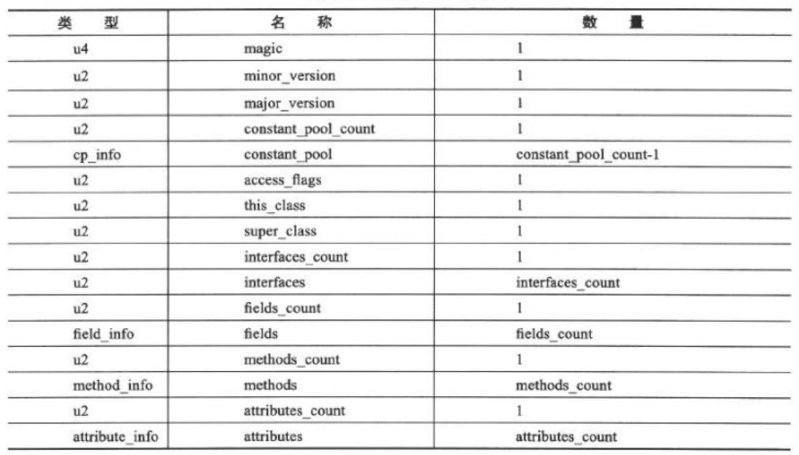
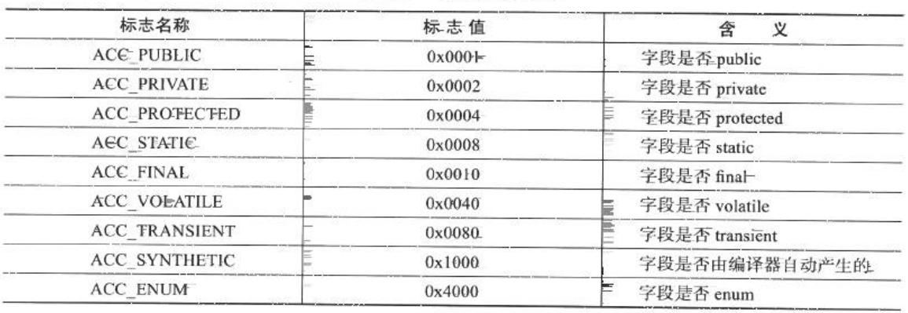
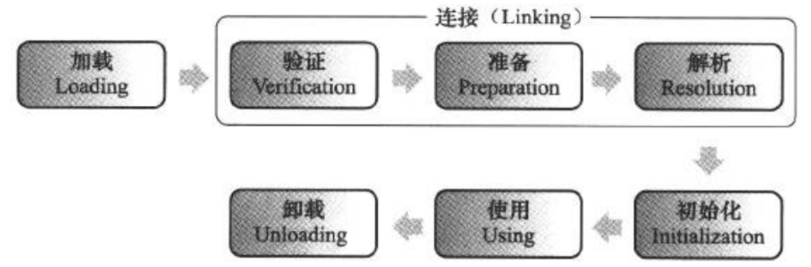
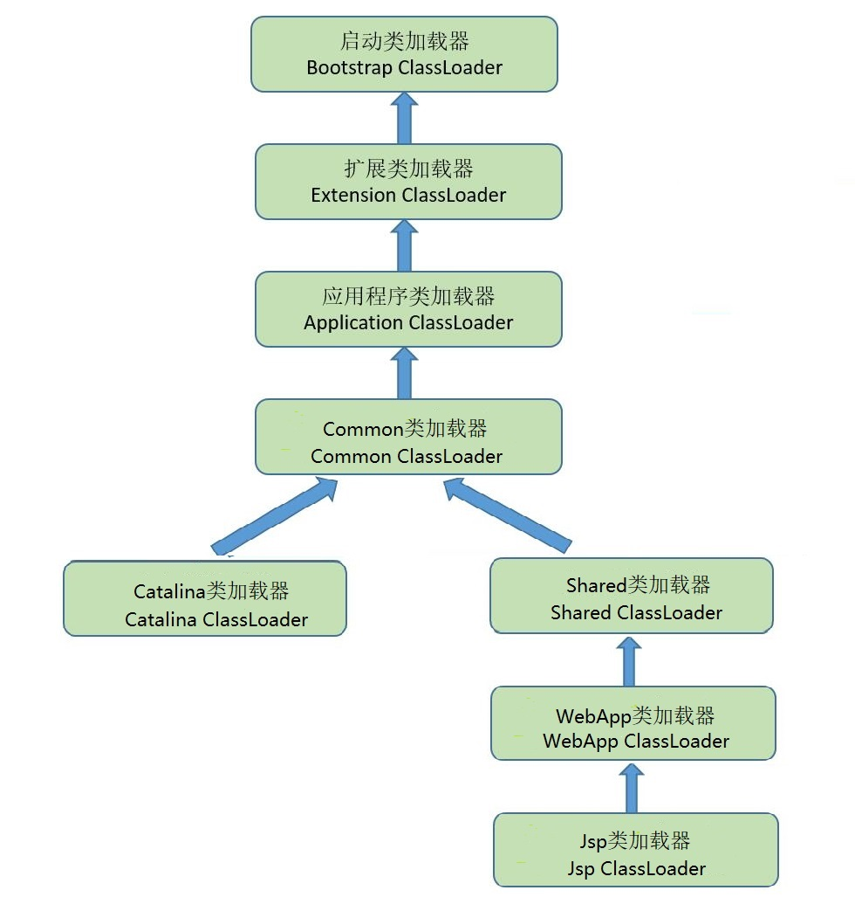
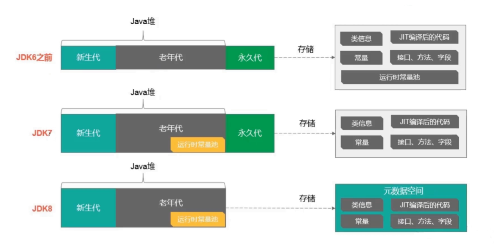
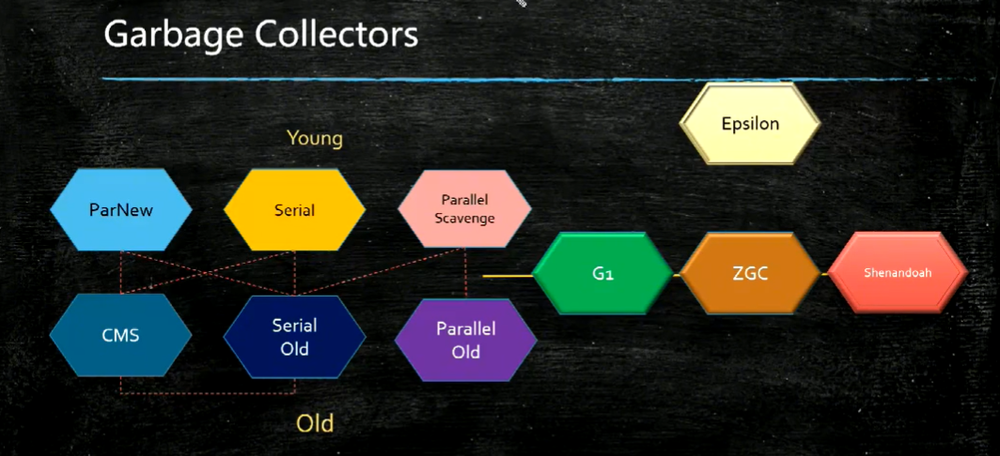

# Java虚拟机

---

### 1. 类文件格式

#### 1.1 数据类型

##### 1.1.1 原始类型

* 虚拟机支持的原始类型数据包括**数值类型（numeric type）**、**boolean类型**和**returnAddress类型**。

* 数值类型又分为整数类型（integral type）和浮点类型（floating-point type）
  
  整数类型包括：
  
  * byte类型：值为8位有符号二进制补码整数，默认值为零。
  * short类型：值为16位有符号二进制补码整数，默认为零。
  * int类型：值为32位有符号二进制补码整数，默认为零。
  * long类型：值为64位有符号二进制补码整数，默认为零。
  * char类型：值为16位无符号整数，指向Unicode码点，默认为null。
  
  浮点类型包括：
  
  * float类型：值为单精度浮点数集合中的元素，默认值为0。
  
  * double类型：值为双精度浮点数集合中的元素，默认值为0。

* boolean类型的值为布尔值true和false，默认值为false。

* returnAddress类型是指向某个操作码的指针，此操作码与虚拟机指令相对应。在虚拟机支持的所有原始类型中，只有returnAddress类型是不能直接与Java语言的数据类型相对应的。

##### 1.1.2 引用类型

* 虚拟机中有三种引用类型：**类类型**（class type）、**数组类型**（array type）和**接口类型**（interface type）。这些引用类型的值分别指向动态创建的类实例、数组实例和实现了某个接口的类实例或者数组实例。

* 数组类型最外面的那一位元素的类型，叫做该数组类型的**组件类型**（component type）。一个数组类型的组件类型也可以是数组。从任意一个数组开始，如果发现其组件类型也是数组类型，那就继续取这个小数组的数组类型。不断执行这样的操作，最终一定可以遇到组件类型不是数组的情况，这时就把这种类型称为本数组类的**元素类型**（element type）。数组的元素类型必须是原生类型、类类型或者接口类型之一。

* 在引用类型的值中还有一个特殊的值：null，当一个引用不指向任何对象的时候，它的值就用null表示。一个为null的引用，起初并不具备任何实际的运行期类型，但是它可转型为任意的引用类型。引用类型的默认值就是nul。

#### 1.2 class文件结构

Class文件是以一组以8位字节为基础单位的二进制流，各个数据项目严格按照顺序紧凑的排列在Class文件中，中间没有任何分隔符。当遇到需要占用8位字节以上空间的数据项是，则会按照高位在前的方式分割成若干个8位字节进行存储。Class文件格式采用一种伪结构来存储数据，这种伪结构中只有两种数据类型：**无符号数**和**表**。

* 无符号数属于基本的数据类型，以u1、u2、u4、u8来分别代表1个字节、2个字节、4个字节和8个字节的无符号数，无符号数可以用来描述**数字**、**索引引用**、**数量值**或者按照UTF-8编码构成**字符串值**。

* 表是由多个无符号数或者其他表作为数据项构成的**复合数据类型**，所有表都习惯性的以“_info”结尾。表用于描述有层次关系的复合结构的数据，整个Class文件本质上就是一张表。



##### 1.2.1 魔数与class文件版本

* 头8个字节：魔数(CAFEBABE)+版本号

##### 1.2.2 常量池

* 常量池前放置一项u2类型的数据，代表常量池容量值（constant_pool_count）。容量值是从1开始的。例如常量值为22，代表常量池中有21项常量，索引值范围为1-21。Class文件结构中只有常量池的容量计数是从1开始，对于其他集合类型，包括接口索引集合、字段表集合、方法表集合等的容量计数都是从0开始。

* 常量池主要存放两类常量：字面量（Literal）和符号引用（Symbolic References）。
  
  * 字面量类似于Java语言中的常量，如文本字符串、声明为final的常量值等。
  
  * 符号引用包括三类常量：**类和接口的全限定名**（Fully Qualified Name）、**字段的名称和描述符**（Descriptor）、**方法的名称和描述符**。

* Class文件在虚拟机加载的时候进行动态连接。在Class文件中不会保存各个方法、字段的最终内存信息。当虚拟机运行时，需要从常量池获得对应的符号引用，再在类创建时或者运行时解析到具体的内存地址中。

##### 1.2.3 访问标志

识别类或者接口的访问信息，包括以下信息


##### 1.2.4 类索引

类索引是一个u2类型的数据，用于确定这个类的全限定名。类索引指向一个类型为CONSTANT_Class_Info的类描述符常量，通过CONSTANT_Class_Info类型的常量中索引值可以找到定义在CONSTANT_Utf-8_Info类型的常量中的全限定名字符串。

##### 1.2.5 父类索引

父类索引是一个u2类型的数据，用于确定这个类的父类的全限定名。父类索引指向一个类型为CONSTANT_Class_Info的类描述符常量，通过CONSTANT_Class_Info类型的常量中索引值可以找到定义在CONSTANT_Utf-8_Info类型的常量中的全限定名字符串。

##### 1.2.6 接口索引集合

接口索引集合是一组u2类型的数据的集合，用来描述这个类实现的接口。接口索引集合有一个u2的数据为接口计数器，表示索引表的容量。接口索引向一个类型为CONSTANT_Class_Info的类描述符常量，通过CONSTANT_Class_Info类型的常量中索引值可以找到定义在CONSTANT_Utf-8_Info类型的常量中的全限定名字符串。

##### 1.2.7 字段表

* 字段表是描述接口或者类中声明的变量。字段包括类级变量以及实例级变量，但不包括方法内部声明的局部变量。

* 字段表结构
  
  | 类型             | 名称               | 数量               |
  | -------------- | ---------------- | ---------------- |
  | u2             | access_flags     | 1                |
  | u2             | name_index       | 1                |
  | u2             | descriptor_index | 1                |
  | u2             | attributes_count | 1                |
  | attribute_info | attributes       | attributes_count |

* access_flags值列表
  
  

* name_index对常量池的引用，表示字段的简单名称。
  
  > 简单名称指的是没有类型和参数修饰的字段或方法名称，例如wait()方法简单名称为“wait”。

* descriptor_index对常量池的引用，表示字段的描述符。
  
  > 描述符用来描述字段的数据类型、方法的参数列表（包括数量、类型以及顺序）和返回值。
  > 
  > | 标识字符 | 含义                       |
  > | ---- | ------------------------ |
  > | B    | 基本类型byte                 |
  > | C    | 基本类型char                 |
  > | D    | 基本类型double               |
  > | F    | 基本类型float                |
  > | I    | 基本类型int                  |
  > | J    | 基本类型long                 |
  > | S    | 基本类型short                |
  > | Z    | 基本类型boolean              |
  > | V    | 基本类型void                 |
  > | L    | 对象类型，如Ljava/lang/Object  |
  > | [    | 数组类型，如[Ljava/lang/Object |

##### 1.2.8 方法表

* 方法表是描述接口或者类中声明的方法。

* 方法表结构与字段表一致。

* access_flags值列表
  
  

##### 1.2.9 属性表

#### 1.3 字节码指令

---

### 2. 类加载机制



#### 2.1 类加载的时机

* 加载、验证、准备、初始化、卸载顺序是确定的，为了支持Java语言的运行时绑定(也称动态绑定或者晚期绑定)，解析阶段在某些情况下可以在初始化阶段之后再开始。虚拟机没有强制约束什么情况下开始类加载的第一阶段：加载。但是对于初始化阶段，虚拟机规范严格规定了**有且只有**5种情况必须对类进行初始化。

* 类初始化的5种情况
  
  1. 遇到new、getstatic、putstatic和invokestatic这4条字节码指令，如果类没有初始化，则需先要触发初始化。生成这4条指令场景：使用new关键字实例化对象、读取或者设置类的静态字段、调用类的静态方法。
  
  2. 使用java.lang.reflect包的方法对类进行反射调用时，如果类没有初始化,则需先要触发初始化。
  
  3. 初始化一个类时，发现其父类还未初始化，先初始化其父类。
  
  4. 当虚拟机启动时，需要指定一个主类(包含main方法的类)，虚拟机会先初始化主类。
  
  5. 当使用时jdk1.7的动态语言支持时，如果一个java.lang.invoke.MethedHandle实例最后的解析结果REF_getStatic、REF_putStatic、REF_invokeStatic的方法句柄，并且这个方法句柄所对应的类没有进行过初始化，则先触发其初始化。
     
     <mark>todo: MethedHandle，以上称为主动引用,其他称为被动引用。</mark>

#### 2.2 类加载的过程

虚拟机中类加载的全过程分为**加载**、**验证**、**准备**、**解析**和**初始化**5个步骤。

##### 2.2.1 加载

* 加载步骤：

##### 2.2.2 验证

* 验证目的是确保Class文件的字节流中包含的信息符合当前虚拟机的要求，并且不会危害虚拟机自身的安全。
  
  > Tips：如果确保运行的全部代码的可靠性，可以通过-Xverify：none参数来关闭大部分的校验。

* 验证的4个阶段的检验动作
  
  1. 文件格式验证：验证字节流是否符合Class类文件格式。
  
  2. 元数据验证：对类的元信息(类本身的信息)进行语义校验，确保符合Java语言规范。
  
  3. 字节码验证：对类的方法体进行校验分析，保证方法在运行时不会出现危害虚拟机安全的事件。
     
     > 实现方案：JDK1.6之后给方法的Code属性的属性表中增加了一项名为"StackMapTable"的属性，描述了方法体中所有基本块开始时本地变量表和操作数栈应有的状态，通过检查StackMapTable属性中的记录是否合法来进行字节码校验。
  
  4. 符号引用验证：对类自身以外的信息进行匹配性校验，如是否能找到通过字符串全限定名引用的类、引用的类中是否存在被调用的方法和属性、引用的类以及类中的方法和属性是否可以被当前类方法等等。

##### 2.2.3 准备

* 准备阶段是正式为**类变量**分配内存并设置**类变量**初始值的阶段，这些变量将在方法区内进行分配。
  
  > Tips：
  > 
  > 1. 该阶段进行内存分配的是类变量，**实例变量**将在**对象实例化**时随对象分配在**Java堆**中。
  > 
  > 2. **类变量**设置的**初始值**指的是该数据类型的**零值**，**代码中的赋值**会在**初始化**阶段通过执行<clinit>()方法赋予。
  > 
  > 3. **类常量**会在该阶段直接赋予**代码中的赋值**。

##### 2.2.4 解析

* 解析阶段是虚拟机将常量池内符号引用替换为直接引用的过程。
  
  > 符号引用：一组符号来描述所引用的目标，符号引用定义在Class文件中，所有虚拟机接收的符号引用必须符合Java虚拟机规范，从而都是一致的。
  > 直接引用：直接引用的形式可以是直接指向目标的指针、相对偏移量或者间接指向目标的句柄。直接引用的与虚拟机内存布局相关。

* 解析动作主要针对于类或接口、字段、类方法、接口方法、方法类型、方法句柄和调用点限定符7类符号引用进行。

##### 2.2.5 初始化

* 初始化阶段才真正执行类中定义的Java程序代码。初始化阶段是执行类构造器<clinit>()方法的过程。
  
  > <clinit>()方法是由编译器自动收集类中的所有类变量的赋值动作和静态语句块(static{}块)的语句合并产生的。 static块可以赋值定义在它之后的类变量但是不能访问它。
  > 
  > <clinit>()方法不需要显示的调用父类的<clinit>()方法，虚拟机保证在执行子类的<clinit>()方法之前父类的<clinti>()方法已经执行完，因此Object的<clinit>()方法肯定是第一个被执行的。
  > 
  > 接口<clinit>()方法执行前不需要先执行父接口的<clinit>()方法，接口的实现类在初始化时也不会执行接口的<clinit>()方法。
  > 
  > 虚拟机保证<clinit>()方法线程安全，如果多个线程初始化一个类，只会有一个线程执行<clinit>()方法，其他线程阻塞等待，直到活动线程执行完<clinit>()方法。

#### 2.3 类加载器

虚拟机规定通过一个类的全限定名来获取定义此类的二进制字节流这个动作可以放到虚拟机外部去实现，以便让应用程序自己决定如何去获取所要的类，实现这个动作的代码模块称为类加载器。

##### 2.3.1 类与类加载器

* 类在Java虚拟机中的唯一性是由类加载器和这个类本身一同确立。

##### 2.3.2 类加载器种类

- 启动类加载器(Boostrap ClassLoader)：使用C++实现，是虚拟机的一部分，负责将存放到%JAVA_HOME%\lib中并且文件名能被虚拟机识别的类库(如rt.jar)加载到虚拟机内存中，不能被Java程序直接引用。
- 扩展类加载器(Extension ClassLoader)：使用Java实现，在hotspot中由sun.misc.Launcher$ExtClassLoader实现，负责加载%JAVA_HOME%\lib\ext中的所有类库，开发者可以直接使用这个类加载器。
- 应用程序类加载器(Application ClassLoader)：使用Java实现，在hotspot中由sun.misc.Launcher$AppClassLoader实现，也称 系统类加载器(System ClassLoader)，负责加载用户类路径(ClassPath)上所指定的类库。开发者可以直接使用这个类加载器，如果应用程序没有自定义过类加载器，这个就是程序中默认的类加载器。
- 自定义类加载器（User ClassLoader）：开发者自定义的类加载，属于应用程序类加载器。

##### 2.3.3 双亲委派模型


- 双亲委派模型要求除了启动类加载器之外每个类都有父类加载器。

- 工作过程：如果一个类加载器收到类加载的请求，先把这个请求委托给父类加载器去完成，以此类推，因此所有加载请求最终都会传送到顶层的启动类加载器中，只有父类加载器反馈无法完成加载请求时，子类加载器才会尝试自己加载。

- Java类随着它的类加载器一起具备一种带有优先级的层次关系，这样可以保证顶层的类总是会有同一个类加载器完成，系统不会出现多个顶层类(如出现多个java.lang.Object类)。

- 破坏双亲委派模型：类加载器不遵循双亲委派模型。
  
  场景：
  
  1. JDK1.2发布之前
  2. Java中所有涉及SPI加载动作的服务，如JNDI、JDBC、JCE、JAXB和JBI等。这些基础服务接口由启动类加载器完成加载，但是需要调用实现这些接口的程序代码，启动类加载器无法加载。采用线程上下文类加载器(Thread Context ClassLoader)来指定子类加载器来完成加载。
  3. OGNi环境下，类加载器发展为复杂的网状结构。

##### 2.3.4 类加载器案例

###### 2.3.4.1 tomcat：典型的类加载器架构

 

* Tomcat自定义了多个类加载器：
  
  1. CommonClassLoader加载/common/*中的Java类库，类库可被Tomcat和所有的Web应用共同使用。
  
  2. CatalinaClassLoader加载/server/*中的Java类库，类库可被Tomcat使用，对所有的Web应用程序不可见。
  
  3. SharedClassLoader加载/shared/*中的Java类库，类库可被所有的Web应用程序共同使用，但对Tomcat自己不可见。
  
  4. WebappClassLoader加载/WebApp/WEB-INF/*中的Java类库，通常会存在多个实例，用来加载容器内的多个Web应用，类库仅仅被此Web应用使用，对Tomcat和其他应用不可见。
  
  5. JspClassLoader加载Jsp文件编译成的Class文件，通常会存在多个实例，每一个Jsp文件对应一个Jsp类加载器。当服务器监测到Jsp文件被修改是，会替换目前的Jsp类加载器的实例，并通过新建一个Jsp类加载器来实现Jsp文件的HotSwap功能。
     
     > WebLogic服务器生产模式下默认不支持JSP热部署

* 对于Tomcat 6.x版本，只有指定了tomcat/conf/catalina.properties配置文件中server.loader和share.loader项后才会真正建立CatalinaClassLoader和SharedClassLoader的实例，否则这两个都会用CommonClassLoader实例代替，所以Tomcat 6.x版本把/common、/server和/shared三个目录默认合并到一起变成一个/lib目录。

###### 2.3.4.2 osgi：灵活的类加载器架构


* OSGi中的每个模块（俗称Bundle）加载器之间只有规则，没有固定的委托关系。例如，某个Bundle声明一个它依赖的Package，如果其他Bundle发布了这个Package，所有对这个Package的类加载动作都会委托给发布它的Bundle类加载器来完成。

<mark>TODO：自定义类加载器，字节码生成技术</mark>

---

### 3. 虚拟机内存结构


##### 3.1 程序计数器

* 程序计数器是线程私有的区域，每一个线程都拥有一个独立的程序计数器。

* 如果线程正在执行的是一个Java方法，计数器记录的是正在执行的字节码指令的地址，如果正在执行的是Native方法，计数器记录的则为空（Undefined）。

* 线程切换后通过读取程序计数器的值来恢复到正确的执行位置。

* 此区域是唯一一个在Java虚拟机规范中没有规定任何OutOfMemoryError的区域。

##### 3.2 虚拟机栈

* 虚拟机栈是线程私有区域，它的生命周期与线程相同。

* 虚拟机栈描述的是Java方法执行的内存模型，每个方法在执行的同时都会创建一个**栈帧**，每一个方法从调用直至执行完成的过程，就对应着一个栈帧在虚拟机中从入栈到出栈的过程。

* 在虚拟机规范中，这个区域规定了两种异常状况：如果线程请求的栈深大于虚拟机所允许的深度，将抛出StackOverflowError；如果虚拟机可以动态扩展，如果扩展时无法申请到足够的内存，就会抛出OutOfMemoryError。

##### 3.3 本地方法栈

* 本地方法栈为虚拟机使用到的native方法服务。

* hotspot将本地方法栈和虚拟机栈合二为一。

* 本地方法栈区域可能会抛出StackOverflowError和OutOfMemoryError。

##### 3.4 堆

* Java堆是被所有线程共享的一块内存区域，在虚拟机启动时创建，此区域存在的唯一目的就是存放对象。

* 从垃圾回收的角度，Java堆可以分为：新生代和老年代，新生代又可以分为Eden空间、From Survivor空间、To Survivor空间。

* 从内存分配的角度，线程共享的Java堆的Eden区中可能划分出多个**线程私有的分配缓冲区**(Thread Loacl Allocation Buffer，TLAB)。

* Java堆可以处于物理上不连续的内存空间中，只要逻辑上连续即可，当前主流的虚拟机都是按照可扩展来实现的（-Xmx和-Xms控制）。

* 如果堆中没有内存完成实例分配，并且堆也无法扩展，将会抛出OutOfMemoryError。

##### 3.5 方法区

* 方法区线程共享，用于存储已被虚拟机加载的类信息、静态变量、即时编译器编译后的代码等数据。

* 虚拟机规范中，方法区是堆的逻辑组成部分，但是没有限制堆的存放位置。

* hotspot中jdk6及之前方法区存放在堆内存中，称为永久代，受垃圾回收器管理。jdk7之后把放到永久代里面的运行时常量池移动到老年代。jdk8之后把方法区存储到本地内存中，称为元数据空间（Meta Space）。
  
  从永久代移动到元数据空间原因：
  
  1. 类及方法的信息等比较难确定其大小，因此对于永久代的大小指定比较困难，太小容易出现永久代溢出，太大则容易导致老年代溢出。
  
  2. 字符串存在永久代中，容易出现性能问题和内存溢出。
  
  3. 方法区会为GC带来不必要的复杂度，并且回收效率较低。

* 当方法区无法满足内存分配需求时，将抛出OutOfMemoryError。

##### 3.6 运行时常量池

* 运行时常量池是方法区的逻辑组成部分，Class文件中的**常量池**（Constant Pool Table）用于存放编译期生成的各种**字面量**和**符号引用**，这部分内容将在类加载后进入运行时常量池中存放。

* 运行时常量池相比较于class文件常量池是具备动态性，运行期间也能将常量放入池中，常见的方法有String.intern()。

* 当常量池无法再申请到内存时会抛出OutOfMemoryError。

##### 3.7 直接内存

* 直接内存不是虚拟机内存的一部分，也不是Java虚拟机规范中定义的内存区域，大小不受Java堆大小的限制。

* NIO中可以使用Native函数库直接分配对外内存，然后通过一个存储在Java堆中的DirectByteBuffer对象作为这块内存的引用。避免IO流在**堆内存**和**Native内存**中来回复制。

* 动态扩展时无法申请到内存时会抛出OutOfMemoryError。

---

### 4. 栈帧与方法执行

##### 4.1 栈帧

* 栈帧（Stack Frame）是用于支持虚拟机进行方法调用的数据结构，它是虚拟机栈中的元素。每一个方法从调用开始到执行完成的过程，对应着一个栈帧在虚拟机栈中从入栈到出栈的过程。

* 位于栈顶的栈帧称为当前栈帧（Current Stack Frame）,对应的方法称为当前方法（Current Method）。执行引擎运行的所有字节码指令都只针对当前栈进行操作。

* 每一个栈帧包括了局部变量表、操作数栈、动态链接、方法返回地址和一些附加信息。

###### 4.1.1 局部变量表

* 局部变量表（Local Varibale Table）是一组变量值存储空间，用于存放**方法参数**和方法内部定义的**局部变量**。Class文件中，方法的Code属性的max_locals数据项中确定了所需分配的局部变量表的最大容量。

* 局部变量表的容量以变量槽（Varibale Slot）为最小单位，虚拟机规范规定一个Slot可以存放一个类型为boolean、byte、char、short、int、float、reference或returnAddress这8种类型的数据，两个Slot可以存放一个类型为long或double类型的数据。

* 虚拟机采用索引定位的方式使用局部变量表，索引值从0开始至局部变量表的最大Slot数量，如果访问单Slot存放的类型，直接定位该Slot的索引来访问；访问两个Slot存放的类型，定位两个中娇小的索引值类定位。

* 方法执行时，如果执行的是实例方法，那么局部变量表中的第0位索引的Slot默认指向对象实例（this），其余参数则按照参数表顺序排列。

* 局部变量表中Slot是可以重用的，变量的作用域不一定会覆盖整个方法体，如果当前PC计数器的值已经超出的某个变量的作用域，那么整个变量的Slot就可以交给其他变量使用。
  
  ```java
  /**
   * System.gc()回收了placeholder堆内存对象，
   * 说明placeholder的Slot已经交给a使用
   */
  public static void main(String[] args) {  
      {  
          byte[] placeholder = new byte[64 * 1024 * 1024];  
      }  
      int a = 0;  
      System.gc();  
  }
  ```

###### 4.1.2 操作数栈

* 每个栈帧都包含一个操作数栈，它是一个先入后出栈，栈帧最大深度由编译器写入Code属性的max_stacks中，操作数栈可以任意Java数据类型，包括long和double，long或double占用两个单位的栈深度。

* 栈帧刚刚创立时，操作数栈是空的。Java虚拟机提供一些字节码指令来从局部变量表或者对象实例的字段中复制常量或者变量值到操作数栈中，也提供了一些指令用于从操作数栈中取走数据、操作数据以及把操作结果重新入栈。在方法调用时，操作数栈也用来准备调用方法的参数以及接收方法返回结果。

* 大多数虚拟机在实现栈帧时会令两个栈帧出现一些重叠，让下面的栈帧的部分操作数栈与上面的栈帧的部分局部变量表重叠在一起，这样在进行方法调用时就可以共用一部分数据，无须进行额外的参数复制传递。

###### 4.1.3 动态链接

* 在class文件中，一个方法若要调用另一个方法，或者访问成员变量，则需要通过符号引用来表示，**动态链接**就是在运行时将这些符号引用转为调用方法的直接引用。

* 每个栈帧内部都包含一个指向当前方法所在类的运行时常量池的引用，目的就是支持当前方法调用其他方法或字段时进行**动态链接**。

* 如果被调用的方法编译器无法确定（多态），则在运行期进行动态动态链接，否则在类加载过程中进行**静态解析**。

###### 4.1.4 方法返回地址

* 正常退出：第一种是遇到返回指令，这时候将返回值（如果有）返回给调用者，这种方式下，当前栈帧承担者恢复调用者状态的责任，包括恢复调用者的局部变量表和操作数栈，把返回值（如果有）压入调用者栈帧的操作数栈中以及正确的递增PC寄存器，从而让调用者正确的继续执行指令。

* 异常退出：另一种是在执行过程中遇到了异常，并且在当前方法中无法处理，就会导致方法退出，这种方式退出，不会给上次调用者返回返回值。

###### 4.1.5 附加信息

* 虚拟机规范允许具体的虚拟机实现增加一些规范里没有描述的信息到栈帧中，例如与调试相关的信息，这部分信息完全取决于具体的虚拟机实现。

* 通常会把动态链接、方法返回地址与其他附加信息完全归为一类，称为**栈帧信息**。

##### 4.2 方法调用

方法调用阶段的唯一任务就是确定被调用方法的版本，暂时还未涉及方法内部的具体运行过程。

###### 4.2.1 解析调用

* 如果方法在类加载的时候就有一个确定的调用版本，并且这个方法的调用版本在运行期是不可变的，那么在类加载的解析阶段会将**调用这类方法的符号引用转化为直接引用**。这类方法的调用称为解析调用。

* 只要能被invokestatic和invokespecial指令调用的方法，都可以在解析阶段中确定唯一的调用版本，Java语言里符合这个条件的方法共有静态方法、私有方法、实例构造器、父类方法4种，再加上被final修饰的方法（尽管它使用invokevirtual指令调用），这5种方法调用会在类加载的时候就可以把符号引用解析为该方法的直接引用。 这些方法统为"非虚方法"（Non-Virtual Method），其他方法就被称为"虚方法"（Virtual Method）。

###### 4.2.2 分派调用

静态类型为变量的定义类型，实际类型为变量的赋值类型。

* 静态分派
  
  所有依赖静态类型来决定方法执行版本的分派动作都称为静态分派。静态分派的最典型应用表现就是方法重载，静态分派发生在编译阶段。
  
  在基本类型的隐式转换和自动装箱拆箱的作用下，方法重载也会寻找"最合适"的方法来执行。（字面量天生的模糊性）

* 动态分派
  
  所有依赖动态类型来决定方法执行版本的分派动作都称为动态分派。动态分派的最经典的应用就是方法重写。多态性的根源在于虚方法调用指令invokevirtual的执行逻辑。

* 单分派与多分派

* 虚拟机动态分派的实现
  
  动态分派的方法版本选择过程需要运行时在接收者类型的方法元数据中搜索合适的目标方法，Java虚拟机实现基于执行性能的考虑， 真正运行时一般不会如此频繁地去反复搜索类型元数据。在invokevirtual执行时会在方法区建立一个**虚方法表**（Virtual Method Table）vtable。在invokeinterface执行时也会用到**接口方法表**（Interface Method Table， 简称itable）。表中存放着各个方法的实际入口地址，如果某个方法没有被重写，那么子类的方法入口地址指向父类的实现入口。如果子类重写的方法，子类方法入口则指向子类方法的实现入口地址。

##### 4.3 动态类型语言支持

<mark>=====todo指令=====</mark>

##### 4.4 基于栈的字节码解释执行引擎

<mark>=====todo指令=====</mark>

##### 4.5 HotSpot编译器优化技术

* Java程序最初都是通过解释器(Interpreter)进行解释执行的，当虚拟机发现某个方法或代码块的运行特别频繁，就会把这些代码认定为"热点代码"(Hot Spot Code)，为了提高热点代码的执行效率，在运行时，虚拟机将会把这些代码编译成本地机器码，并以各种手段尽可能地进行代码优化，运行时完成这个任务的后端编译器被称为即时编译器。

###### 4.5.1 方法内联

* 方法内联的优化行为就是把目标方法的代码原封不动地"复制"到发起调用的方法之中， 避免发生真实的方法调用而已。

* Java对象的方法默认就是虚方法，调用时是根据实际类型动态分派的，而实际类型必须在实际运行到这一行代码时才能确定，为了解决虚方法的内联问题，Java虚拟机首先引入了一种名为类型继承关系分析(Class Hierarchy  Analysis，CHA) 的技术，用于确定已加载的类中，某个接口是否多于一种实现、某个类是否存在子类、某个子类是否覆盖了父类的某个虚方法等信息。这样就可以根据不同情况进行处理：
  
  1. 如果是非虚方法，那么直接进行内联就可以了。
  
  2. 如果遇到虚方法，则会向CHA查询此方法在当前程序状态下是否真的有多个目标版本可供选择， 如果查询到只有一个版本，那就可以假设"应用程序的全貌就是现在运行的这个样子"来进行内联，这种内联被称为守护内联（Guarded Inlining）。假如在程序的后续执行过程中，如果加载了导致继承关系发生变化的新类，那么就必须抛弃已经编译的代码，退回到解释状态进行执行，或者重新进行编译。
  
  3. 假如向CHA查询出来的结果是该方法确实有多个版本的目标方法可供选择，那即时编译器使用内联缓存(Inline Cache)的方式来缩减方法调用的开销。这种状态下方法调用是真正发生了的，但是比起直接查虚方法表还是要快一些。

###### 4.5.2 逃逸分析

* 分析对象动态作用域，当一个对象在方法里面被定义后，它可能被外部方法所引用，例如作为调用参数传递到其他方法中，这种称为**方法逃逸**；甚至还有可能被外部线程访问到，譬如赋值给可以在其他线程中访问的实例变量，这种称为**线程逃逸**；从不逃逸、方法逃逸到线程逃逸，称为对象由低到高的不同逃逸程度。

* 如果能证明一个对象不会逃逸到方法或线程之外，或者逃逸程度比较低(只逃逸出方法而不会逃逸出线程)， 则可能为这个对象实例采取不同程度的优化：
  
  * 栈上分配：如果确定一个对象不会逃逸出线程之外，那让这个对象在栈上分配内存将，对象所占用的内存空间就可以随栈帧出栈而销毁。
  
  * 标量替换：若一个数据已经无法再分解成更小的数据来表示了（如int、 long等数值类型及reference类型等）那么这些数据就可以被称为标量。如果一个数据可以继续分解则称为聚合量。Java中的对象就是典型的聚合量，如果把一个Java对象拆散，将其用到的成员变量恢复为原始类型来访问，这个过程就成为标量替换。将对象拆散可以让对象的成员变量在栈上分配和读写。变量替换不允许对象逃逸出方法的范围。
  
  * 同步消除：如果逃逸分析能够确定一个变量不会逃逸出线程，无法被其他线程访问，对这个对象的同步措施就可以消除。

* 在现在仍处于实验阶段的Valhalla项目里，设计了新的inline关键字用于定义Java的内联类型，目的是实现与C#中值类型相对标的功能。有了这个标识与约束，以后逃逸分析做起来就会简单很多。

###### 4.5.3 公共子表达式消除

* 如果一个表达式E之前已经被计算过了，并且从先前的计算到现在E中所有变量的值都没有发生变化，那么E的这次出现就称为公共子表达式。对于这种表达式，没有必要花时间再对它重新进行计算，只需要直接用前面计算过的表达式结果代替E。

###### 4.5.4 数组边界检查消除

* 数组边界检查指的是在访问数组元素的时候系统将会自动进行上下界的范围检查，即数组下标必须满足>=0小于并且<数组长度的条件，否则将抛出一个运行时异常：java.lang.ArrayIndexOutOfBoundsException。

* 数组边界消除是指在某些情况下（例如在编译期分析出数组下标小于数组长度或者在数据使用循环变量来进行数组的访问，变量大于0小于等于数组长度），那么就可以把整个数组的上下界检查消除掉，这可以节省很多次的条件判断操作。

---

### 5. 对象的创建与分配

##### 5.1 对象的创建

* 对象创建过程
  
  1. 去常量池中定位类的引用符号，检查类是否被初始化过，如果没有初始化类。
  
  2. 为新对象分配内存。
  
  3. 将分配到的内存空间都初始化**零值**。如果使用TLAB这一动作也可以提前至TLAB分配时进行。
  
  4. 设置对象，如对象头。
  
  5. 执行<init>方法初始化对象。

* 内存分配方式
  
  1. 指针碰撞：假设内存规整，用过的放一边，空闲的放一边，中间指针作为分界点的指示器。分配内存就是将指针向空闲空间移动一段与对象大小相等的距离。
  
  2. 空闲列表：假设内存不规则，已使用和空闲内存相互交错，虚拟机维护一个列表记录哪些内存可用，在分配的时候从内存中找出一块足够大的分配给对象，并更新维护的表。

> 根据内存是否规整选择算法，看内存回收时是否带有压缩整理功能，serial、ParNew等采用指针碰撞分配方式，CMS采用空闲列表的方式。

* 多线程内存分配并发问题解决方式
  
  1. 对分配内存的动作进行同步处理（虚拟机采用CAS+失败重试来保证原子性）。
  
  2. 内存分配的动作按照线程分配在不同的空间来进行，每个线程在Java堆中预先分配一小块内存，称之为本地线程分配缓冲（Thread Local Allocation Buffer，TLAB），哪个线程要分配内存， 就在哪个线程的本地缓冲区中分配， 只有本地缓冲区用完了， 分配新的缓存区时才需要同步锁定。通过-XX：+/- UseTLAB参数来设定。

##### 5.2 对象的内存布局

对象头、实例数据、对齐填充

* 对象头：Mark Word、类型指针。
  
  * Mark Word存储如哈希码（HashCode）、GC分代年龄、锁状态标志、线程持有的锁、偏向线程ID、偏向时间戳等。这部分数据的长度在32位和64位的虚拟机（未开启压缩指针）中分别为32个比特和64个比特。
  
  * 类型指针：对象指向它的类型元数据的指针，Java虚拟机通过这个指针来确定该对象是哪个类的实例。
  
  * 如果对象是数组，对象还有一块用于记录数组长度的数据。

* 实例数据存储代码中定义的字段数据，包括从父类中继承的。

* 对齐填充：对象大小为8字节的整数倍，如果不满足则对齐填充。

##### 5.3 对象的访问定位

* 句柄访问：Java划出一块作为句柄池，reference中存储的时句柄的地址，句柄中包含对象实例和类数据的访问地址。

* 直接访问:reference中存储的是对象的访问地址，对象头中存储类信息的访问地址。hotspot使用直接访问。

> 指针压缩： 由于对象的大小是8字节的整数倍，指针存储时后三位0抹除，用时候加上。指针压缩能够识别的最大堆内存4G*8byte=32GB**，当JVM的堆内存一旦超过32G，其指针压缩功能则自动失。
> 
> ```java
> -XX:+UseCompressedClassPointers：表示是否启用类指针压缩，因为对于任何一个
> jvm中的对象而言，其内部都有一个指向自己对应类(属于哪个class)的指针
> (Java习惯叫引用)，在64位的Java虚拟机中，默认是启动压缩的。
> -XX:+UseCompressedOops：表示是否使用普通对象指针压缩，
> Oops是Ordinary object pointers的缩写，就是任何指向一个在堆中的对象
> (非简单类型)的指针，默认也是启动压缩的。
> ```

##### 5.4 内存分配策略

1. 对象优先在Eden分配：
   
   大多数情况下，对象在新生代Eden区中分配。当Eden区没有足够空间进行分配时，虚拟机将发起一次Minor GC。

2. 大对象直接进入老年代：
   
   大对象指需要连续内存的对象，典型的例子是很长的字符串和数组，虚拟机提供-XX：PretenureSizeThreshold参数，大于这个值得对象直接进入老年代，这样做的目的就是避免在Eden区及两个Survivor区之间来回复制，产生大量的内存复制操作。

---

### 6. 对象的回收（垃圾回收）

##### 6.1 垃圾标记算法

###### 6.1.1 引用计数算法

对象添加引用计数器，每增加一个对象引用就加1，引用失效就减1。数据器为0就表示没有被引用。

问题：相互引用的对象没法被回收。

###### 6.1.2 可达性分析算法

通过GC Root作为起始点，向下搜索，走过的路劲称为引用链(Reference Chain)，当一个对象到GC Root没有任何引用链相连，证明不可用。

GC Root：虚拟机栈中栈帧中的本地变量表中引用的对象、方法区中类静态属性引用的对象、常量缓存池中常量引用的对象、本地方法栈中引用的对象。

> 即使在可达性分析算法中判定为不可达的对象，也不是"非死不可"的，这时候它们暂时还处于"缓刑"阶段，要真正宣告一个对象死亡，至少要经历两次标记过程：如果对象在进行可达性分析后发现没有与GC Roots相连接的引用链，那它将会被第一次标记，随后进行一次筛选，筛选的条件是此对象是否有必要执行finalize()方法。假如对象没有覆盖finalize()方法，或者finalize()方法已经被虚拟机调用过，那么虚拟机将这两种情况都视为"没有必要执行"。如果这个对象被判定为确有必要执行finalize()方法，那么该对象将会被放置在一个名为F-Queue的队列之中，并在稍后由一条由虚拟机自动建立的、低调度优先级的Finalizer线程去执行它们的finalize()方法。 这里所说的"执行"是指虚拟机会触发这个方法开始运行，但并不承诺一定会等待它运行结束。这样做的原因是，如果某个对象的finalize()方法执行缓慢，或者更极端地发生了死循环，将很可能导致F-Queue队列中的其他对象永久处于等待， 甚至导致整个内存回收子系统的崩溃。 finalize()方法是对象逃脱死亡命运的最后一次机会， 稍后收集器将对F-Queue中的对象进行第二次小规模的标记， 如果对象要在finalize()中成功拯救自己——只要重新与引用链上的任何一个对象建立关联即可， 譬如把自己 （this关键字）赋值给某个类变量或者对象的成员变量，那在第二次标记时它将被移出"即将回收"的集合；如果对象这时候还没有逃脱，那基本上它就真的要被回收了。

##### 6.2 垃圾回收算法

###### 6.2.1 标记-清除算法

* 标记出需要回收的对象，然后统一回收对象。问题是效率低而且容易产生内存碎片。

###### 6.2.2 标记-复制算法

* 内存分为等分两块，每次使用其中一块，当一块用完将存活的对象复制到另外一块上去，当前这块全部清除。问题是空间利用效率偏低。年轻代使用这个算法(空间占比为eden:survivor:survivor 8:1:1)

###### 6.2.3 标记-整理算法

* 标记完所有存活对象向一端移动，后续清理边界外的内存。老年代使用这个算法。

##### 6.3 HotSpot的算法细节实现

###### 6.3.1 根节点枚举

* <mark>todo 使用OopMap存放对象的引用</mark>

###### 6.3.2 安全点

* 决定了用户程序执行时并非在代码指令流的任意位置都能够停顿下来开始垃圾收集， 而是强制要求必须执行到达安全点后才能够暂停。

* 到达安全点线程停顿方式：抢先式中断和主动式中断
  
  抢先式中断：系统主动中断所有线程，如果发现有线程不在安全点上。就恢复这条线程直到跑到安全点上。
  
  主动式中断：当垃圾收集需要中断线程的时候，不直接对线程操作，仅仅简单地设置一个标志位，各个线程执行过程时会不停地主动去轮询这个标志，一旦发现中断标志为真时就自己在最近的安全点上主动中断挂起。

###### 6.3.3 安全区域

* 安全区域是指能够确保在某一段代码片段之中，引用关系不会发生变化，因此，在这个区域中任意地方开始垃圾收集都是安全的。我们也可以把安全区域看作被扩展拉伸了的安全点。

###### 6.3.4 记忆集与卡表

* 记忆集是一种用于记录从非收集区域指向收集区域的指针集合的抽象数据结构。

* 垃圾收集器在新生代中建立了名为记忆集（Remembered Set） 的数据结构，用以避免把整个老年代加进GC Roots扫描范围。

##### 6.4 垃圾回收器



###### 6.4.1 Serial收集器

* 单线程收集垃圾，收集垃圾的时候STW。是虚拟机在Client模式下年轻代的默认收集器。

###### 6.4.2 ParNew收集器

* ParNew收集Serial的多线程版本，多线程进行垃圾回收。只有Serial和ParNew可以和CMS配合工作。ParNew在单CPU的效果没有Serial好。

###### 6.4.3 Parallel Scavenge收集器

* 新生代收集器，基于复制算法实现。与ParNew类似，关注吞吐量，称为"吞吐量优先"收集器。虚拟机会根据当前系统的运行情况收集性能监控信息，动态调整这些参数以提供最合适的停顿时间或者最大的吞吐量，称为GC自适应调节策略。

###### 6.4.4 Serial Old收集器

* Serial收集器老年代版本，使用标记-整理算法。提供给Client模式下的HotSpot虚拟机使用。

###### 6.4.5 Parallel Old收集器

* ParallelScavenge的老年代版本，支持多线程并发收集，基于标记-整理算法实现。

###### 6.4.6 CMS收集器

* CMS（Concurrent Mark Sweep） 收集器是一种以获取最短回收停顿时间为目标的收集器，基于标记-清除算法实现的。分为4个步骤：
  
  1. 初始标记：需要STW，标记GC Root直接关联的对象，速度很快。
  
  2. 并发标记：不需要STW，进行GC Root Tracing的过程。
  
  3. 重新标记：需要STW，修正并发标记期间因用户程序继续运行而导致的标记变动那部分对象的标记记录。
  
  4. 并发清除：不需要STW，清除标记的对象。
  
  重新标记要比初始标记需要的时间略长，但远比并发标记时间短，整个过程耗时最长的并发标记和并发清除都和用户线程一起工作。

* CMS缺点：
  
  1. 占用CPU资源导致程序响应慢。
  
  2. 无法处理"浮动垃圾"（Floating Garbage），在并发清除阶段还在不断产生垃圾这部分垃圾称为浮动垃圾，只能放到下次GC清除。因为清除是不断产生新的垃圾就无法等到老年代填满再清理。jkd1.5默认当老年代使用68%的情况下GC，jdk1.6调整到92%。要是在CMS期间预留的内存无法满足程序的需要，就会出现"Concurrent Mode Failure"失败，虚拟机临时启用Serial Old来清理，就会程序停顿时间很长。
  
  3. 产生大量的空间碎片。CMS提供参数-XX:+UseCMSCompactAtFullCollection开关(默认开启)，开启内存碎片合并整理的工作，内存整理时间无法并发，STW时间变长。-XX:+CMSFulllGCsBreforeCompaction(默认值0)，设置多少次不压缩Full GC后来一次压缩的Full GC，0表示每次都压缩。

###### 6.4.7 Garbage First收集器

* G1可以面向堆内存任何部分来组成回收集（Collection Set，一般简称CSet）进行回收。衡量标准不再是它属于哪个分代，而是哪块内存中存放的垃圾数量最多，回收收益最大，这就是G1收集器的Mixed GC模式。虽然G1仍然保留新生代和老年代的概念，但新生代和老年代不再是固定的了，它们都是一系列区域（不需要连续）的动态集合。

* G1采用了开创性的**局部收集**的设计思路和以`Region`为基本单位的内存布局方式。G1基于Region的堆内存布局，虽然G1也仍是遵循分代收集理论设计的，但其堆内存的布局与其他收集器有非常明显的差异。G1不再坚持固定大小以及固定数量的分代区域划分，而是把连续的Java堆划分为多个大小相等的独立区域（Region），每一个Region都可以根据需要，扮演新生代的Eden空间、Survivor空间，或者老年代空间。

* G1采用复制算法。分为4个步骤：
  
  1. 初始标记：需要STW，仅仅只是标记一下GC Roots能直接关联到的对象， 并且修改TAMS指针的值，让下一阶段用户线程并发运行时，能正确地在可用的Region中分配新对象。
  
  2. 并发标记：从GC Root开始对堆中对象进行可达性分析，这阶段耗时较长，但可与用户程序并发执行。 
  
  3. 最终标记：需要STW，用于处理并发阶段结束后仍遗留下来的最后那少量的SATB记录。
  
  4. 筛选回收：需要STW，负责更新Region的统计数据， 对各个Region的回收价值和成本进行排序，根据用户所期望的停顿时间来制定回收计划，可以自由选择任意多个Region构成回收集，然后把决定回收的那一部分Region的存活对象复制到空的Region中，再清理掉整个旧Region的全部空间。

* G1和CMS对比：
  
  1. G1分Region的内存布局，只存在逻辑上的分代，CMS是老年代垃圾回收器。G1可以局部回收，CMS整个区域回收。
  
  2. G1可以指定最大停顿时间。G1从整体上采用标记整理的算法实现回收器，从局部上采用复制算法实现，CMS采用标记清除算法实现。使得G1不会产生大量的空间碎片。
  
  3. 虽然G1和CMS都使用卡表来处理跨代指针，但G1的卡表实现更为复杂，而且堆中每个Region，无论扮演的是新生代还是老年代角色，都必须有一份卡表，这导致G1的记忆集（和其他内存消耗）可能会占整个堆容量的20%乃至更多的内存空间。

###### 6.4.8 Shenandoah收集器

###### 6.4.9 ZGC收集器

* 采用复制算法。分为7个步骤：
  
  1. 初始标记：需要STW，只标记GC Root直接指向的对象。
  
  2. 并发标记：不需要STW，三色标记法。遇到读引用的对象插入读屏障类似于aop的before操作。
  
  3. 再标记：需要STW，处理漏标的对象，读屏障，记录并发标记过程中被读取的对象。
  
  4. 并发转移准备：不需要STW，分区中的筛选（有垃圾的，有对象的）进行选择性分区回收。
  
  5. 初始转移：需要STW
  
  6. 并发转移：不需要STW，转发表记录，新老指针映射关系。

##### 6.5 内存回收策略

1. 长期存活的对象将进入老年代：
   
   每一次Minor GC对象年龄计数器+1，当年龄到达一定值(默认15)时将会进入老年代。

2. 动态对象年龄判定：
   
   如果在Survivor空间中相同年龄所有对象大小的总和大于Survivor空间的一半，年龄大于或等于该年龄的对象就可以直接进入老年代，无须等到-XX：MaxTenuringThreshold中要求的年龄。

3. 空间分配担保：
   
   老年代空间担保将Minor GC中Survivor无法容纳的对象直接进入老年代，在每次Minor GC之前，虚拟机检查老年代内存连续空间是否大于新生代所有对象空间总和，如果小于则查看HandlePromotionFailure设置值是否允许担保失败，如果允许则查看老年代连续内存空间是否大于历次进入老年代对象的平均大小，如果大于则进行Minor GC，如果小于或者不允许担保失败则进行一次Full GC，如果担保失败时则进行一次Full GC。

---

### 7. JVM调优
