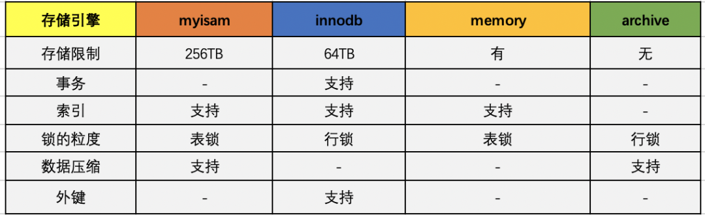
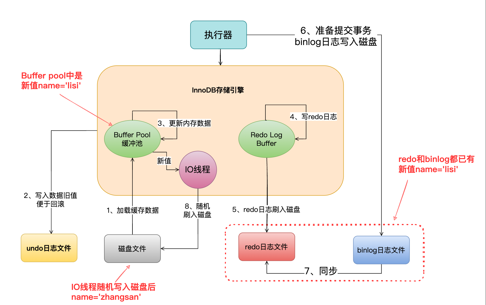
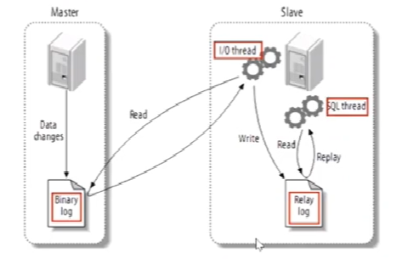
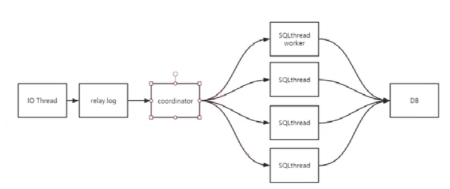

# Mysql

---

### 1. 基本概念

##### 1.1 三大范式

**三大范式：**

1. 第一范式（1NF）：保证数据表中的每一个字段的值必须具有原子性，也就是数据表中的**每个字段的值是不可再拆分的最小数据单元**。（拆字段）

2. 第二范式（2NF）：在满足第一范式的基础上，还要满足**数据表里的每一条数据记录，都是可唯一标识的，而且所有的非主键字段，都必须完全依赖主键，不能只依赖主键的一部分**。**第二范式要求实体的属性完全依赖主关键字。如果存在不完全依赖，那么这个属性和主关键字的这一部分就应该分离处理形成一个新的实体。**（拆表）

3. 第三范式（3NF）：第三范式建立在已经满足第二范式的基础上，数据表中的每一个非主键字段都和主键字段直接相关，也就是说数据表中的所有非主键字段不能依赖于其他非主键字段，这个规则的意思是所有非主属性之间不能有依赖关系，它们是互相独立的。（去除冗余字段）

**三大范式优缺点：**

优点：

* 数据的标准化有助于消除数据库中的数据冗余

* 第三范式通常被认为在性能，扩展性和数据完整性方面达到了最好的平衡

缺点：

* 降低了查询效率，因为范式等级越高，设计出来的表就越多，进行数据查询的时候就可能需要关联多张表，不仅代价昂贵，而且可能会使得一些索引失效

* 范式只是提出设计的标标准，实际设计的时候，我们可能为了性能和读取效率违反范式的原则，通过增加少量的冗余或重复的数据来提高数据库的读取性能，减少关联查询，实现空间换时间的目的

**反范式化：**

概述：

- 遵循业务优先的原则
- 首先满足业务需求，再进来减少冗余
- 有时候我们想要对查询效率进行优化，反范式化也是一种优化思路，我们可以通过在数据表中增加冗余字段来提高数据库的读性能

问题：

- 存储空间变大了
- 一个表中字段做了修改，另外一个表中冗余字段也要同步进行修改，不然会导致数据不一致
- 在数据量小的情况下，反范式不能体现性能的优势，可能还会让数据库的设计更加复杂。

**BCNF(巴斯范式)**：

3NF基础上，任何主属性不能对主键子集依赖。巴斯-科德范式（BCNF）是第三范式（3NF）的一个子集，即满足巴斯-科德范式（BCNF）必须满足第三范式（3NF）。通常情况下，巴斯-科德范式被认为没有新的设计规范加入，只是对第二范式与第三范式中设计规范要求更强，因而被认为是修正第三范式，也就是说，它事实上是对第三范式的修正，使数据库冗余度更小。这也是BCNF不被称为第四范式的原因。

##### 1.2 数据库类型

1. 关系型数据库：将复杂的数据结构用较为简单的二元关系（二维表）来表示，在该类型的数据库中，对数据的操作基本上都是建立在一个或者多个表格上，我们可以采用结构化查询语言（SQL）对数据库进行操作。代表性关系型数据库有：Oracle、DB2、SQL Server、MySQL等。

2. 非关系型数据库：泛指非关系型数据库，常见的非关系型数据库：Memcached、MongoDB、redis、HBase等。

##### 1.3 OLAP和OLTP

* OLTP（On-Line Transaction Processing）：联机事务处理，系统强调数据库内存效率，强调内存各种指标的命令率，强调绑定变量，强调并发操作。数据库，常见应用mysql、oracle等。

* OLAP（On-Line Analytical Processing）：系统则强调数据分析，强调SQL执行市场，强调磁盘I/O，强调分区等。数据仓库，常见应用hive。

---

### 2. 执行流程

##### 2.1 执行组件

###### 2.1.1 连接器

连接器职责：

1. 负责与客户端的通信

2. 验证请求用户的账户和密码是否正确

3. 查询当前用户的权限

###### 2.1.2 缓存

MySQL的缓存主要的作用是为了提升查询的效率，**缓存以key和value的哈希表形式存储，key是具体的SQL语句，value是结果的集合**。**在MySQL的8.0版本以后，缓存被官方删除掉了。** 因为查询缓存的失效非常频繁，如果在一个写多读少的环境中，缓存会频繁的新增和失效。对于某些更新压力大的数据库来说，查询缓存的命中率会非常低，MySQL为了维护缓存可能会出现一定的伸缩性的问题，目前在5.6的版本中已经默认关闭了，比较推荐的一种做法是将缓存放在客户端，性能大概会提升5倍左右。

###### 2.1.3 分析器

分析器的主要作用是**将客户端发过来的SQL语句进行分析，这将包括预处理与解析过程**，在这个阶段会解析SQL语句的语义，并进行关键词和非关键词进行提取、解析，并组成一个**解析树**。如果分析到语法错误，会直接给客户端抛出异常。

###### 2.1.4 优化器

**主要是进行SQL语句的优化**，会根据执行计划进行最优的选择，匹配合适的索引，选择最佳的执行方案。

优化器分为RBO和CBO两种类型：

* RBO(Rule-Based Optimizer)：基于规则的优化器

* CBO(Cost-Based Optimizer)：基于成本的优化器

###### 2.1.5 执行器

在执行器的阶段，此时**会调用存储引擎的API，API会调用存储引擎**，主要有一下存储的引擎，不过常用的还是myisam和innodb。

##### 2.2 Server层执行流程

> **磁盘IO**：mysql的数据一般是以文件形式存储在磁盘上，检索是需要磁盘I/O操作的，就是把磁盘中的数据读取到内存中，或者是把内存中的数据写到磁盘中；与主存不同，磁盘I/O存在机械运动耗费(存在 寻道时间+旋转延迟+数据传输时间，前面两个时间是主要的时间花费)，因此磁盘I/O (对磁盘进行读写文件) 的时间消耗是巨大的。因此在对数据的处理的时候要尽量规避磁盘IO；当需要从磁盘读取数据时，系统会将数据地址传给磁盘，即确定要读的数据在哪个磁道，哪个扇区。为了读取这个扇区的数据，需要将磁头放到这个扇区上方，为了实现这一点，磁头需要移动对准相应磁道，这个过程叫做【寻道】，所耗费时间叫做【寻道时间】，然后磁盘旋转将目标扇区旋转到磁头下，这个过程耗费的时间叫做旋转时间。

##### 2.3 引擎层执行流程（Innodb）

###### 2.3.1 数据页（datapage）

内存和磁盘在进行数据交互的时候存在一个最小的逻辑单元，称之为页，或者叫datapage，不同的操作系统页的大小是不同的，一般是4K或者8K，每次在进行读取的时候需要读取4K的整数倍。InnoDB存储引擎默认读取的是16K的数据。

###### 2.3.2 磁盘预读

由于存储介质的特性，磁盘本身存取就比主存慢很多，再加上机械运动耗费，磁盘的存取速度往往是主存的十万分之一，因此为了提高效率，要尽量减少磁盘I/O次数。磁盘往往不是严格按需读取，而是每次都会预读，即使只需要一个字节，磁盘也会从这个位置开始，顺序向后读取一定长度的数据放入内存。

* **局部性原理**：
  
  - 当一个数据被用到时，其附近的数据也通常会马上被使用。
  
  - 程序运行期间所需要的数据通常比较集中。
  
  - 分为时间局部性和空间局部性。

* 触发条件：
  
  1. 如果顺序访问了一个区的中的多个数据页，访问的数据页超过了这个阈值，会触发预读机制，将下一个相邻的数据页都加载到BufferPool中。阈值通过设置innodb_read_ahead_threshold参数来控制，默认值为56。
  
  2. 如果BufferPool中存放了一个区中13个连续的数据页，而且这些数据页都是比较频繁的被访问，此时会触发预读机制，将该区中其他数据页都加载到BufferPool中。通过参数innodb_random_read_ahead来控制，默认值为OFF。

###### 2.3.3 Buffer Pool

Buffer Pool是数据库的一个内存组件，缓存的磁盘的上的真实数据，对数据的增删改查其实是直接对BufferPool中的缓存数据进行操作的，BufferPool默认大小为128M，可以通过innodb_buffer_pool_size = 21455255来配置大小。

* **缓存页**：数据页加载到内存中，存放到内存中的数据称为缓存页，默认情况下，数据页和缓存页是一一对应的。

* **缓存页描述信息(控制块)**：对应每个缓存页，都有一个对应的描述信息来描述这个缓存页。例如，数据页所属的表空间，数据页的编号，缓存页的内存地址等，相当于内存的元数据。BufferPool中描述信息大概相当于缓存页大小的5%左右。

**Buffer Pool中的数据结构：**

* **数组**：缓存页在BufferPool是以数组形式存储的。

* **free链表**：**用来存储空白的数据页**。是一个双向链表结构，每个节点就是一个空闲的缓存页的控制块，每个控制块都存储两个指针，一个free_pre指针指向上一个节点，一个free_next指针指向下一个节点。数据库启动的时候，所有缓存页都是空白的，所以所有控制块都会被放到free链表中。每个free都存在一个**基节点**，它会指向链表的头结点和尾结点，还存储了空白页的数量。

* **flush链表：** 缓存页中的数据一旦被修改，那么缓存页中的数据和对应的磁盘中数据页中数据就不一致，此时该缓存页被称为**脏页**。flush链表存放的是脏页的控制块，flush链表结构和free链表一致。

* **LRU链表：** 
  
  * 基本概念：存放加载了数据页数据的内存页的控制块，最新存放数据的内存页的控制块放到链表的头部，最近被访问的内存块的控制块也放到链表头部。淘汰的时候淘汰链表的尾结点。
  
  * **冷热数据分离：** 磁盘的预读机制或者全表扫描可能会导致LRU表中频繁被访问的数据被淘汰，而预读的数据或者全表的数据可能没有被访问或者只访问过一次。导致BufferPool中内存页频繁淘汰交换。为了解决以上问题，Mysql在设计LRU链表的时候基于冷热数据分离优化LRU算法。LRU链表被拆分成两部分，一部分热数据，一部分冷数据，冷数据比例由参数innodb_old_blocks_pct控制，默认值为37，也就是冷数据占比37%。数据页第一次被加载到BufferPool中时，**该内存页对应的控制块存放到冷数据链表头部**。innodb默认在1s后，如果该缓存页被访问，缓存页对应的控制块被移动到热数据链表的头部，可以通过参数innodb_old_blocks_time修改值，默认为1s。
  
  * **热数据区域优化**：只有在热数据区域3/4部分的缓存页被访问，才会移动到热数据区域链表头部。避免链表中节点频繁移动。

**数据页扭转旅程：**

1. 数据页被访问加载到内存页，free链表对应控制块移除，LRU链表冷数据区域头部新增控制块。

2. 数据被更新flush链表新增控制块节点。

3. 后台线程定期将LRU尾部控制块对应的内存页刷到磁盘数据页中，删除缓存页，删除LRU链表和flush链表中对应的控制块，在free链表尾结点新增对应控制块。

4. 后台线程定期将flush链表中数据刷到磁盘数据页中，将flush链表和LRU链表中控制块删除。

###### 2.3.4 三大日志

* Binlog：
  
  * Binlog位于server层，不管是什么存储引擎，对数据库进行了修改都会产生二进制日志。
  
  * Binlog 以事件的形式记录了所有数据库表结构变更以及表数据修改的二进制日志，还包含了语句所执行的消耗时间，但是不会记录 Select 和 Show 这类操作。
  
  * Binlog 文件中记录的是对数据库的各种修改操作，用来表示修改操作的数据结构是 Log Event。Binlog 是追加写入，写完一个写下一个，不会覆盖使用。
  
  * Binlog持久化：通过**sync_binlog**参数设置：
    
    - 0（**默认值**）：当事务提交之后，将binlog 从binlog cache中 write到page cache上，不做fsync之类的磁盘同步指令刷新binlog_cache中的信息到磁盘，而让**File system自行决定**什么时候来做同步，或者**cache满了之后**才同步到磁盘，**性能最佳**；
    - 1：当每进行1次事务提交之后，MySQL将进行一次fsync之类的磁盘同步指令来将binlog_cache中的数据强制写入磁盘，是**最慢的，但是最安全**；
    - N：每次提交事务都将binlog write到磁盘上，当每进行n次事务提交之后，MySQL将进行一次fsync之类的磁盘同步指令来将binlog_cache中的数据强制写入磁盘。
  
  * 主要使用场景**主从复制**和**数据恢复**。

* RedoLog：
  
  * RedoLog最主要的作用就是**用于数据库异常宕机的恢复工作**。
  
  * RedoLog写入机制：redo log是一个环，大小是固定的，文件个数和大小是可以配置的。其中有两个指针，write和checkpoint，分别对应可以写入的位置，和已经刷新到磁盘的位置。当write追上了checkpoint，说明已经没有空闲的位置可以写入了，就需要刷新一下，保证有位置可以写入。
  
  * RedoLog持久化：
    
    1. redo log先写入内存中的redo log buffer
    
    2. redo log buffer写入page cache（操作系统里的页，操作系统会定时自动刷到磁盘。或者调用fsync函数就能确保刷盘）
    
    3. page cache的数据刷到磁盘。
    
    通过设置innodb_flush_log_at_trx_commit的值就可以控制控制合适刷盘
    
    * 值为0表示不立即写入page cache，后台线程每秒提交一次写入page cache并调用fsync将数据刷新到disk。
    
    * 值为1为默认值表示每次都要写入page cache，并调用fsync刷盘，这是最安全且性能最差的方式。
    
    * 值为2表示每次都要写入page cache，后台线程每秒调用fsync将数据刷新到disk中。
    
    一般比较重要的选择双一（redolog和binlog都选1）

* UndoLog：
  
  * Undo Log 属于逻辑日志，记录一个变化过程。主要采用段的方式管理和记录。在 InnoDB 数据文件中包含一种 rollback segment 回滚段（内部包含了 1024 个 Undo Log Segment），可以通过参数 **innodb_undo** 命令控制 Undo Log。
  
  * Undo Log 在事务开始前产生；事务在提交时，并不会立刻删除 Undo Log，InnoDB 会将该事务对应的 Undo Log放入到删除列表中，后面会通过后台线程 purge thread 进行回收处理。
  
  * Undo Log作用：实现事务的原子性，实现多版本并发控制（MVCC）

###### 2.3.5 更新语句执行流程

1. **查找数据**：查看符合条件的数据是否在内存**缓冲池**(Buffer Pool)中，如果不在，会直接从磁盘中加载到Buffer Pool中，并且对符合条件的数据加独占锁。如果存在则直接返回。

2. **写入undo log**：innodb 引擎开启事务，获得一个事务ID(是一直递增的)，根据执行的语句生成一个反向的语句，(如果是INSERT会生成一条DELETE语句，如果UPDATE语句就会生成一个UPDATE成旧数据的语句)，用于提交失败后回滚，将这条反向语句写入undo log，得到回滚指针，并且更新这个数据行的回滚指针和事务id。

3. **更新数据**：更新Buffer Pool中的缓存页数据。

4. **写redo log buffer**：将对数据的更改写入到内存中Redo Log Buffer中。

5. **写bin log buffer**：将更新的SQL写入bin log。

6. **提交事务**

7. **redo log刷盘**：将内存中redo log buffer刷到磁盘中，将redo log中这条事务更改为prepare状态。

8. **bin log刷盘**：将内存中bin log刷到磁盘中，会把本次更新对应的binlog文件名和文件中对应的位置写入redo log中，同时将redo log中这条记录更改为commit状态。

9. **数据写入磁盘**：后台IO线程随机的将buffer pool中的数据写入到磁盘中。

##### 2.4 Sql执行顺序

##### 2.5 执行计划

* **id**：查询标识符。在所有组中，id值越大，优先级越高，越先执行，id如果相同，可以认为是一组，从上往下顺序执行；

* **select_type**：select_type可选的参数较多，如下：
  
  * **SIMPLE**：简单的select查询，未使用UNION和子查询；
  
  * **PRIMARY**：查询中包含任何复杂的子部分，则被标记为PRIMARY，PRIMARY为最外层查询，最后执行；
  
  * **UNION**：第2个SELECT在UNION之后，则被标记为UNION；
  
  * **DEPENDENT UNION**：含有UNION查询的第二个或最后一个表，依赖外部的查询；
  
  * **UNION RESULT**：UNION结果；
  
  * **SUBQUERY**：在SELECT或WHERE中包含的子查询；
  
  * **DEPENDENT SELECT**：子查询中的第一个SELECT，依赖外部的查询；
  
  * **DERIVED**：衍生表，衍生表是FROM子句中子查询的内部名称； 
  
  * **MATERIALIZED**：物化子查询； 
  
  * **UNCACHEABLE SUBQUERY**：子查询，其结果无法缓存，必须针对外部查询的每一行进行评估；
  
  * **UNCACHEABLE UNION**：在UNION里的第二个或最后一个表属于不可缓存的子查询。

* **table**：此次查询访问的表

* **partitions**：该参数用于记录使用的分区信息，NULL表示该表不是分区表

* **type**：访问类型，表示以何种方式访问数据，一般情况下，至少达到range，最好能达到ref
  
  - **system**：该表只有一行，这是const连接的特殊情况，平时不会出现，可以不用重点注意；
  - **const**：该表最多只有一个匹配行，该行在查询开始时读取。因为只有一行，所以优化器的其余部分可以将这一行中的值做为常量，因为它值读取一次。const在基于主键或者唯一性索引比较时使用。
  - **eq_ref**：与驱动表的连接查询，后表(被驱动表)仅读取一行数据，当被驱动表存在主键索引或者unique+not null时使用，eq_ref用于使用"="运算的索引列；
  - **ref**：与驱动表的连接查询，后表(被驱动表)读取一行或多行数据。ref用于仅使用key的最左前缀，或者说key不是PAIMARY KAY或UNIQUE索引。换句话说，如果连接无法根据KEY选择单个行，则使用ref，否则使用eq_ref。ref可以用于使用"="或者"<=>"运算符进行的比较；
  - **fulltext**：使用FULLTEXT进行连接
  - **ref_or_null**：这种方式类似于ref，但是MySQL会额外搜索包含NULL值的行
  - **index_merge**：索引合并优化，把多个索引合并为一个使用
  - **unique_subquery**：该类型替换eq_ref形式下的IN子查询，子查询中最多返回一个值，提高查询效率
  - **index_subquery**：该类型类似于unique_subquery，它用来替代子查询，子查询中返回值的个数不确 
  - **range**：使用索引去检索一个范围的行数据，key列是使用到的索引，ref列为null。range可以在=，<>，>，>=，<，<=，IS NULL，<=>，BETWEEN，LIKE或IN()
  - **index**：index与ALL相似，只是索引树被扫描，对应2种情况：
    1. 索引本省存储相关的列数据，如果索引中的数据可满足查询需求，则仅扫描索引树，在这种情况下，Extra列显示为Using index。
    2. 使用对索引的读取执行全表扫描，以按顺序查找数据行，在这种情况下，Extra没有出现Using index。
  - **all**：全表扫描，如果驱动表不是以const方式获取数据的，则可以会导致非常糟糕的查询性能。通常可以添加索引来避免权标扫描。

* **possible_keys**：在该查询中，MySQL可能使用的索引，如果此列是NULL，则没有相关的索引，在这种情况下，需要检查WHERE字句，以确定是否适合创建索引

* **key**：MySQL实际使用的索引。在大多数情况下，key中的值都在possible_key里面，但也会出现possible_key不存在该值，但key里面存在的情况；

* **key_len**：该列指MySQL决定使用的索引长度。该值体现了在使用复合索引的时候，使用了复合索引的前面哪几个列(需要根据字段长度计算)，如果key列为NULL，则该列也为NULL。由于key存储的格式原因，可以为NULL的列的key长度比NOT NULL的列长度大1；

* **ref**：列显示哪些列或者常量与key中的索引进行比较，以从表中选择行；

* **rows**：MySQL查询需要遍历的行数，对于innodb表，可能并不总是准确的。这里需要特别注意，Oracle数据库的执行计划里面也有rows列，不过代表结果的行数，含义不一样

* **filtered**：被条件过滤的行数百分比。最大值为100，表示没有行过滤，值从100减小表示过滤增加。rows表示检查的行数，rows * filtered/100表示过滤后的行数，也就是与下表进行连接的行

* **Extra**：执行计划的额外信息
  
  * Using index：表示查询语句中用到了覆盖索引，不访问表的数据行，查询效率比较好
  
  * Using filesort：代表MySQL会使用一个外部索引对数据进行排序(文件排序)，而不是使用表内索引。这种情况在SQL查询需要避免，最好不要在Extra中出现此类型
  
  * Using temporary：产生临时表保存中间结果，这种SQL是不允许的，遇见数据量大的场景，就会特别慢
  
  * Using index Condition：在MySQL 5.6版本后加入的新特性（Index Condition Pushdown）；会先条件过滤索引，过滤完索引后找到所有符合索引条件的数据行，随后用 WHERE 子句中的其他条件去过滤这些数据行；
  
  * Using Where：表示MySQL服务器在存储引擎收到记录后进行“后过滤”（Post-filter）,如果查询未能使用索引，Using where的作用只是提醒我们MySQL将用where子句来过滤结果集。这个一般发生在MySQL服务器，而不是存储引擎层。一般发生在不能走索引扫描的情况下或者走索引扫描，但是有些查询条件不在索引当中的情况下。

---

### 3. 索引

##### 3.1 索引分类

###### 3.1.1 按照存储结构分类

* **B+tree索引**：Innodb和Myisam使用B+tree存储。
  
  B+树组件：
  
  * 叶子节点：包含的条目直接指向表里的数据行。叶子节点之间彼此相连，一个叶子节点有一个指向下一个叶子节点的指针。
  
  * 分支节点：包含的条目指向索引里其他的分支节点或者叶子节点。
  
  * 根节点：一个 B+tree索引只有一个根节点，实际上就是位于树的最顶端的分支节点。
  
  基于这种树形数据结构，表中的每一行都会在索引上有一个对应值。因此，在表中进行数据查询时，可以根据索引值一步一步定位到数据所在的行。

* **Hash索引**：Memory 存储引擎和 Heap 存储引擎支持使用Hash索引，Innodb支持自适应Hash（由存储引擎自动优化，用户不可以干扰）。
  
  Hash是把任意长度的输入通过散列算法变换成固定长度的输出，该输出就是散列值。
  
  缺点：
  
  1. MySQL 需要读取表中索引列的值来参与散列计算，散列计算是一个比较耗时的操作。也就是说，相对于 B-树索引来说，建立哈希索引会耗费更多的时间。
  
  2. 不能使用 HASH 索引排序。
  
  3. HASH 索引只支持等值比较，如“=”“IN()”或“<=>”。
  
  4. HASH 索引不支持键的部分匹配，因为在计算 HASH 值的时候是通过整个索引值来计算的。
  
  5. HASH不支持范围查找。

###### 3.1.2 按照物理存储分类

* **聚簇索引**：
  
  * 数据跟索引放在一起的叫聚簇索引。
  
  * InnoDB表存在聚簇索引，默认在主键字段上建立聚簇索引，在没有主键字段的情况下，在表的第一个非空的唯一索引上建立聚簇索引，在前两者都没有的情况下，InnoDB生成一个6字节的Row_ID作为索引的key值。
  
  * InnoDB使用的是聚簇索引，*.frm存放的是表结构，*.ibd存放的是数据和索引文件。
    
    > mysql的innoDB存储引擎默认的情况下会把所有的数据文件放到表空间中，不会为每一个单独的表保存一份数据文件，如果需要将每一个表单独使用文件保存，设置属性set global innodb_file per_table = on；

* **非聚簇索引**：
  
  * 数据跟索引分开放的叫非聚簇索引。
  
  * InnoDB也存在非聚簇索引，非聚簇索引查询数据的时候容易产生**回表**。当查询的字段非聚簇索引中都存在，则无需回表，称为**索引覆盖**。
  
  * Myisam使用的是非聚簇索引，*.frm存放的是表结构，*.myi存放索引文件，*.myd存放数据文件。

###### 3.1.3 按照字段特性分类

* **主键索引**：一个表只能有一个主键，不允许为NULL，数据列不允许重复。

* **唯一索引**：一个表允许多个列创建唯一索引，允许为NULL值，数据列不允许重复。

* **普通索引**：基本的索引类型，没有唯一性的限制，允许为NULL值。

* **组合索引**：指在多个字段上创建的索引，只有在查询条件中使用了创建索引时的第一个字段，索引才会被使用。使用组合索引时遵循最左前缀集合。

* **全文索引**：全文索引主要用来查找文本中的关键字，而不是直接与索引中的值相比较。fulltext索引跟其它索引大不相同，它更像是一个搜索引擎，而不是简单的where语句的参数匹配。fulltext索引配合match against操作使用，而不是一般的where语句加like。它可以在create table，alter table ，create index使用，不过目前只有char、varchar，text 列上可以创建全文索引。值得一提的是，在数据量较大时候，现将数据放入一个没有全局索引的表中，然后再用CREATE index创建fulltext索引，要比先为一张表建立fulltext然后再将数据写入的速度快很多。

---

### 4. 事务

##### 4.1 ACID

* 原子性（Atomicity）：指事务是一个不可分割的最小工作单位，事务中的操作只有全部成功和全部失败两种情况。实现原理：undolog。

* 一致性（Consistency）：事务开始前和结束后，数据库的完整性约束没有被破坏 。比如A向B转账，不可能A扣了钱，B却没收到。一致性依靠其他三个特性来保证。

* 隔离性（Isolation）：一个事务的执行不能被其他事务干扰，即一个事务内部的操作及使用的数据对并发的其他事务是隔离的，并发执行的各个事务之间不能互相干扰。实现原理：MVCC，锁

* 持久性（Durability）：一个事务一旦提交成功，它对数据库中数据的改变将是永久性的，接下来的其他操作或故障不应对其有任何影响。实现原理：redolog

##### 4.2 事务并发问题

* 脏读：事务A读取了事务B更新的数据，然后B回滚操作，那么A读取到的数据是脏数据。

* 不可重复读：事务A多次读取同一数据，事务B在事务A多次读取的过程中，对数据作了更新并提交，导致事务A多次读取同一数据时，结果不一致。

* 幻读：事务A在表中根据条件读取了一行数据，然后事务B又在表中插入了一条新的数据时，事务A再读取该表时，就会发现神不知鬼不觉的多出1行了。

##### 4.3 事务的隔离级别

* read uncommitted（读未提交数据）：允许事务读取未被其他事务提交的变更。（脏读、不可重复读和幻读的问题都会出现）。

* read committed（读已提交数据）：只允许事务读取已经被其他事务提交的变更。（可以避免脏读，但不可重复读和幻读的问题仍然可能出现）**oracle默认隔离级别**

* repeatable read（可重复读）：确保事务可以多次从一个字段中读取相同的值。（可以避免脏读和不可重复读，但幻读仍然存在）**myql默认隔离级别**

*  serializable（串行化）：串行的执行事务，性能十分低下（可以避免脏读、幻读和不可重复读）

##### 4.4 MVCC

Multi-Version Concurrency Control，多版本并发控制。MVCC是指维持一个数据的多个版本，使得读写操作没有冲突，快照读是mysql为了实现MVCC的一个非阻塞功能。

* 快照读：读取的是mysql对应数据的历史版本，事务中select是快照读。

* 当前读：读取的最新的数据结果，事务中select for update，select lock in share mode ,insert，update，delete

**MVCC解决问题：**

数据库并发场景有三种，分别为：

1. **读读**：不存在任何问题，也不需要并发控制

2. **读写**：有线程安全问题，可能会造成事务隔离性问题，可能遇到脏读、幻读、不可重复读

3. **写写**：有线程安全问题，可能存在更新丢失问题

MVCC是一种用来解决**读写**冲突的无锁并发控制，也就是为事务分配单项增长的时间戳，为每个修改保存一个版本，版本与事务时间戳关联，读操作只读该事务开始前的数据库的快照，所以MVCC可以为数据库解决一下问题：

1. 在并发读写数据库时，可以做到在读操作时不用阻塞写操作，写操作也不用阻塞读操作，提高了数据库并发读写的性能

2. **解决脏读、不可重复读等事务隔离问题，但是不能解决幻读问题**

**MVCC实现原理**：

mvcc的实现原理主要依赖于记录中的三个隐藏字段，undolog，read view来实现的。

**隐藏字段**：

* DB_TRX_ID：最近修改事务id，记录创建这条记录或者最后一次修改该记录的事务id

* DB_ROLL_PTR：回滚指针，指向这条记录的上一个版本，用于配合undolog，指向上一个旧版本

* DB_ROW_ID：隐藏主键，如果数据表没有主键，那么innodb会自动生成一个6字节的row_id。

**undolog**：回滚日志，记录的是之前数据的历史版本。

**readview**：当事务在进行快照读的时候，会生成一个读视图来进行可见性判断。可见性判断是由可见性算法确定的。**RC级别每次执行快照读都生成一个readview；RR级别只有第一次进行快照读的时候生成一个readview，之后快照读都使用当前readview。**

readview生产三个字段：

* trx_list：当前系统活跃的事务id

* up_limit_id：活跃事务列表中最小的id值

* low_limit_id：当前系统尚未分配的下一个事务id

可见性算法：

1. 首先比较DB_TRX_ID < up_limit_id，如果小于，则当前事务能看到DB_TRX_ID所在的记录，如果大于等于进入下一条判断。

2. 判断DB_TRX_ID >= low_limit_id，如果大于等于则代表DB_TRX_ID所在记录在read view生成后才出现的，那么对于当前事务肯定不可见，如果小于，则进入下一步判断。

3. 判断DB_TRX_ID是否在活跃事务中，如果在，则代表在read view生成时刻，这个事务还是活跃状态，还没有commit，修改的数据，当前事务也是看不到，如果不在，则说明这个事务在read view生成之前就已经开始commit，那么修改的结果是能够看到的。

##### 4.5 锁

4.5.1 行级锁

如果当前的所有操作都是当前读，那么是不会产生幻读问题，只有当前读和快照读一起使用的时候才会产生幻读问题。

只有加锁才能解决幻读问题。

**行级锁分类：**

1.  **记录锁（Record Lock）**：锁定单个行记录的锁，防止其他事务对此行进行update和delete。在RC、RR隔离级别下都支持。

2. **间隙锁（Gap Lock）**：锁定索引记录间隙（不含该记录），确保索引记录间隙不变，防止其他事务在这个间隙进行insert，产生幻读。在RR隔离级别下支持。

3. **临键锁（Next-Key Lock）**：行锁和间隙锁组合，同时锁住数据，并锁住数据前面的间隙Gap（左开右闭区间）。在RR隔离级别下支持。

**行级锁使用：**

默认情况下，InnoDB在 REPEATABLE READ事务隔离级别运行，InnoDB使用 next-key 锁进行搜索和索引扫描，以防止幻读。

1. 针对主键或者唯一索引加锁的时候，会对查询的这一行加锁。称为记录锁。

2. 针对非唯一索引查询的时候，默认会加一个临建锁，当查询的记录不存的时候会降级为间隙锁。

3. 当加锁操作没有使用到索引列，该锁自动退化为表锁。

4. 针对索引列的范围查询时，无论唯一索引和非唯一索引，如果存在匹配结果加临键锁，没有匹配结果加间隙锁。

---

### 5. mysql主从复制

##### 5.1 概述

MySQL主从复制是指数据可以从一个MySQL数据库服务器主节点复制到一个或多个从节点。MySQL默认采用异步复制方式。这样从节点不用一直访问主服务器来更新自己的数据，数据的更新可以在远程连接上进行，从节点可以复制主数据库中的所有数据库或者特定的数据库，或者特定的表。

##### 5.2 原理

##### 5.3 延时问题

mysql并行复制（MTS）

增加多个worker处理SQL Thread，worker个数参数设置slave_parallel_workers。

保证顺序性：

1. 不能造成更新覆盖，要求更新同一行的两个事务，必须分配到一个worker中。

2. 同一个事务不能被拆开，必须放到同一个worker中。

分发粒度：

1. 按库分发：key值是数据库的名字

2. 按表分发：key值是库名+表名

3. 按行分发：key值是库名+表名+唯一键

Mysql5.6的主从复制：MySQL5.6版本支持了并行复制，只是支持的粒度是按库并行。

MariaDB的并行复制策略:

MySQL5.7版本的并行复制策略:

MySQL5.7版本由参数`slave-parallel-type`来控制并行复制策略：

- 配置为DATABASE，表示使用MySQL5.6版本的按库并行策略
- 配置为LOGICAL_CLOCK，表示的就是类似MariaDB的策略。MySQL在此基础上做了优化

MySQL5.7并行复制策略的思想是：

1. 同时处于prepare状态的事务，在备库执行时是可以并行的
2. 处于prepare状态的事务，与处于commit状态的事务之间，在备库执行时也是可以并行的

基于GTID的主从复制问题：组提交
