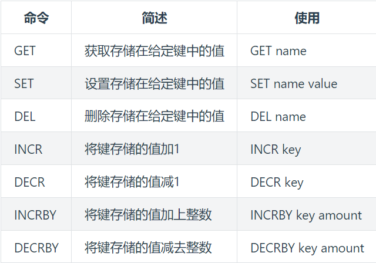

# Redis

---

Redis是一款内存高速缓存数据库。Redis全称为：**Remote Dictionary Server**（远程数据服务），使用C语言编写，Redis是一个key-value存储系统（键值存储系统），Redis能读的速度是110000次/s,写的速度是81000次/s。

### 1. 数据类型


##### 1.1 String

String是redis中最基本的数据类型，一个key对应一个value。String类型是二进制安全的，意思是 redis 的 string 可以包含任何数据。如数字，字符串，jpg图片或者序列化的对象。

**value类型：**

* 字符串

* 数值

**常用命令**：



**使用场景：**

* **缓存**： 经典使用场景，把常用信息，字符串，图片或者视频等信息放到redis中，redis作为缓存层，mysql做持久化层，降低mysql的读写压力。

* **计数器**：redis是单线程模型，一个命令执行完才会执行下一个，同时数据可以一步落地到其他的数据源。

* **session**：常见方案spring session + redis实现session共享

##### 1.2 List

Redis中的List其实就是链表（Redis用双端链表实现List）。

**常用命令：**


**使用技巧：**

- lpush+lpop=Stack(栈)
- lpush+rpop=Queue（队列）
- lpush+ltrim=Capped Collection（有限集合）
- lpush+brpop=Message Queue（消息队列）

**使用场景：**

* 最新消息排队功能，比如新浪微博的TimeLine

* 消息队列，可以利用List的push操作，将任务存放在List中，然后工作线程再用pop操作将任务取出进行执行。

##### 1.3 Hash

Redis hash 是一个 string 类型的 field（字段） 和 value（值） 的映射表，hash 特别适合用于存储对象。

**常用命令：**


**使用场景：**

* 缓存： 能直观，相比string更节省空间，的维护缓存信息，如用户信息，视频信息等。

##### 1.4 Set

Redis 的 Set 是 String 类型的无序集合。集合成员是唯一的，这就意味着集合中不能出现重复的数据。Redis 中集合是通过哈希表实现的，所以添加，删除，查找的复杂度都是 O(1)。

**常用命令：**


**使用场景：**

* 标签：给用户添加标签，或者用户给消息添加标签，这样有同一标签或者类似标签的可以给推荐关注的事或者关注的人。

* 点赞，收藏，set中存放点赞的人可以防止重复。

##### 1.5 Zset

Redis 有序集合和集合一样也是 string 类型元素的集合,且不允许重复的成员。不同的是每个元素都会关联一个 double 类型的分数。redis 正是通过分数来为集合中的成员进行从小到大的排序。**有序集合的成员是唯一的, 但分数(score)却可以重复。**

**数据结构：**

* **压缩列表(ziplist)**: ziplist是为了提高存储效率而设计的一种特殊编码的双向链表。它可以存储字符串或者整数，存储整数时是采用整数的二进制而不是字符串形式存储。它能在O(1)的时间复杂度下完成list两端的push和pop操作。但是因为每次操作都需要重新分配ziplist的内存，所以实际复杂度和ziplist的内存使用量相关。

* **跳跃表（skiplist)**: 跳跃表的性能可以保证在查找，删除，添加等操作的时候在对数期望时间内完成，这个性能是可以和平衡树来相比较的，而且在实现方面比平衡树要优雅，这是采用跳跃表的主要原因。跳跃表的复杂度是O(log(n))。

**常用命令：**


**使用场景：**

* 排行榜：有序集合经典使用场景。例如小说视频等网站需要对用户上传的小说视频做排行榜，榜单可以按照用户关注数，更新时间，字数等打分，做排行。

---

### 2. 特殊数据类型

##### 2.1 HyperLogLogs（基数统计）

##### 2.2 Bitmap（位存储）

##### 2.3 Geospatial (地理位置)

---

### 3. Stream流

##### 3.1 Stream结构


- **Consumer Group** ：消费组，使用 XGROUP CREATE 命令创建，一个消费组有多个消费者(Consumer), 这些消费者之间是竞争关系。
- **last_delivered_id** ：游标，每个消费组会有个游标 last_delivered_id，任意一个消费者读取了消息都会使游标 last_delivered_id 往前移动。
- **pending_ids** ：消费者(Consumer)的状态变量，作用是维护消费者的未确认的 id。 pending_ids 记录了当前已经被客户端读取的消息，但是还没有 `ack` (Acknowledge character：确认字符）。如果客户端没有ack，这个变量里面的消息ID会越来越多，一旦某个消息被ack，它就开始减少。这个pending_ids变量在Redis官方被称之为PEL，也就是Pending Entries List，这是一个很核心的数据结构，它用来确保客户端至少消费了消息一次，而不会在网络传输的中途丢失了没处理。
- **消息ID** ：消息ID的形式是timestampInMillis-sequence，例如1527846880572-5，它表示当前的消息在毫米时间戳1527846880572时产生，并且是该毫秒内产生的第5条消息。消息ID可以由服务器自动生成，也可以由客户端自己指定，但是形式必须是整数-整数，而且必须是后面加入的消息的ID要大于前面的消息ID。

---

### 4. RedisObject对象

---

### 5. 底层数据结构

---

### 6. 发布订阅模式

---

### 7. 事件机制

---

### 8. 事务

###### 8.1 命令

- MULTI ：开启事务，redis会将后续的命令逐个放入队列中，然后使用EXEC命令来原子化执行这个命令系列。
- EXEC：执行事务中的所有操作命令。
- DISCARD：取消事务，放弃执行事务块中的所有命令。
- WATCH：监视一个或多个key,如果事务在执行前，这个key(或多个key)被其他命令修改，则事务被中断，不会执行事务中的任何命令。
- UNWATCH：取消WATCH对所有key的监视。

###### 8.2 出现错误处理

* 语法错误（编译器错误）：事务提交失败，事务回滚。

* Redis类型错误：比如操作string用lpush命令，只有错误指令回滚，其他指令正常提交。

* Watch值改变：watch的key的值在multi之后set时发现变化，事务提交失败，事务回滚。

---

### 9. 持久化

##### 9.1 RDB 持久化

RDB 就是 Redis DataBase 的缩写，中文名为快照/内存快照，RDB持久化是把当前进程数据生成快照保存到磁盘上的过程，由于是某一时刻的快照，那么快照中的值要早于或者等于内存中的值。

###### 9.1.1 触发方式

1. 手动触发：
   
   * **save命令**：阻塞当前Redis服务器，直到RDB过程完成为止，对于内存比较大的实例会造成长时间**阻塞**，线上环境不建议使用。
   
   * **bgsave命令**：Redis进程执行fork操作创建子进程，RDB持久化过程由子进程负责，完成后自动结束。阻塞只发生在fork阶段，一般时间很短。

2. 自动触发：下面情况会自动触发
   
   * redis.conf中配置`save m n`，即在m秒内有n次修改时，自动触发bgsave生成rdb文件；
   
   * 主从复制时，从节点要从主节点进行全量复制时也会触发bgsave操作，生成当时的快照发送到从节点；
   
   * 执行debug reload命令重新加载redis时也会触发bgsave操作；
   
   * 默认情况下执行shutdown命令时，如果没有开启aof持久化，那么也会触发bgsave操作；

###### 9.1.2 redis.conf中RDB配置

```bash
# 周期性执行条件的设置格式为
save <seconds> <changes>

# 默认的设置为：
# 如果900秒内有1条Key信息发生变化，则进行快照
save 900 1
# 如果300秒内有10条Key信息发生变化，则进行快照
save 300 10
# 如果60秒内有10000条Key信息发生变化，则进行快照
save 60 10000

# 关闭RDB快照功能
save ""
# 文件名称
dbfilename dump.rdb
# 文件保存路径,默认设置为“./”,也就是Redis服务的主目录
dir /home/work/app/redis/data/
# 如果持久化出错，主进程是否停止写入
stop-writes-on-bgsave-error yes
# 是否压缩
rdbcompression yes
# 导入时是否检查
rdbchecksum yes
```

###### 9.1.3 数据一致性：

RDB中的核心思路是**Copy-on-Write**，来保证在进行快照操作的这段时间，需要压缩写入磁盘上的数据在内存中不会发生变化。在正常的快照操作中，一方面Redis主进程会fork一个新的快照进程专门来做这个事情，这样保证了Redis服务不会停止对客户端包括写请求在内的任何响应。另一方面**这段时间发生的数据变化会以副本的方式存放在另一个新的内存区域**，待快照操作结束后才会同步到原来的内存区域。

###### 9.1.4 优缺点

优点：

- RDB文件是某个时间节点的快照，默认使用LZF算法进行压缩，压缩后的文件体积远远小于内存大小，适用于备份、全量复制等场景；
- Redis加载RDB文件恢复数据要远远快于AOF方式；

缺点：

- RDB方式实时性不够，无法做到秒级的持久化；
- 每次调用bgsave都需要fork子进程，fork子进程属于重量级操作，频繁执行成本较高；
- RDB文件是二进制的，没有可读性，AOF文件在了解其结构的情况下可以手动修改或者补全；

##### 9.2 AOF持久化

"写后"日志，**Redis先执行命令，把数据写入内存**，然后才记录日志。日志里记录的是Redis收到的每一条命令，这些命令是以文本形式保存。PS: 大多数的数据库采用的是写前日志（WAL），例如MySQL，通过写前日志和两阶段提交，实现数据和逻辑的一致性。

###### 9.2.1 后写日志特点

**优点：**

* 避免额外的检查开销：Redis 在向 AOF 里面记录日志的时候，并不会先去对这些命令进行语法检查。所以，如果先记日志再执行命令的话，日志中就有可能记录了错误的命令，Redis 在使用日志恢复数据时，就可能会出错

* 不会阻塞当前的写操作

**缺点：**

* 如果命令执行完成，写日志之前宕机了，会丢失数据

* 主线程写磁盘压力大，导致写盘慢，阻塞后续操作

###### 9.2.2 AOF步骤

1. 命令追加（append）：服务器在执行完一个写命令之后，会以协议格式将被执行的写命令追加到服务器的 aof_buf 缓冲区

2. 文件写入（write）：调用操作系统write命令将缓冲区数据写入pagecache中

3. 文件同步（sync）：调用操作系统fsync命令将pagecache中数据刷到硬盘中

###### 9.2.3 AOF同步（sync）策略

1. **Always**：同步sync，每次有新命令追加到 AOF 文件时就执行一次 fsync，非常慢，也非常安全；

2. **EverySec（默认）**：每秒 fsync 一次，足够快（和使用 RDB 持久化差不多），并且在故障时只会丢失 1 秒钟的数据。

3. **No**：从不 fsync，将数据交给操作系统来处理。更快，也更不安全的选择。

###### 9.2.4 redis.conf中AOF的配置

默认情况下，Redis是没有开启AOF的，可以通过配置redis.conf文件来开启AOF持久化，关于AOF的配置如下：

```bash
# appendonly参数值为yes表示开启AOF持久化
appendonly no

# AOF持久化的文件名，默认是appendonly.aof
appendfilename "appendonly.aof"

# AOF文件的保存位置和RDB文件的位置相同，都是通过dir参数设置的
dir ./

# 同步策略
# appendfsync always
appendfsync everysec
# appendfsync no

# aof重写期间是否同步,保证在完成fsync函数调用时，
# 不会将这段时间内发生的命令操作放入操作系统的Page Cache
no-appendfsync-on-rewrite no

# 重写触发配置
auto-aof-rewrite-percentage 100
auto-aof-rewrite-min-size 64mb

# 加载aof出错如何处理
aof-load-truncated yes

# 文件重写策略
aof-rewrite-incremental-fsync yes
```

###### 9.2.5 AOF重写

AOF会记录每个写命令到AOF文件，随着时间越来越长，AOF文件会变得越来越大。如果不加以控制，会对Redis服务器，甚至对操作系统造成影响，而且AOF文件越大，数据恢复也越慢。为了解决AOF文件体积膨胀的问题，Redis提供AOF文件重写机制来对AOF文件进行“瘦身”。

* 阻塞问题：
  
  AOF重写过程是由后台进程bgrewriteaof来完成的。主线程fork出后台的bgrewriteaof子进程，fork会把主线程的内存拷贝一份给bgrewriteaof子进程，这里面就包含了数据库的最新数据。然后，bgrewriteaof子进程就可以在不影响主线程的情况下，逐一把拷贝的数据写成操作，记入重写日志。所以aof在重写时，在fork进程时是会阻塞住主线程的。

* 重写时机：
  
  `auto-aof-rewrite-min-size`：表示运行AOF重写时文件的最小大小，默认为64MB。
  
  `auto-aof-rewrite-percentage`：这个值的计算方式是，当前aof文件大小和上一次重写后aof文件大小的差值，再除以上一次重写后aof文件大小。也就是当前aof文件比上一次重写后aof文件的增量大小，和上一次重写后aof文件大小的比值。

* 重写流程：
  
  重写过程总结为：“一个拷贝，两处日志”。在fork出子进程时的拷贝，以及在重写时，如果有新数据写入，主线程就会将命令记录到两个aof日志内存缓冲区中。如果AOF写回策略配置的是always，则直接将命令写回旧的日志文件，并且保存一份命令至AOF重写缓冲区，这些操作对新的日志文件是不存在影响的。（旧的日志文件：主线程使用的日志文件，新的日志文件：bgrewriteaof进程使用的日志文件）
  
  而在bgrewriteaof子进程完成会日志文件的重写操作后，会提示主线程已经完成重写操作，主线程会将AOF重写缓冲中的命令追加到新的日志文件后面。这时候在高并发的情况下，AOF重写缓冲区积累可能会很大，这样就会造成阻塞，Redis后来通过Linux管道技术让aof重写期间就能同时进行回放，这样aof重写结束后只需回放少量剩余的数据即可。
  
  最后通过修改文件名的方式，保证文件切换的原子性。
  
  在AOF重写日志期间发生宕机的话，因为日志文件还没切换，所以恢复数据时，用的还是旧的日志文件。
  
  总结为3步：
  
  1. 主线程fork出子进程重写aof日志
  
  2. 子进程重写日志完成后，主线程追加aof日志缓冲
  
  3. 替换日志文件

* 重写时子线程数据拷贝
  
  fork采用操作系统提供的写时复制（copy on write）机制，就是为了避免一次性拷贝大量内存数据给子进程造成阻塞。fork子进程时，子进程时会拷贝父进程的页表，即虚实映射关系（虚拟内存和物理内存的映射索引表），而不会拷贝物理内存。这个拷贝会消耗大量cpu资源，并且拷贝完成前会阻塞主线程，阻塞时间取决于内存中的数据量，数据量越大，则内存页表越大。拷贝完成后，父子进程使用相同的内存地址空间。
  
  但主进程是可以有数据写入的，这时候就会拷贝物理内存中的数据。

* 重写时组线程阻塞点
  
  1. fork子进程时，需要拷贝虚拟页表，会对主线程阻塞。
  
  2. 主进程有bigkey写入时，操作系统会创建页面的副本，并拷贝原有的数据，会对主线程阻塞。
  
  3. 子进程重写日志完成后，主进程追加aof重写缓冲区时可能会对主线程阻塞。

##### 9.3 RDB和AOF同时使用

* 备份：
  
  * 同时使用两种持久化功能需要耗费大量系统资源，系统的硬件必须能够支撑运行这两种功能所需的资源消耗，否则会给系统性能带来影响
  
  * 当Redis服务器正在后台生成新的RDB文件时，如果有用户向服务器发送BGREWRITEAOF命令，或者配置选项中设置的AOF重写条件被满足了，那么服务器 将把 AOF重写操作 推延到 RDB文件创建完毕之后再执行，以此来避免两种持久化操作同时执行并争抢系统资源
  
  * 同样，当服务器正在执行BGREWRITEAOF命令时，用户发送或者被触发的BGSAVE命令也会推延到BGREWRITEAOF命令执行完毕之后再执行

* 还原：
  
  - redis重启时判断是否开启aof，如果开启了aof，那么就优先加载aof文件；
  - 如果aof存在，那么就去加载aof文件，加载成功的话redis重启成功，如果aof文件加载失败，那么会打印日志表示启动失败，此时可以去修复aof文件后重新启动；
  - 若aof文件不存在，那么redis就会转而去加载rdb文件，如果rdb文件不存在，redis直接启动成功；
  - 如果rdb文件存在就会去加载rdb文件恢复数据，如加载失败则打印日志提示启动失败，如加载成功，那么redis重启成功，且使用rdb文件恢复数据。

##### 9.4 RDB和AOF混合方式

Redis 4.0 中提出了一个**混合使用 AOF 日志和内存快照**的方法。简单来说，内存快照以一定的频率执行，在两次快照之间，使用 AOF 日志记录这期间的所有命令操作。

* 开启混合模式：
  
  config get aof-use-rdb-preamble = yes

* 工作方式：
  
  Redis服务器 在执行 AOF重写操作时，就会像执行BGSAVE命令那样，根据数据库当前的状态 生成出 相应的RDB数据，并将这些数据 写入 新建的AOF文件中，至于那些 在AOF重写开始之后 执行的Redis命令，则会继续以协议文本的方式 追加到 新AOF文件的末尾，即已有的RDB数据的后面。服务器生成的AOF文件将由两个部分组成，其中位于AOF文件开头的是RDB格式的数据，而跟在RDB数据后面的则是AOF格式的数据。

* 还原：
  
  - 如果包含RDB（AOF文件以REDIS开头），那么服务器就会先载入开头的RDB数据（RDB_OPCODE_EOF结束标记），然后再载入之后的AOF数据
  - 如果AOF文件只包含AOF数据（AOF文件以*开头），那么服务器将直接载入AOF数据

---

### 10. 内存过期淘汰

##### 10.1 设置过期时间

* SETEX key timeout value

* SET key value EX timeout

* SET key value
  
  EXPIRE key timeout

##### 10.2 过期策略

* 定期删除：
  
  Redis会将每个设置了过期时间的key放入到一个独立的字典中，以后会定期遍历这个字典来删除到期的key。Redis默认每秒进行10次过期扫描（hz=10表示表示Redis执行定期任务的频率，取值范围为1~500），但这个扫描并不会扫描过期字典中所有的key，而是通过一种贪心策略来随机筛选删除key，步骤如下：
  
  1. 从设置了过期时间的key的集合中随机检查20个key。
  
  2. 删除检查中发现的所有过期key。
  
  3. 如果检查结果中25%以上的key已过期，则重新开启新一轮任务。

* 惰性删除：
  
  在客户端访问这个key的时候，Redis对key的过期时间进行检查，如果过期了就立即删除，然后返回null。

##### 10.3 内存淘汰策略

* 配置：
  
  ```bash
  # 内存达到多大时开启内存淘汰，通常设置为物理内存的75%
  maxmemory <bytes>
  
  # 内存淘汰策略，默认为noeviction
  maxmemory-policy noeviction
  ```

* 策略：
  
  * volatile-lru ：Evict using approximated LRU, only keys with an expire set.
  
  * allkeys-lru -> Evict any key using approximated LRU.
  
  * volatile-lfu -> Evict using approximated LFU, only keys with an expire set.
  
  * allkeys-lfu -> Evict any key using approximated LFU.
  
  * volatile-random -> Remove a random key having an expire set.
  
  * allkeys-random -> Remove a random key, any key.
  
  * volatile-ttl -> Remove the key with the nearest expire time (minor TTL)
  
  * noeviction -> Don't evict anything, just return an error on write operations.

---

### 11. 高可用

##### 11.1 主从复制

主从复制，是指将一台Redis服务器的数据，复制到其他的Redis服务器。前者称为主节点(master)，后者称为从节点(slave)；数据的复制是单向的，只能由主节点到从节点。

**主从复制的作用：**

* **数据冗余**：主从复制实现了数据的热备份，是持久化之外的一种数据冗余方式。

* **故障恢复**：当主节点出现问题时，可以由从节点提供服务，实现快速的故障恢复；实际上是一种服务的冗余。

* **负载均衡**：在主从复制的基础上，配合读写分离，可以由主节点提供写服务，由从节点提供读服务（即写Redis数据时应用连接主节点，读Redis数据时应用连接从节点），分担服务器负载；尤其是在写少读多的场景下，通过多个从节点分担读负载，可以大大提高Redis服务器的并发量。

* **高可用基石**：除了上述作用以外，主从复制还是哨兵和集群能够实施的基础，因此说主从复制是Redis高可用的基础。

**主从复制原理：**

在2.8版本之前只有全量复制，而2.8版本后有全量和增量复制。

* 全量复制：
  
  * 确立主从关系：通过在从库中配置 replicaof ip port（Redis 5.0 之前使用 slaveof）形成主从关系。
  
  * 三个阶段：
    
    1. 建立连接：从库给主库发送 psync 命令，表示要进行数据同步，主库根据这个命令的参数来启动复制。psync 命令包含了主库的 runID 和复制进度 offset 两个参数。runID，是每个 Redis 实例启动时都会自动生成的一个随机 ID，用来唯一标记这个实例。当从库和主库第一次复制时，因为不知道主库的 runID，所以将 runID 设为“？”。offset，此时设为 -1，表示第一次复制。主库收到 psync 命令后，会用 FULLRESYNC 响应命令带上两个参数：主库 runID 和主库目前的复制进度 offset，返回给从库。从库收到响应后，会记录下这两个参数。这里有个地方需要注意，FULLRESYNC 响应表示第一次复制采用的全量复制，也就是说，主库会把当前所有的数据都复制给从库。
    
    2. 全量同步：主库执行 bgsave 命令，生成 RDB 文件，接着将文件发给从库。从库接收到 RDB 文件后，会先清空当前数据库，然后加载 RDB 文件。在主库将数据同步给从库的过程中，主库不会被阻塞，仍然可以正常接收请求。否则，Redis 的服务就被中断了。但是，这些请求中的写操作并没有记录到刚刚生成的 RDB 文件中。为了保证主从库的数据一致性，主库会在内存中用专门的 replication buffer，记录 RDB 文件生成后收到的所有写操作。
    
    3. 增量同步：当主库完成 RDB 文件发送后，就会把此时 replication buffer 中的修改操作发给从库，从库再重新执行这些操作。这样一来，主从库就实现同步了。

* 增量同步：
  
  * buffer：
    
    1. **repl_backlog_buffer**：为了从库断开之后，如何找到主从差异数据而设计的环形缓冲区，从而避免全量复制带来的性能开销。如果从库断开时间太久，repl_backlog_buffer环形缓冲区被主库的写命令覆盖了，那么从库连上主库后只能乖乖地进行一次全量复制，所以**repl_backlog_buffer配置尽量大一些，可以降低主从断开后全量复制的概率**。
    
    2. **replication buffer**：Redis和客户端通信也好，和从库通信也好，Redis都需要给分配一个 内存buffer进行数据交互，客户端是一个client，从库也是一个client，我们每个client连上Redis后，Redis都会分配一个client buffer，所有数据交互都是通过这个buffer进行的：Redis先把数据写到这个buffer中，然后再把buffer中的数据发到client socket中再通过网络发送出去，这样就完成了数据交互。所以主从在增量同步时，从库作为一个client，也会分配一个buffer，只不过这个buffer专门用来传播用户的写命令到从库，保证主从数据一致，我们通常把它叫做replication buffer。
  
  * **repl_backlog_size环形缓冲区写满之后是全量还是增量**：
    
    1. 一个从库如果和主库断连时间过长，造成它在主库repl_backlog_buffer的slave_repl_offset位置上的数据已经被覆盖掉了，此时从库和主库间将进行全量复制。
    
    2. 每个从库会记录自己的slave_repl_offset，每个从库的复制进度也不一定相同。在和主库重连进行恢复时，从库会通过psync命令把自己记录的slave_repl_offset发给主库，主库会根据从库各自的复制进度，来决定这个从库可以进行增量复制，还是全量复制。

**读写分离问题：**

* **延迟与不一致问题：**
  
  由于主从复制的命令传播是异步的，延迟与数据的不一致不可避免。如果应用对数据不一致的接受程度程度较低，可能的优化措施包括：优化主从节点之间的网络环境（如在同机房部署）；监控主从节点延迟（通过offset）判断，如果从节点延迟过大，通知应用不再通过该从节点读取数据；使用集群同时扩展写负载和读负载等。
  
  在命令传播阶段以外的其他情况下，从节点的数据不一致可能更加严重，例如连接在数据同步阶段，或从节点失去与主节点的连接时等。从节点的slave-serve-stale-data参数便与此有关：它控制这种情况下从节点的表现；如果为yes（默认值），则从节点仍能够响应客户端的命令，如果为no，则从节点只能响应info、slaveof等少数命令。该参数的设置与应用对数据一致性的要求有关；如果对数据一致性要求很高，则应设置为no。

* **数据过期问题：**
  
  在主从复制场景下，为了主从节点的数据一致性，从节点不会主动删除数据，而是由主节点控制从节点中过期数据的删除。由于主节点的惰性删除和定期删除策略，都不能保证主节点及时对过期数据执行删除操作，因此，当客户端通过Redis从节点读取数据时，很容易读取到已经过期的数据。
  
  Redis 3.2中，从节点在读取数据时，增加了对数据是否过期的判断：如果该数据已过期，则不返回给客户端；将Redis升级到3.2可以解决数据过期问题。

* **故障切换问题：**
  
  在没有使用哨兵的读写分离场景下，应用针对读和写分别连接不同的Redis节点；当主节点或从节点出现问题而发生更改时，需要及时修改应用程序读写Redis数据的连接；连接的切换可以手动进行，或者自己写监控程序进行切换，但前者响应慢、容易出错，后者实现复杂，成本都不算低。

##### 11.2 哨兵机制

**哨兵集群组件：**

在主从集群中，主库上有一个名为`__sentinel__:hello`的频道，不同哨兵就是通过它来相互发现，实现互相通信的。在下图中，哨兵 1 把自己的 IP（172.16.19.3）和端口（26579）发布到`__sentinel__:hello`频道上，哨兵 2 和 3 订阅了该频道。那么此时，哨兵 2 和 3 就可以从这个频道直接获取哨兵 1 的 IP 地址和端口号。然后，哨兵 2、3 可以和哨兵 1 建立网络连接。

**哨兵监控Redis库**：

哨兵向主库发送 INFO 命令来完成的。就像下图所示，哨兵 2 给主库发送 INFO 命令，主库接受到这个命令后，就会把从库列表返回给哨兵。接着，哨兵就可以根据从库列表中的连接信息，和每个从库建立连接，并在这个连接上持续地对从库进行监控。哨兵 1 和 3 可以通过相同的方法和从库建立连接。

**主库下线判定：**

当某个哨兵（如下图中的哨兵2）判断主库“主观下线”后，就会给其他哨兵发送 `is-master-down-by-addr` 命令。接着，其他哨兵会根据自己和主库的连接情况，做出 Y 或 N 的响应，Y 相当于赞成票，N 相当于反对票。如果赞成票数（这里是2）是大于等于哨兵配置文件中的 `quorum` 配置项（比如这里如果是quorum=2）, 则可以判定**主库客观下线**了。

**哨兵集群的选举：** 选举哨兵主节点

选举机制：

Raft算法选举，选举的票数大于等于sentinels/2+1时，将成为领导者，如果没有超过继续选举。

成为主节点条件：

1. 拿到半数以上的投票。

2. 大于哨兵配置文件的quorum值

**新主库的选举：**

步骤：

1. 过滤掉不健康的（下线或断线），没有回复过哨兵ping响应的从节点

2. 选择`salve-priority`从节点优先级最高（redis.conf）的

3. 选择复制偏移量最大，只复制最完整的从节点

**故障迁移：**

- 将slave-1脱离原从节点（PS: 5.0 中应该是`replicaof no one`)，升级主节点，
- 将从节点slave-2指向新的主节点
- 通知客户端主节点已更换
- 将原主节点（oldMaster）变成从节点，指向新的主节点

详见 [Redis进阶 - 高可用：哨兵机制（Redis Sentinel）详解 | Java 全栈知识体系](https://www.pdai.tech/md/db/nosql-redis/db-redis-x-sentinel.html)

##### 11.3 分片技术

---

### 12. 缓存问题

##### 12.1 缓存击穿

* 问题描述：
  
  redis中一个热点key过期（大量用户访问该热点key，但是热点key过期）

* 解决方案：
  
  1. 预热热点数据并设置热点数据永远不过期。
  
  2. 加互斥锁。

##### 12.2 缓存雪崩

* 问题描述：
  
  redis中大量key同时过期

* 解决方案：
  
  1. 缓存数据的过期时间设置随机，防止同一时间大量数据过期现象发生。
  
  2. 多级缓存
  
  3. 预热热点数据并设置热点数据永远不过期。

##### 12.3 缓存穿透

* 问题描述：
  
  大量请求根本不存在的key

* 解决方案：
  
  1. 对空值进行缓存
  
  2. 使用布隆过滤器
  
  3. 防火墙设置黑白名单，限流   

---

### 13. 数据库和redis缓存一致性方案

##### 13.1 Cache Aside Pattern

**逻辑：**

1. 读取：先从redis取数据，得到则返回；没有得到，则从数据库中取数据，成功后，放到缓存中。

2. 更新：先把数据存到数据库中，成功后，再让缓存失效。

**问题：**

1. 在把数据存入数据库成功和让缓存失效之间，其他线程读取的是脏数据。

2. 把数据库更新成功了，之后更新缓存失败了，则读取是脏数据。

##### 13.2 异步更新缓存

**逻辑：**

1. 监听 MySQL 的 Binlog，然后通过异步的方式，将数据更新到 Redis。

**问题：**

1. 异步更新，无法实时同步，之间可能读取到脏数据。
