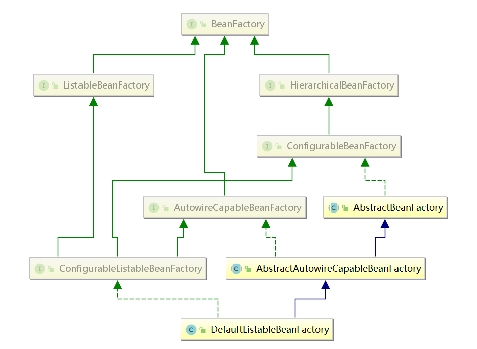
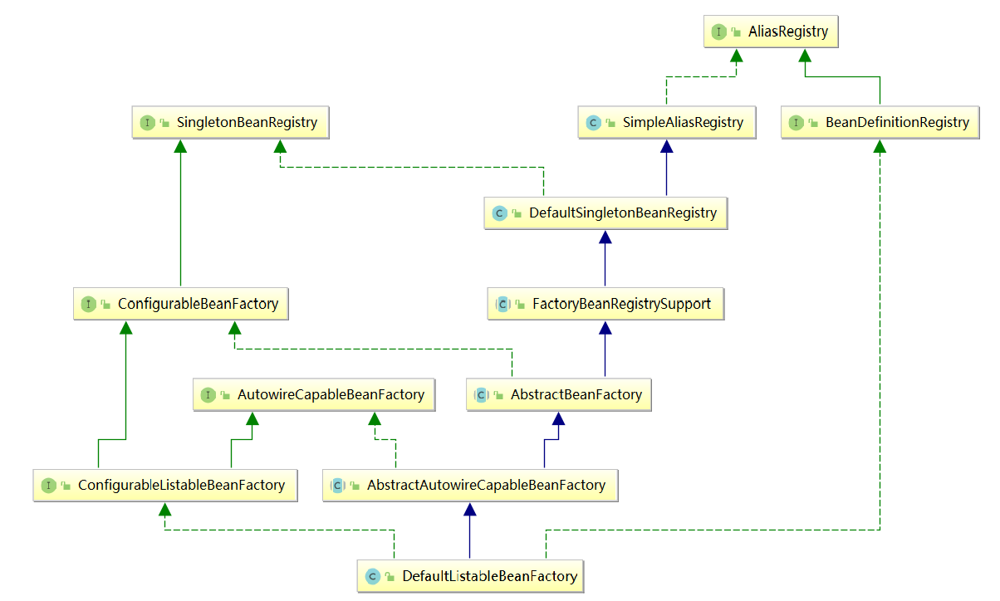
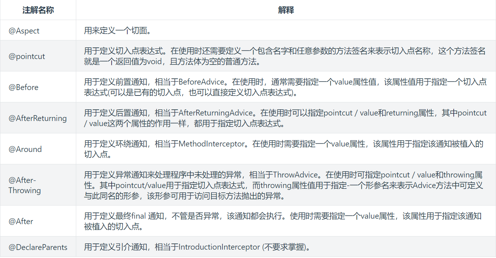
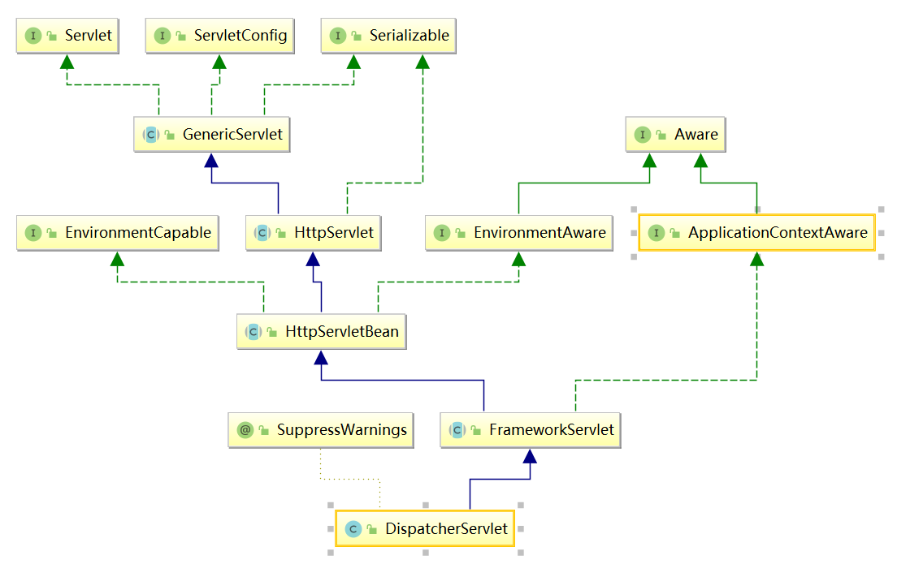

# Spring

---

### 1. Spring框架

##### 1.1 spring框架组成

Spring框架特性：

- 非侵入式：基于Spring开发的应用中的对象可以不依赖于Spring的API
- 控制反转：IOC——Inversion of Control，指的是将对象的创建权交给 Spring 去创建。使用 Spring 之前，对象的创建都是由我们自己在代码中new创建。而使用 Spring 之后。对象的创建都是给了 Spring 框架。
- 依赖注入：DI——Dependency Injection，是指依赖的对象不需要手动调用 setXX 方法去设置，而是通过配置赋值。
- 面向切面编程：Aspect Oriented Programming——AOP
- 容器：Spring 是一个容器，因为它包含并且管理应用对象的生命周期
- 组件化：Spring 实现了使用简单的组件配置组合成一个复杂的应用。在 Spring 中可以使用XML和Java注解组合这些对象。
- 一站式：在 IOC 和 AOP 的基础上可以整合各种企业应用的开源框架和优秀的第三方类库（实际上 Spring 自身也提供了表现层的 SpringMVC 和持久层的 Spring JDBC）

Spring组件：

* Core Container（Spring的核心容器）
  
  Spring 的核心容器是其他模块建立的基础，由 Beans 模块、Core 核心模块、Context 上下文模块和 SpEL 表达式语言模块组成。
  
  - **Beans 模块**：提供了框架的基础部分，包括控制反转和依赖注入。
  - **Core 核心模块**：封装了 Spring 框架的底层部分，包括资源访问、类型转换及一些常用工具类。
  - **Context 上下文模块**：建立在 Core 和 Beans 模块的基础之上，集成 Beans 模块功能并添加资源绑定、数据验证、国际化、Java EE 支持、容器生命周期、事件传播等。ApplicationContext 接口是上下文模块的焦点。
  - **SpEL 模块**：提供了强大的表达式语言支持，支持访问和修改属性值，方法调用，支持访问及修改数组、容器和索引器，命名变量，支持算数和逻辑运算，支持从 Spring 容器获取 Bean，它也支持列表投影、选择和一般的列表聚合等。

* AOP、Aspects、Instrumentation和Messaging
  
  在 Core Container 之上是 AOP、Aspects 等模块。
  
  - **AOP 模块**：提供了面向切面编程实现，提供比如日志记录、权限控制、性能统计等通用功能和业务逻辑分离的技术，并且能动态的把这些功能添加到需要的代码中，这样各司其职，降低业务逻辑和通用功能的耦合。
  - **Aspects 模块**：提供与 AspectJ 的集成，是一个功能强大且成熟的面向切面编程（AOP）框架。
  - **Instrumentation 模块**：提供了类工具的支持和类加载器的实现，可以在特定的应用服务器中使用。
  - **messaging 模块**：Spring 4.0 以后新增了消息（Spring-messaging）模块，该模块提供了对消息传递体系结构和协议的支持。
  - **jcl 模块**： Spring 5.x中新增了日志框架集成的模块。

* Data Access/Integration（数据访问／集成）
  
  数据访问／集成层包括 JDBC、ORM、OXM、JMS 和 Transactions 模块。
  
  - **JDBC 模块**：提供了一个 JDBC 的样例模板，使用这些模板能消除传统冗长的 JDBC 编码还有必须的事务控制，而且能享受到 Spring 管理事务的好处。
  - **ORM 模块**：提供与流行的“对象-关系”映射框架无缝集成的 API，包括 JPA、JDO、Hibernate 和 MyBatis 等。而且还可以使用 Spring 事务管理，无需额外控制事务。
  - **OXM 模块**：提供了一个支持 Object /XML 映射的抽象层实现，如 JAXB、Castor、XMLBeans、JiBX 和 XStream。将 Java 对象映射成 XML 数据，或者将XML 数据映射成 Java 对象。
  - **JMS 模块**：指 Java 消息服务，提供一套 “消息生产者、消息消费者”模板用于更加简单的使用 JMS，JMS 用于用于在两个应用程序之间，或分布式系统中发送消息，进行异步通信。
  - **Transactions 事务模块**：支持编程和声明式事务管理。

* Web模块
  
  spring 的 Web 层包括 Web、Servlet、WebSocket 和 Webflux 组件。
  
  - **Web 模块**：提供了基本的 Web 开发集成特性，例如多文件上传功能、使用的 Servlet 监听器的 IOC 容器初始化以及 Web 应用上下文。
  - **Servlet 模块**：提供了一个 Spring MVC Web 框架实现。Spring MVC 框架提供了基于注解的请求资源注入、更简单的数据绑定、数据验证等及一套非常易用的 JSP 标签，完全无缝与 Spring 其他技术协作。
  - **WebSocket 模块**：提供了简单的接口，用户只要实现响应的接口就可以快速的搭建 WebSocket Server，从而实现双向通讯。
  - **Webflux 模块**： Spring WebFlux 是 Spring Framework 5.x中引入的新的响应式web框架。与Spring MVC不同，它不需要Servlet API，是完全异步且非阻塞的，并且通过Reactor项目实现了Reactive Streams规范。Spring WebFlux 用于创建基于事件循环执行模型的完全异步且非阻塞的应用程序。
  - **Portlet 模块**：提供了在 Portlet 环境中使用 MVC 实现，类似 Web-Servlet 模块的功能。在Spring 5.x中已经移除。

* Test模块
  
  Spring 支持 Junit 和 TestNG 测试框架，而且还额外提供了一些基于 Spring 的测试功能，比如在测试 Web 框架时，模拟 Http 请求的功能。包含Mock Objects, TestContext Framework, Spring MVC Test, WebTestClient。

Spring场景架构：


##### 1.2 Spring控制反转(IOC)

###### 1.2.1 概念

Ioc—Inversion of Control，即“控制反转”，**不是什么技术，而是一种设计思想**。在Java开发中，Ioc意味着将你设计好的对象交给容器控制，而不是传统的在你的对象内部直接控制。

DI—Dependency Injection，即依赖注入：组件之间依赖关系由容器在运行期决定，形象的说，即由容器动态的将某个依赖关系注入到组件之中。依赖注入的目的并非为软件系统带来更多功能，而是为了提升组件重用的频率，并为系统搭建一个灵活、可扩展的平台。通过依赖注入机制，我们只需要通过简单的配置，而无需任何代码就可指定目标需要的资源，完成自身的业务逻辑，而不需要关心具体的资源来自何处，由谁实现。

###### 1.2.2 IOC配置的三种方式

* XML配置：
  
  * 优点：可以使用于任何场景，结构清晰，通俗易懂
  
  * 缺点：配置繁琐，不易维护，枯燥无味，扩展性差

* Java配置：将类的创建交给我们配置的JavcConfig类来完成，Spring只负责维护和管理，采用纯Java创建方式。其本质上就是把在XML上的配置声明转移到Java配置类中。
  
  * 优点：适用于任何场景，配置方便，因为是纯Java代码，扩展性高，十分灵活。
  
  * 缺点：由于是采用Java类的方式，声明不明显，如果大量配置，可读性比较差。
  
  ```java
  /**
   * 创建一个配置类， 添加@Configuration注解声明为配置类
   * 创建方法，方法上加上@bean，该方法用于创建实例并返回，
   * 该实例创建后会交给spring管理，方法名建议与实例名相同（首字母小写）。
   * 注：实例类不需要加任何注解
   **/
  @Configuration
  public class BeansConfig {
      /**
       * @return user dao
       */
      @Bean("userDao")
      public UserDaoImpl userDao() {
          return new UserDaoImpl();
      }
  
      /**
       * @return user service
       */
      @Bean("userService")
      public UserServiceImpl userService() {
          UserServiceImpl userService = new UserServiceImpl();
          userService.setUserDao(userDao());
          return userService;
      }
  }
  ```

* 注解配置：配置了Spring的注解扫描器，Spring会自动扫描带有@Component，@Controller，@Service，@Repository这四个注解的类，然后帮我们创建并管理。
  
  * 优点：开发便捷，通俗易懂，方便维护。
  
  * 缺点：具有局限性，对于一些第三方资源，无法添加注解。只能采用XML或JavaConfig的方式配置。
  
  设置ComponentScan的basePackage, 比如`<context:component-scan base-package='com.czx.springframework'>`, 或者`@ComponentScan("com.czx.springframework")`注解，或者 `new AnnotationConfigApplicationContext("com.czx.springframework")`指定扫描的basePackage。

###### 1.2.3 依赖注入的三种方式

常用的注入方式主要有三种：构造方法注入（Construct注入），setter注入，基于注解的注入（接口注入）。

* setter方式：在XML配置方式中，property都是setter方式注入，比如下面的xml:
  
  ```xml
  <bean id="userService" class="com.czx.UserServiceImpl">
      <property name="userDao" ref="userDao"/>
  </bean>
  ```
  
  本质上包含两步：
  
  1. 第一步：需要new UserServiceImpl()创建对象, 所以需要默认构造函数
  2. 第二步：调用setUserDao()函数注入userDao的值, 所以需要setUserDao()函数
  
  在Spring3.x刚推出的时候，推荐使用注入的就是这种, 但是这种方式比较麻烦，所以在Spring4.x版本中推荐构造函数注入。

* 构造函数方式：在XML配置方式中，`<constructor-arg>`是通过构造函数参数注入，比如下面的xml:
  
  ```xml
  <bean id="userService" class="com.czx.UserServiceImpl">
      <constructor-arg name="userDao" ref="userDao"/>
  </bean>
  ```
  
  本质上是new UserServiceImpl(userDao)创建对象。
  
  在Spring4.x版本中推荐的注入方式就是这种。

* 注解注入：以@Autowired（自动注入）注解注入为例，修饰符有三个属性：Constructor，byType，byName。默认按照byType注入。
  
  - **constructor**：通过构造方法进行自动注入，spring会匹配与构造方法参数类型一致的bean进行注入，如果有一个多参数的构造方法，一个只有一个参数的构造方法，在容器中查找到多个匹配多参数构造方法的bean，那么spring会优先将bean注入到多参数的构造方法中。
  - **byName**：被注入bean的id名必须与set方法后半截匹配，并且id名称的第一个单词首字母必须小写。
  - **byType**：查找所有的set方法，将符合符合参数类型的bean注入。
  
  @Autowired和@Resource以及@Inject
  
  - Autowired注解：
    
    1. @Autowired是Spring自带的注解，通过。AutowiredAnnotationBeanPostProcessor 类实现的依赖注入。
    
    2. @Autowired可以作用在CONSTRUCTOR、METHOD、PARAMETER、FIELD、ANNOTATION_TYPE。
    
    3. @Autowired默认是根据类型（byType ）进行自动装配的。
    
    4. 如果有多个类型一样的Bean候选者，需要指定按照名称（byName ）进行装配，则需要配合@Qualifier。
    
    5. 也可以将@Autowired中required配置为false，如果配置为false之后，当没有找到相应bean的时候，系统不会抛异常。
  
  - Resource注解：
    
    1. @Resource是JSR250规范的实现，在javax.annotation包下。
    
    2. @Resource可以作用TYPE、FIELD、METHOD上。
    
    3. @Resource是默认根据属性名称进行自动装配的，如果有多个类型一样的Bean候选者，则可以通过name进行指定进行注入。
  
  - Inject注解：
    
    1. @Inject是JSR330 (Dependency Injection for Java)中的规范，需要导入javax.inject.Inject jar包 ，才能实现注入。
    
    2. @Inject可以作用CONSTRUCTOR、METHOD、FIELD上。
    
    3. @Inject是根据类型进行自动装配的，如果需要按名称进行装配，则需要配合@Named。

###### 1.2.4 IOC体系结构

**BeanFactory**：



* **BeanFactory**：作为最顶层的一个接口类，它定义了IOC容器的基本功能规范，BeanFactory 有三个子类：ListableBeanFactory、HierarchicalBeanFactory 和AutowireCapableBeanFactory。
- **ListableBeanFactory**：该接口定义了访问容器中 Bean 基本信息的若干方法，如查看Bean 的个数、获取某一类型 Bean 的配置名、查看容器中是否包括某一 Bean 等方法；
- **HierarchicalBeanFactory**：父子级联 IoC 容器的接口，子容器可以通过接口方法访问父容器； 通过 HierarchicalBeanFactory 接口， Spring 的 IoC 容器可以建立父子层级关联的容器体系，子容器可以访问父容器中的 Bean，但父容器不能访问子容器的 Bean。Spring 使用父子容器实现了很多功能，比如在 Spring MVC 中，展现层 Bean 位于一个子容器中，而业务层和持久层的 Bean 位于父容器中。这样，展现层 Bean 就可以引用业务层和持久层的 Bean，而业务层和持久层的 Bean 则看不到展现层的 Bean。
- **AutowireCapableBeanFactory**：定义了将容器中的 Bean 按某种规则（如按名字匹配、按类型匹配等）进行自动装配的方法；
- **ConfigurableBeanFactory**：继承HierarchicalBeanFactory接口，是一个重要的接口，增强了 IoC 容器的可定制性，它定义了设置类装载器、属性编辑器、容器初始化后置处理器等方法。
- **ConfigurableListableBeanFactory**：ListableBeanFactory 和 ConfigurableBeanFactory的融合。
- **DefaultListableBeanFactory**：实现了ConfigurableListableBeanFactory，这个类也是AbstractAplicationContext类中refresh方法中obtainFreshBeanFactory()获取的工厂类。

**Registry**：



* **AliasRegistry**：用于管理别名的公共接口，定义对别名的简单增删等操作。

* **SimpleAliasRegistry**：AliasRegistry实现类，**aliasMap**存放alias标签中alias和name的映射关系。或者bean标签中name和id的映射关系(这里可以把name看成是id的alias)。如下例中map中会存放4条数据：a-->simpleBean，b-->simpleBeam，            bean-->a，bean1-->simpleBean。
  
  ```xml
  <bean id="simpleBean" name="a,b" class="com.nursery.spring.SimpleBean"/>
  <alias name="a" alias="bean"/>
  <alias name="simpleBean" alias="bean1"/>
  ```
  
  通过别名alias去获取bean实例时，会在doGetBean中调用transformedBeanName方法获取bean的id，transformedBeanName方法中调用SimpleAliasRegistry中的canonicalName方法。canonicalName会根据alias名从aliasMap中获取name，然后将name再从aliasMap中获取，一直循环获取直到获取不到值，这样就能够找到bean的id。
  
  ```java
  public String canonicalName(String name) {
      String canonicalName = name;
      // Handle aliasing...
      String resolvedName;
      do {
          resolvedName = this.aliasMap.get(canonicalName);
          if (resolvedName != null) {
              canonicalName = resolvedName;
          }
      }
      while (resolvedName != null);
      return canonicalName;
  }
  ```

* **BeanDefinitionRegistry**：继承AliasRegistry具体AliasRegistry所有的功能，同时提供了对BeanDefinition注册、移除，获取等基本操作。

* **DefaultListableBeanFactory**：实现了BeanDefinitionRegistry接口，核心方法registerBeanDefinition用于注册BeanDefinition，类中**beanDefinitionMap**存放beanId和BeanDefinition对象的映射关系。

* **SingletonBeanRegistry**：定义了操作单例Bean实例注册、获取、判断是否存在等基本操作。

* **DefaultSingletonBeanRegistry**：SingletonBeanRegistry接口实现类，它不仅实现了SingletonBeanRegistry的基础方法，还针对单例Bean扩展了许多功能。如存储 Bean 之间的依赖关系、存储 Bean 的包含关系（外部类包含内部类）、获取 Bean 所处的状态（正在创建、创建完毕等）、回调销毁 Bean 时触发的 destroy 方法等。此类中还存放了**单例Bean的三级缓存**。
  
  ```java
  /** Cache of singleton objects: bean name --> bean instance */
  private final Map<String, Object> singletonObjects = new ConcurrentHashMap<String, Object>(64);
  /** Cache of early singleton objects: bean name --> bean instance */
  private final Map<String, Object> earlySingletonObjects = new HashMap<String, Object>(16);
  /** Cache of singleton factories: bean name --> ObjectFactory */
  private final Map<String, ObjectFactory<?>> singletonFactories = new HashMap<String, ObjectFactory<?>>(16);
  ```

**BeanDefinition**:

BeanDefinition主要是用来描述Bean，存储Bean的相关信息，主要包括：Bean的属性、是否单例、延迟加载、Bean的名称、构造方法等。

**ApplicationContext**：

IoC容器的接口类是ApplicationContext，继承BeanFactory对Bean规范（最基本的ioc容器的实现）进行定义。而ApplicationContext表示的是应用的上下文，除了对Bean的管理外，还至少应该包含了访问资源、国际化、应用时间等功能。

* 接口设计：
  
  
  
  - **HierarchicalBeanFactory 和 ListableBeanFactory**： ApplicationContext 继承了 HierarchicalBeanFactory 和 ListableBeanFactory 接口，在此基础上，还通过多个其他的接口扩展了 BeanFactory 的功能：
  - **ApplicationEventPublisher**：让容器拥有发布应用上下文事件的功能，包括容器启动事件、关闭事件等。实现了 ApplicationListener 事件监听接口的 Bean 可以接收到容器事件 ， 并对事件进行响应处理 。 在 ApplicationContext 抽象实现类AbstractApplicationContext 中，我们可以发现存在一个 ApplicationEventMulticaster，它负责保存所有监听器，以便在容器产生上下文事件时通知这些事件监听者。
  - **MessageSource**：为应用提供 i18n 国际化消息访问的功能；
  - **ResourcePatternResolver**：所有ApplicationContext 实现类都实现了类似于PathMatchingResourcePatternResolver 的功能，可以通过带前缀的 Ant 风格的资源文件路径装载 Spring 的配置文件。
  - **LifeCycle**：该接口是 Spring 2.0 加入的，该接口提供了 start()和 stop()两个方法，主要用于控制异步处理过程。在具体使用时，该接口同时被 ApplicationContext 实现及具体 Bean 实现， ApplicationContext 会将 start/stop 的信息传递给容器中所有实现了该接口的 Bean，以达到管理和控制 JMX、任务调度等目的。

* 接口实现
  
  
  
  ConfigurableApplicationContext扩展于 ApplicationContext，它新增加了两个主要的方法： refresh()和 close()，让 ApplicationContext 具有启动、刷新和关闭应用上下文的能力。在应用上下文关闭的情况下调用 refresh()即可启动应用上下文，在已经启动的状态下，调用 refresh()则清除缓存并重新装载配置信息，而调用close()则可关闭应用上下文。这些接口方法为容器的控制管理带来了便利，但作为开发者，我们并不需要过多关心这些方法。AbstractApplicationContext实现了它。
  
  **从是Bean是否刷新来分：**
  
  - **GenericApplicationContext**： 是初始化的时候就创建容器，往后的每次refresh都不会更改
  
  - **AbstractRefreshableApplicationContext**： AbstractRefreshableApplicationContext及子类的每次refresh都是先清除已有(如果不存在就创建)的容器，然后再重新创建；AbstractRefreshableApplicationContext及子类无法做到GenericApplicationContext**混合搭配从不同源头获取bean的定义信息**
  
  **从加载的源来分（比如xml,groovy,annotation等）：**
  
  - **FileSystemXmlApplicationContext**： 从文件系统下的一个或多个xml配置文件中加载上下文定义，也就是说系统盘符中加载xml配置文件。
  - **ClassPathXmlApplicationContext**： 从类路径下的一个或多个xml配置文件中加载上下文定义，适用于xml配置的方式。
  - **AnnotationConfigApplicationContext**： 从一个或多个基于java的配置类中加载上下文定义，适用于java注解的方式。

###### 1.2.5 IOC初始化过程

Spring IoC容器对Bean定义资源的载入是从refresh()函数开始的，refresh()是一个模板方法，refresh()方法的作用是：在创建IoC容器前，如果已经有容器存在，则需要把已有的容器销毁和关闭，以保证在refresh之后使用的是新建立起来的IoC容器。refresh的作用类似于对IoC容器的重启，在新建立好的容器中对容器进行初始化，对Bean定义资源进行载入。

```java
public void refresh() throws BeansException, IllegalStateException {
    synchronized (this.startupShutdownMonitor) {
        StartupStep contextRefresh = this.applicationStartup.start("spring.context.refresh");
        // Prepare this context for refreshing.
        prepareRefresh();
        // Tell the subclass to refresh the internal bean factory.
        ConfigurableListableBeanFactory beanFactory = obtainFreshBeanFactory();
        // Prepare the bean factory for use in this context.
        prepareBeanFactory(beanFactory);
        try {
            // Allows post-processing of the bean factory in context subclasses.
            postProcessBeanFactory(beanFactory);
            StartupStep beanPostProcess = this.applicationStartup.start("spring.context.beans.post-process");
            // Invoke factory processors registered as beans in the context.
            invokeBeanFactoryPostProcessors(beanFactory);
            // Register bean processors that intercept bean creation.
            registerBeanPostProcessors(beanFactory);
            beanPostProcess.end();
            // Initialize message source for this context.
            initMessageSource();
            // Initialize event multicaster for this context.
            initApplicationEventMulticaster();
            // Initialize other special beans in specific context subclasses.
            onRefresh();
            // Check for listener beans and register them.
            registerListeners();
            // Instantiate all remaining (non-lazy-init) singletons.
            finishBeanFactoryInitialization(beanFactory);
            // Last step: publish corresponding event.
            finishRefresh();
        }
        catch (BeansException ex) {
            // Destroy already created singletons to avoid dangling resources.
            destroyBeans();
            // Reset 'active' flag.
            cancelRefresh(ex);
            // Propagate exception to caller.
            throw ex;
        }
        finally {
            // Reset common introspection caches in Spring's core, since we
            // might not ever need metadata for singleton beans anymore...
            resetCommonCaches();
            contextRefresh.end();
        }
    }
}
```

###### 1.2.6 Bean实例化

实例化的调用方法链：getBean --> doGetBean --> createBean --> doCreateBean

**Spring中Bean的生命周期：**

Spring 只帮我们管理单例模式 Bean 的完整生命周期，对于 prototype 的 bean ，每次请求 prototype 作用域的 Bean 时，Spring 容器都会创建一个新的实例，Spring 在创建好交给使用者之后则不会再管理后续的生命周期。

Bean生命周期过程：

**创建**：

1. 实例化对象：createBeanInstance

2. 给对象自定义属性赋值：populateBean

3. 初始化对象：initializeBean
   
   1. 给对象**容器内部对象**属性赋值：invokeAwareMethods，给实现aware接口的类的对应容器属性赋值。
   
   2. 调用BeanPostProcessor前置方法：applyBeanPostProcessorsBeforeInitialization
   
   3. 调用初始化方法：invokeInitMethods
      
      1. 给实现InitializingBean接口的类调用bean中重写的afterPropertiesSet方法。
      
      2. 调用init-method方法：invokeCustomInitMethod。
   
   4. 调用BeanPostProcessor后置方法：applyBeanPostProcessorsAfterInitialization
   
   5. 注册Destruction回调接口：registerDisposableBeanIfNecessary，给实现DisposableBean接口的类或者定义了destroy-method的方法的类注册DisposableBeanAdapter实例的回调函数。

**使用中**

**销毁**：调用DisposableBeanAdapter.destory方法

1. 给实现DisposableBean接口的类调用bean中重写的destroy方法。

2. 调用destory-method方法：invokeCustomDestroyMethod。

**Spring中Bean的循环依赖：**

只能解决单例并且是通过setter方法注入的循环依赖问题

**前提：**

1. 单例模式下容器是先获取bean获取不到再去创建bean。容器是从三级缓存中获取bean，先从一级获取，获取不到再从二级获取，获取不到最后从三级获取。

2. 三级缓存存放在DefaultSingletonBeanRegistry中：
   
   * 一级缓存：存放已经实例化并且已经给属性赋值的完整对象。
   
   * 二级缓存：存放已经实例化但是没有给属性赋值的半成品对象。
   
   * 三级缓存：存放ObjectFactory对象的实例工厂。
   
   ```java
   /** Cache of singleton objects: bean name --> bean instance */
   private final Map<String, Object> singletonObjects = new ConcurrentHashMap<String, Object>(64);
   /** Cache of early singleton objects: bean name --> bean instance */
   private final Map<String, Object> earlySingletonObjects = new HashMap<String, Object>(16);
   /** Cache of singleton factories: bean name --> ObjectFactory */
   private final Map<String, ObjectFactory<?>> singletonFactories = new HashMap<String, ObjectFactory<?>>(16);
   ```

3. doCreate中实例化和初始化是分开的步骤，并且在实例化之后就新建ObjectFactory对象并且把beanName，md实例，bean实例放到ObjectFactory实例内。

**过程：**

假设有A和B两个Bean，A中持有B对象，B中持有A对象

1. 对A进行实例化，新建ObjectFactory对象，将A的实例放入其中，且将ObjectFactory实例放入3级缓存中。

2. 对A中类型为B的属性赋值，在1,2,3级缓存没有找到B的实例，对B进行实例化，新建ObjectFactory对象，将B的实例放入其中，且将ObjectFactory实例放入3级缓存中。

3. 对B中类型为A的属性赋值，在3级缓存中找到beanName为a的ObjectFactory对象，然后执行ObjectFactory中的getObject方法获取到A半成品的对象放入2级缓存中删除3缓存中的a。**如果A对象存在代理，则返回A的代理对象放入2级缓存中。** 并将2级缓存中A的实例赋值给B的a属性。

4. B对象完成创建放入1级缓存中，并返回给A实例。对A实例中的b对象进行赋值。A完成初始化放入1级缓存中，A，B对象完成创建。

##### 1.3 Spring面向切面编程(AOP)

###### 1.3.1 概念

- **连接点（Jointpoint）**：表示需要在程序中插入横切关注点的扩展点，**连接点可能是类初始化、方法执行、方法调用、字段调用或处理异常等等**，Spring只支持方法执行连接点，在AOP中表示为**在哪里干**；

- **切入点（Pointcut）**： 选择一组相关连接点的模式，即可以认为连接点的集合，Spring支持perl5正则表达式和AspectJ切入点模式，Spring默认使用AspectJ语法，在AOP中表示为**在哪里干的集合**；

- **通知（Advice）**：在连接点上执行的行为，通知提供了在AOP中需要在切入点所选择的连接点处进行扩展现有行为的手段；包括前置通知（before advice）、后置通知(after advice)、环绕通知（around advice），在Spring中通过代理模式实现AOP，并通过拦截器模式以环绕连接点的拦截器链织入通知；在AOP中表示为**干什么**；

- **方面/切面（Aspect）**：横切关注点的模块化，比如上边提到的日志组件。可以认为是通知、引入和切入点的组合；在Spring中可以使用Schema和@AspectJ方式进行组织实现；在AOP中表示为**在哪干和干什么集合**；

- **引入（inter-type declaration）**：也称为内部类型声明，为已有的类添加额外新的字段或方法，Spring允许引入新的接口（必须对应一个实现）到所有被代理对象（目标对象）, 在AOP中表示为**干什么（引入什么）**；

- **目标对象（Target Object）**：需要被织入横切关注点的对象，即该对象是切入点选择的对象，需要被通知的对象，从而也可称为被通知对象；由于Spring AOP 通过代理模式实现，从而这个对象永远是被代理对象，在AOP中表示为**对谁干**；

- **织入（Weaving）**：把切面连接到其它的应用程序类型或者对象上，并创建一个被通知的对象。这些可以在编译时（例如使用AspectJ编译器），类加载时和运行时完成。Spring和其他纯Java AOP框架一样，在运行时完成织入。在AOP中表示为**怎么实现的**；

- **AOP代理（AOP Proxy）**：AOP框架使用代理模式创建的对象，从而实现在连接点处插入通知（即应用切面），就是通过代理来对目标对象应用切面。在Spring中，AOP代理可以用JDK动态代理或CGLIB代理实现，而通过拦截器模型应用切面。在AOP中表示为**怎么实现的一种典型方式**。

###### 1.3.2 AspectJ

AspectJ是一个java实现的AOP框架，它能够对java代码进行AOP编译（一般在编译期进行），让java代码具有AspectJ的AOP功能（当然需要特殊的编译器）。

ApectJ采用的是静态织入的方式。ApectJ主要采用的是编译期织入，在这个期间使用AspectJ的acj编译器(类似javac)把aspect类编译成class字节码后，在java目标类编译时织入，即先编译aspect类再编译目标类。


###### 1.3.3 SpringAOP引入AspectJ

在Spring 2.0使用了和AspectJ 5一样的注解，并使用AspectJ来做切入点解析和匹配。但是，AOP在运行时仍旧是纯的Spring AOP，并不依赖于AspectJ的编译器或者织入器（weaver）。

Spring 2.5对AspectJ的支持：在一些环境下，增加了对AspectJ的装载时编织支持，同时提供了一个新的bean切入点。

###### 1.3.4 Spring配置方式

* XML Schema配置方式
  
  ```xml
  <aop:config>
      <!-- 配置切面 -->
      <aop:aspect ref="logAspect">
          <!-- 配置切入点 -->
          <aop:pointcut id="pointCutMethod" expression="execution(* *.*(..))"/> 
          <!-- 环绕通知 -->
          <aop:around method="doAround" pointcut-ref="pointCutMethod"/>
          <!-- 前置通知 -->
          <aop:before method="doBefore" pointcut-ref="pointCutMethod"/>
          <!-- 后置通知；returning属性：用于设置后置通知的第二个参数的名称，类型是Object -->
          <aop:after-returning method="doAfterReturning" pointcut-ref="pointCutMethod" returning="result"/>
          <!-- 异常通知：如果没有异常，将不会执行增强；throwing属性：用于设置通知第二个参数的的名称、类型-->
          <aop:after-throwing method="doAfterThrowing" pointcut-ref="pointCutMethod" throwing="e"/>
          <!-- 最终通知 -->
          <aop:after method="doAfter" pointcut-ref="pointCutMethod"/>
      </aop:aspect>
  </aop:config>
  ```

* AspectJ注解方式
  
  

###### 1.3.5 SpringAOP动态代理方式

Spring AOP的实现方式是动态织入，动态织入的方式是在运行时动态将要增强的代码织入到目标类中，这样往往是通过动态代理技术完成的；**如Java JDK的动态代理(Proxy，底层通过反射实现)或者CGLIB的动态代理(底层通过继承实现)**，Spring AOP采用的就是基于运行时增强的代理技术。

##### 1.4 Spring事务

###### 1.4.1 事务的隔离级别

1. **DEFAULT**： Spring 中默认的事务隔离级 ，以连接的数据库的事务隔离级别为准；

2. **READ_UNCOMMITTED**：读未提交，也叫未提交读，该隔离级别的事务可以看到其他事务中未提交的数据。该隔离级别因为可以读取到其他事务中未提交的数据，而未提交的数据可能会发生回滚，因此我们把该级别读取到的数据称之为脏数据，把这个问题称之为脏读；

3. **READ_COMMITTED**：读已提交，也叫提交读，该隔离级别的事务能读取到已经提交事务的数据，因此它不会有脏读问题。但由于在事务的执行中可以读取到其他事务提交的结果，所以在不同时间的相同 SQL 查询中，可能会得到不同的结果，这种现象叫做不可重复读；

4. **REPEATABLE_READ**：可重复读，它能确保同一事务多次查询的结果一致。但也会有新的问题，比如此级别的事务正在执行时，另一个事务成功的插入了某条数据，但因为它每次查询的结果都是一样的，所以会导致查询不到这条数据，自己重复插入时又失败（因为唯一约束的原因）。明明在事务中查询不到这条信息，但自己就是插入不进去，这就叫幻读 （Phantom Read）；

5. **SERIALIZABLE**：串行化，最高的事务隔离级别，它会强制事务排序，使之不会发生冲突，从而解决了脏读、不可重复读和幻读问题，但因为执行效率低，所以真正使用的场景并不多。

###### 1.4.2 事务的传播属性

1. **REQUIRED**：支持当前事务，如果没有就新建事务，**spring默认的事务传播机制。**

2. **REQUIRES_NEW**：无论当前是否有事务，都会新起一个事务

3. **SUPPORTS**：支持当前事务，如果没有就不以事务的方式运行

4. **NOT_SUPPORTED**：不支持事务，如果当前存在事务，就将此事务挂起不以事务方式运行

5. **NESTED(嵌套)**：如果当前存在事务，在当前事务中再新起一个事务

6. **NEVER**：不支持事务，如果有事务就抛异常

7. **MANDATORY(强制的)**：支持当前事务，如果当前没事务就抛异常

##### 1.5 SpringMVC

###### 1.5.1 概念

mvc模块介绍：

- **Model**（模型）是应用程序中用于处理应用程序数据逻辑的部分。通常模型对象负责在数据库中存取数据。
- **View**（视图）是应用程序中处理数据显示的部分。通常视图是依据模型数据创建的。
- **Controller**（控制器）是应用程序中处理用户交互的部分。通常控制器负责从视图读取数据，控制用户输入，并向模型发送数据。

SpringMVC介绍：

Spring Web MVC 是一种基于Java 的实现了Web MVC 设计模式的请求驱动类型的轻量级Web 框架，即使用了MVC架构模式的思想，将 web 层进行职责解耦，基于请求驱动指的就是使用请求-响应模型，帮助我们简化开发。

###### 1.5.2 SpringMVC初始化过程

**初始化ContextLoaderListener监听器：**

org.springframework.web.context.ContextLoaderListener监听器配置在web.xml中，serlvet容器启动时调用ContextLoaderListener.contextInitialized方法，方法内调用initWebApplicationContext方法创建XmlWebApplicationContext实例并且执行refresh方法初始化容器。

**初始化DispatcherServlet**：

DispatcherServlet 需要 WebApplicationContext（继承自 ApplicationContext） 来配置。WebApplicationContext 可以链接到ServletContext 和 Servlet。因为绑定了 ServletContext，这样应用程序就可以在需要的时候使用 RequestContextUtils 的静态方法访问 WebApplicationContext。



1. servlet容器在创建servlet对象时会先调用该servlet的init方法。DispathcherServlet继承自HttpServletBean类中。

2. init方法中读取web.xml中servlet的配置并调用initServletBean()方法，具体实现位于FrameworkServlet类中。

3. 调用initWebApplicationContext方法，initWebApplicationContext用来初始化和刷新WebApplicationContext。

4. 调用createWebApplicationContext方法来创建XmlWebApplicationContext并把监听器里面监听的ApplicationContext设置为父容器。

5. 调用configureAndRefreshWebApplicationContext来执行refresh初始化容器。

6. 在initWebApplicationContext中调用完createWebApplicationContext方法，调用onRefresh方法，实际调用DispatcherServlet重写的onRefresh方法。

7. 调用initStrategies方法初始化DispatcherServlet中的组件。

###### 1.5.3 DispatcherServlet执行流程

 

调用DispatcherServlet中的doDispatch方法执行主流程。

1. 调用getHandler方法，getHandler中先获取HandlerMapping对象，然后调用HandlerMapping的getHandler方法获取HandlerExecutionChain对象，HandlerExecutionChain内部包含一个HandlerIntercepter集合和一个Handler对象。HandlerIntercepter集合用于在Handler方法前后拦截执行。

2. 调用getHandlerAdapter方法，循环遍历handlerAdapters看哪个handlerAdapter.supports当前Handler，返回第一个适配的HandlerAdapter对象。

3. 调用HandlerExecutionChain对象的applyPreHandle方法，方法内遍历HandlerIntercepter集合，调用HandlerIntercepter中的preHandle方法。

4. 调用HandlerAdapter对象中的handle方法，方法内调用handleInternal方法，方法内调用invokeHandlerMethod方法，调用Handler的相关方法执行目标方法。

RequestMapping中invokeHandlerMethod方法的实现步骤：

---

### 2. SpringBoot
