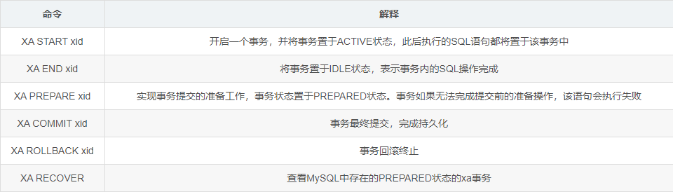
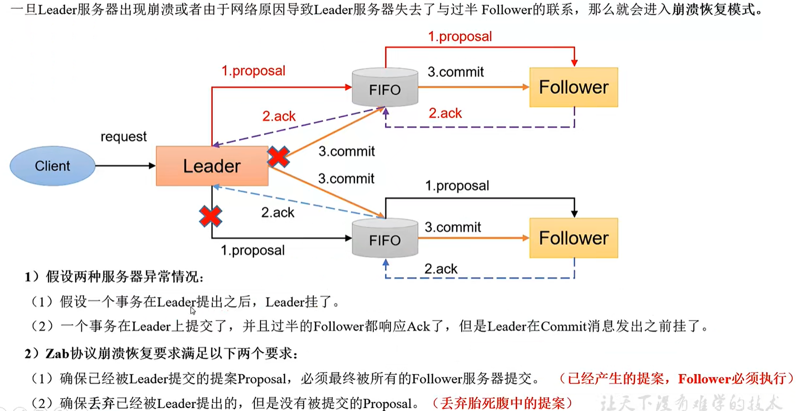

# 分布式

---

### 1. 分布式理论

##### 1.1 分布式系统特点

* **分布性**：
  
  分布式系统中的多台计算机之间在空间位置上可以随意分布，同时，机器的分布情况也会随时变动。

* **对等性**：
  
  分布式系统中的计算机没有主／从之分，即没有控制整个系统的主机，也没有被控制的从机，组成分布式系统的所有计算机节点都是对等的。

* **自治性**：
  
  分布式系统中的各个节点都包含自己的处理机和内存，各自具有独立的处理数据的功能。通常，彼此在地位上是平等的，无主次之分，既能自治地进行工作，又能利用共享的通信线路来传送信息，协调任务处理。

* **并发性：**
  
  一个分布式系统中的多个节点，可能会并发地操作一些共享的资源。

##### 1.2 分布式系统面临的问题

* **缺乏全局时钟**:
  
  在分布式系统中，很难定义两个事件究竟谁先谁后，原因就是因为分布式系统缺乏一个全局的时钟序列控制。

* **机器宕机**:
  
  机器宕机是最常见的异常之一。在大型集群中每日宕机发生的概率为千分之一左右，在实践中，一台宕机的机器恢复的时间通常认为是24 小时，一般需要人工介入重启机器。

* **网络异常：**
  
  1. 消息丢失，两片节点之间彼此完全无法通信，即出现了“网络分化”；
  
  2. 消息乱序，有一定的概率不是按照发送时的顺序依次到达目的节点，考虑使用序列号等机制处理网络消息的乱序问题，使得无效的、过期的网络消息不影响系统的正确性；
  
  3. 数据错误；不可靠的TCP，TCP 协议为应用层提供了可靠的、面向连接的传输服务，但在分布式系统的协议设计中不能认为所有网络通信都基于TCP 协议则通信就是可靠的。TCP协议只能保证同一个TCP 链接内的网络消息不乱序，TCP 链接之间的网络消息顺序则无法保证。

* **分布式三态：**
  
  如果某个节点向另一个节点发起RPC(Remote procedure call)调用，即某个节点A 向另一个节点B 发送一个消息，节点B 根据收到的消息内容完成某些操作，并将操作的结果通过另一个消息返回给节点A，那么这个RPC 执行的结果有三种状态：“成功”、“失败”、“超时（未知）”，称之为分布式系统的三态。

* **存储数据丢失：**
  
  对于有状态节点来说，数据丢失意味着状态丢失，通常只能从其他节点读取、恢复存储的状态。 异常处理原则：任何在设计阶段考虑到的异常情况一定会在系统实际运行中发生，但在系统实际运行遇到的异常却很有可能在设计时未能考虑，所以，除非需求指标允许，在系统设计时不能放过任何异常情况。

##### 1.3 分布式系统指标

* **性能：**
  
  系统的吞吐能力，指系统在某一时间可以处理的数据总量，通常可以用系统每秒处理的总的数据量来衡量；系统的响应延迟，指系统完成某一功能需要使用的时间；系统的并发能力，指系统可以同时完成某一功能的能力，通常也用QPS(query per second)来衡量。上述三个性能指标往往会相互制约，追求高吞吐的系统，往往很难做到低延迟；系统平均响应时间较长时，也很难提高QPS。

* **可用性：**
  
  系统的可用性(availability)指系统在面对各种异常时可以正确提供服务的能力。系统的可用性可以用系统停服务的时间与正常服务的时间的比例来衡量，也可以用某功能的失败次数与成功次数的比例来衡量。可用性是分布式的重要指标，衡量了系统的鲁棒性，是系统容错能力的体现。

* **可扩展性：**
  
  系统的可扩展性(scalability)指分布式系统通过扩展集群机器规模提高系统性能（吞吐、延迟、并发）、存储容量、计算能力的特性。好的分布式系统总在追求“线性扩展性”，也就是使得系统的某一指标可以随着集群中的机器数量线性增长。

* **一致性：**
  
  分布式系统为了提高可用性，总是不可避免的使用副本的机制，从而引发副本一致性的问题。越是强的一致的性模型，对于用户使用来说使用起来越简单。

##### 1.4 CAP理论

CAP理论是分布式系统、特别是分布式存储领域中被讨论的最多的理论。其中C代表一致性 (Consistency)，A代表可用性 (Availability)，P代表分区容错性 (Partition tolerance)。CAP理论告诉我们C、A、P三者不能同时满足，最多只能满足其中两个。

- `一致性 (Consistency)`: 一个写操作返回成功，那么之后的读请求都必须读到这个新数据；如果返回失败，那么所有读操作都不能读到这个数据。所有节点访问同一份最新的数据。
- `可用性 (Availability)`: 对数据更新具备高可用性，请求能够及时处理，不会一直等待，即使出现节点失效。
- `分区容错性 (Partition tolerance)`: 能容忍网络分区，在网络断开的情况下，被分隔的节点仍能正常对外提供服务。

##### 1.5 BASE理论

BASE是“Basically Available, Soft state, Eventually consistent(基本可用、软状态、最终一致性)”的首字母缩写。其中的软状态和最终一致性这两种技巧擅于对付存在分区的场合，并因此提高了可用性。BASE 理论是对 CAP 理论的延伸，核心思想是即使无法做到强一致性（Strong Consistency，CAP 的一致性就是强一致性），但应用可以采用适合的方式达到最终一致性（Eventual Consitency）。

- **Basically Available**（基本可用）分布式系统在出现不可预知故障的时候，允许损失部分可用性

- **Soft state**（软状态）软状态也称为弱状态，和硬状态相对，是指允许系统中的数据存在中间状态，并认为该中间状态的存在不会影响系统的整体可用性，即允许系统在不同节点的数据副本之间进行数据同步的过程存在延时。

- **Eventually consistent**（最终一致性）最终一致性强调的是系统中所有的数据副本，在经过一段时间的同步后，最终能够达到一个一致的状态。因此，最终一致性的本质是需要系统保证最终数据能够达到一致，而不需要实时保证系统数据的强一致性。

##### 1.6 AKF理论

AKF 立方体也叫做scala cube，旨在提供一个系统化的扩展思路。AKF 把系统扩展分为以下三个维度：

- X 轴：直接水平复制应用进程来扩展系统。
- Y 轴：将功能拆分出来扩展系统。
- Z 轴：基于用户信息扩展系统。

---

### 2. 一致性算法

##### 2.1 一致性Hash算法

[分布式算法 - 一致性Hash算法](https://www.pdai.tech/md/algorithm/alg-domain-distribute-x-consistency-hash.html)

##### 2.2 Paxos算法

[分布式算法 - Paxos算法](https://www.pdai.tech/md/algorithm/alg-domain-distribute-x-paxos.html)

##### 2.3 Raft算法

[分布式算法 - Raft算法](https://www.pdai.tech/md/algorithm/alg-domain-distribute-x-raft.html)

### 3. 分布式解决方案

##### 3.1 分布式ID

###### 3.1.1 UUID

UUID （Universally Unique Identifier），通用唯一识别码的缩写。UUID是由一组32位数的16进制数字所构成，所以UUID理论上的总数为16^32=2^128，约等于3.4 x 10^38。也就是说若每纳秒产生1兆个UUID，要花100亿年才会将所有UUID用完。

**缺点：**

* **位数太长：** UUID太长，16字节128位，通常以36长度的字符串表示。

* **信息不安全：** 基于MAC地址生成UUID的算法可能会造成MAC地址泄露，暴露使用者的位置。

* **Mysql插入效率低：** 如果作为数据库主键，在InnoDB引擎下，UUID的无序性可能会引起数据位置频繁变动，严重影响性能。

###### 3.1.2 数据库生成

以MySQL举例，利用给字段设置`auto_increment_increment`和`auto_increment_offset`来保证ID自增。

- `auto_increment_offset`：表示自增长字段从那个数开始，他的取值范围是1 .. 65535。
- `auto_increment_increment`：表示自增长字段每次递增的量，其默认值是1，取值范围是1 .. 65535。

假设有三张水平拆分的表，表1起始ID为1，表2起始ID为2，表3起始ID为3，自增步长都为3，则可以保证ID不重复。

**缺点：**

不利于扩展，如增加表4则会有问题，可以新建时为后续留有空间。

###### 3.1.3 redis实现

Redis实现分布式唯一ID主要是通过提供像 `INCR` 和 `INCRBY` 这样的自增原子命令，由于Redis自身的单线程的特点所以能保证生成的 ID 肯定是唯一有序的。

缺点：

1. ID长度不一致

2. redis持久化异步可能会导致ID重复。

###### 3.1.4 雪花算法-Snowflake

Snowflake，雪花算法是由Twitter开源的分布式ID生成算法，以划分命名空间的方式将 64-bit位分割成多个部分，每个部分代表不同的含义。而 Java中64bit的整数是Long类型，所以在 Java 中 SnowFlake 算法生成的 ID 就是 long 来存储的。


* **第1部分**占用1bit，其值始终是0，可看做是符号位不使用。

* **第2部分**开始的41位是时间戳，41-bit位可表示2^41个数，每个数代表毫秒，那么雪花算法可用的时间年限是`(1L<<41)/(1000L360024*365)`=69 年的时间。

* **第3部分**表示机器数，即2^10 = 1024台机器，但是一般情况下我们不会部署这么台机器。如果我们对IDC（互联网数据中心）有需求，还可以将 10-bit 分 5-bit 给 IDC，分5-bit给工作机器。这样就可以表示32个IDC，每个IDC下可以有32台机器。

* **第4部分**是自增序列，可表示2^12 = 4096个数。

**优点：**

* 不依赖数据库等第三方系统，以服务的方式部署，稳定性高。

* 生成ID的性能高。

* 可根据自身业务特性分配bit位，十分灵活。

**缺点：**

* 依赖机器时钟，如果机器出现时钟回拨，会导致发号重复。

###### 3.1.5 UidGenerator

百度的 `UidGenerator` 是百度开源基于Java语言实现的唯一ID生成器，是在雪花算法 snowflake 的基础上做了一些改进。`UidGenerator`以组件形式工作在应用项目中, 支持自定义workerId位数和初始化策略，适用于docker等虚拟化环境下实例自动重启、漂移等场景。

UidGenerator 提供了两种生成唯一ID方式，分别是 `DefaultUidGenerator` 和 `CachedUidGenerator`，官方建议如果有**性能考虑**的话使用 `CachedUidGenerator` 方式实现。


* **第1部分**占用1bit，其值始终是0。

* **第2部分**的28位是时间戳，28-bit位可表示2^28个数，这里不再是以毫秒而是以秒为单位，每个数代表秒则可用`（1L<<28）/ (360024365) ≈ 8.51` 年的时间。

* **第3部分**workId （数据中心+工作机器，可以其他组成方式）则由 **22-bit位**组成，可表示 2^22 = 4194304个工作ID。最多可支持约420w次机器启动。**内置实现为在启动时由数据库分配（表名为 WORKER_NODE），默认分配策略为用后即弃，后续可提供复用策略**。

* **第4部分**13-bit位构成自增序列，可表示2^13 = 8192个数。

**实现方式：**

* **DefaultUidGenerator**：和雪花算法很相似，对于时钟回拨也只是抛异常处理。仅有一些不同，如**以秒为为单位**而不再是毫秒和支持Docker等虚拟化环境。

* **CachedUidGenerator**：使用 RingBuffer 缓存生成的id。数组每个元素成为一个slot。RingBuffer容量，默认为Snowflake算法中sequence最大值（2^13 = 8192）。可通过 boostPower 配置进行扩容，以提高 RingBuffer 读写吞吐量。

###### 3.1.6 Leaf

Leaf是美团基础研发平台推出的一个分布式ID生成服务，名字取自德国哲学家、数学家莱布尼茨的著名的一句话：“There are no two identical leaves in the world”，世间不可能存在两片相同的叶子。Leaf 也提供了两种ID生成的方式，分别是 `Leaf-segment 数据库方案`和 `Leaf-snowflake 方案`。

* Leaf-segment数据库方案

* Leaf-snowflake方案

###### 3.1.7 Mist 薄雾算法

薄雾算法采用了与 snowflake 相同的位数——64，在考量业务场景和要求后并没有沿用 1-41-10-12 的占位，而是采用了 1-47-8-8 的占位。

- 第一段为最高位，占 1 位，保持为 0，使得值永远为正数。
- 第二段放置自增数，占 47 位，自增数在高位能保证结果值呈递增态势，遂低位可以为所欲为。
- 第三段放置随机因子一，占 8 位，上限数值 255，使结果值不可预测。
- 第四段放置随机因子二，占 8 位，上限数值 255，使结果值不可预测。

##### 3.2 分布式锁

分布式锁应具备以下条件：

- **互斥**（属于安全性）：在任何给定时刻，只有一个客户端可以持有锁。
- **无死锁**（属于有效性）：即使锁定资源的客户端崩溃或被分区，也总是可以获得锁；通常通过超时机制实现。
- **容错性**（属于有效性）：只要大多数 Redis 节点都启动，客户端就可以获取和释放锁

###### 3.2.1 基于数据库实现方案

创建一张锁表，然后通过操作该表中的数据来实现了。

新建一张表：

```sql
CREATE TABLE database_lock (
    `id` BIGINT NOT NULL AUTO_INCREMENT,
    `resource` varchar(1024) NOT NULL COMMENT '锁定的资源',
    `count` int NOT NULL COMMENT '是否占用锁，0-未占用，其他-占用次数',
    `owner` varchar(1024) NOT NULL COMMENT '锁持有者',
    `description` varchar(1024) NOT NULL DEFAULT "" COMMENT '描述',
    PRIMARY KEY (id)
) ENGINE=InnoDB DEFAULT CHARSET=utf8mb4 COMMENT='数据库分布式锁表';
```

初始化数据

```sql
insert into database_lock(resource, count, description) 
values ('resource1', 0, '', lock');
```

加锁

```sql
// 尝试获取锁
update database_lock set count= 1 and owner='czx' 
where resource = 'resource1' and count = 0;
// 如果更新条数为0，需要实现可重入，更新条数为1则获取锁
update database_lock set count = count + 1 
where resource = 'resource1' and owner = 'czx';
```

解锁

```sql
// 释放锁
update database_lock set count = count -1 
where resource = 'resource1' and owner = 'czx';
```

**问题：**

1. 数据库性能瓶颈

2. 用有锁的线程挂掉，其他线程无法获得所

###### 3.2.2 基于redis实现方案

* SET lock value [NX | XX] [EX seconds | PX milliseconds]，value为锁的持有者
  
  缺点：
  
  1. 锁过期释放，业务没执行完
  2. 主节点出错，锁还没同步到从节点，从节点升级为主节点，导致锁失效

* Redisson框架
  
  ```java
  RLock rLock = redissonClient.getLock(lockName);
  try {
      if (rLock.tryLock(expireTime, TimeUnit.MILLISECONDS)) {
          // TODO
  
      } catch (Exception e) {
  
      } finally {
          rLock.unlock();
      }
  }
  ```
  
  **特点：**
  
  1. redisson所有指令都通过lua脚本执行，保证了操作的原子性。
  2. redisson设置了watchdog看门狗，“看门狗”的逻辑保证了没有死锁发生。
  3. redisson支持Redlock的实现方式。
  4. redisson支持可重入。

###### 3.2.2 基于zookeeper实现方案

zookeeper利用Znode临时节点、顺序节点和watch机制可实现分布式锁。

具体步骤如下：

1. 创建锁父节点“/lock”，然后以它为父亲节点的前缀为“/lock/seq-”依次发号；

2. 获取锁时先创建临时节点"/lock/seq-x"，判断当前节点是否是最小节点，如果是则获取锁。

3. 如果当前节点不是最小节点则watch前一个节点的删除事件，监听到删除事件响应，则获取锁。

Curator框架：

```java
InterProcessMutex lock = new InterProcessMutex(zkClient, lockPath);
try {
    lock.acquire();
    // todo 

} catch (Exception e) {

}finally {
    lock.release();
}
```

##### 3.3 分布式事务

###### 3.3.1 分布式事务分类

* **刚性事务**：满足CAP中的CP理论，通常无业务改造，强⼀致性，原生支持回滚/隔离性，低并发，适合短事务。要使分布式事务达到像本地事务一样，具备强一致性。但由于同步阻塞，处理效率低，不适合大型分布式场景。
  
  应用例如：2PC、3PC

* **柔性事务**：满足BASE理论(基本可用，最终一致)，不要求强⼀致性，换句话说，就是AP状态。柔性事务需要业务改造，实现补偿接口，实现资源锁定接口，高并发，适合长事务。
  
  柔性事务分为：
  
  * 补偿型（同步）：TCC、Saga
  
  * 通知型（异步）：异步确保型事务、最⼤努⼒通知型

###### 3.3.2 XA规范

XA 是由 X/Open 组织提出的分布式事务规范，XA 规范主要定义了事务协调者（Transaction Manager）和资源管理器（Resource Manager）之间的接口。

DTP模型：规范了分布式事务的模型设计。

DTP规范中主要包含了AP、RM、TM三个部分，其中AP是应用程序，是事务发起和结束的地方；RM是资源管理器，主要负责管理每个数据库的连接数据源；TM是事务管理器，负责事务的全局管理，包括事务的生命周期管理和资源的分配协调等。


MySQL XA常用的命令



在XA START执行后所有资源将会被锁定，直到执行了XA ROLLBACK或者XA COMMIT才会释放。如果在这个时间段内另外一个事务执行如下语句则会一直被阻塞，这就是XA规范这种解决方案很少被使用的原因，因为中间过程会锁定资源，很难支持高并发。

###### 3.3.3 2PC

2PC分为两个阶段处理：

* 阶段1：准备阶段，执行事务，不提交

* 阶段2：提交阶段，提交或回滚事务

2PC缺点：

1. 单点故障：协调者出错，事务会失败

2. 阻塞资源：占用数据库连接，性能低

3. 数据不一致：二阶段出错，数据不一致

###### 3.3.4 3PC

3PC将2PC的准备阶段拆分为2个阶段canCommit和preCommit阶段，并加入了超时机制。

三阶段：

* 阶段1：canCommit，检查是否能执行，所有参与者反馈yes进入2阶段，否则所有节点abort

* 阶段2：preCommit，执行事务，不提交，所有参与者反馈yes进入3阶段，否则所有节点abort

* 阶段3：doCommit，提交获取回滚事务

超时机制：

* 相比较2PC而言，3PC对于协调者（Coordinator）和参与者（Partcipant）都设置了超时时间，而2PC只有协调者才拥有超时机制。这解决了一个什么问题呢？这个优化点，主要是避免了参与者在长时间无法与协调者节点通讯（协调者挂掉了）的情况下，无法释放资源的问题，因为参与者自身拥有超时机制会在超时后，自动进行本地commit从而进行释放资源。而这种机制也侧面降低了整个事务的阻塞时间和范围。

3PC缺点：

1. 阻塞资源：占用数据库连接，性能低

2. 数据不一致：参与者3阶段如果无法接到协调者通信，会自动提交事务，有的事务成功，有的失败会出现不一致情况。

###### 3.3.5 TCC

TCC（Try-Confirm-Cancel）分布式事务模型相对于 XA 等传统模型，其特征在于**它不依赖资源管理器(RM)对分布式事务的⽀持，⽽是通过对业务逻辑的分解来实现分布式事务**。

TCC（Try-Confirm-Cancel）是一种常用的分布式事务解决方案，它将一个事务拆分成三个步骤：

1. T（Try）：业务检查阶段，这个阶段主要进行业务校验和检查或者资源的预留；也可以是直接进行业务操作。

2. C（Confirm）：业务确认阶段，这阶段对Try阶段校验过的业务或者预留的资源进行确认。

3. C（Cancel）：业务回滚阶段，这阶段和上面的C（Confirm）是互斥的，用于释放Try阶段预留的资源或者业务。

特点：

* TCC是业务层⾯的分布式事务，最终⼀致性，不会⼀直持有资源的锁

* 每个业务都要自己实现Try，Confirm和Cancel接口和逻辑，对业务代码侵入性大

使用场景：

* 支付，交易相关和钱打交道的场景，严格保证分布式事务要么全部成功，要么全部回滚。

###### 3.3.6 Saga

###### 3.3.7 异步确保型事务

###### 3.3.8 最大努力通知

---

### 4. 高并发

##### 4.1 缓存

**缓存实现：**

* 本地缓存：
  
  * Ehcache
  
  * Guava Cache

* 分布式缓存：
  
  * redis
  
  * memcached

##### 4.2 限流

###### 4.2.1 计数器算法

计数器限流算法主要用来限制总并发数，比如数据库连接池大小、线程池大小、程序访问并发数等都是使用计数器算法。

**实现方式：**

* AtomicInteger：统计执行的次数，超过域值就直接返回，缺点是过于暴力，直接返回。

* Semaphore：控制并发数据，超过数量则阻塞放入等待队列，阻塞队列满了则拒绝。相对AtomicInteger可以放到阻塞队列中，达到削峰的目的。

###### 4.2.2 固定窗口算法

在计数器算法的基础上增加的时间窗口，首先维护一个计数器，将单位时间段当做一个窗口，计数器记录这个窗口接收请求的次数。

1. 当次数少于限流阀值，就允许访问，并且计数器+1。
2. 当次数大于限流阀值，就拒绝访问。
3. 当前的时间窗口过去之后，计数器清零。

###### 4.2.3 滑动窗口算法

相对于固定窗口，滑动窗口除了需要引入计数器之外还需要记录时间窗口内每个请求到达的时间点，因此对内存的占用会比较多。

规则如下，假设时间窗口为 1 秒：

1. 记录每次请求的时间

2. 统计每次请求的时间 至 往前推1秒这个时间窗口内请求数，并且 1 秒前的数据可以删除。

3. 统计的请求数小于阈值就记录这个请求的时间，并允许通过，反之拒绝。

###### 4.2.4 漏斗算法

往漏桶中以任意速率流入水，以固定的速率流出水。当水超过桶的容量时，会被溢出，也就是被丢弃。

缺点：

* 面对突发请求，服务的处理速度和平时是一样的，不能以更快的速度处理请求

###### 4.2.5 令牌桶算法

令牌桶算法是对漏斗算法的一种改进，除了能够起到限流的作用外，还允许一定程度的流量突发。

1. 有一个令牌管理员，根据限流大小，定速往令牌桶里放令牌。
2. 如果令牌数量满了，超过令牌桶容量的限制，那就丢弃。
3. 系统在接受到一个用户请求时，都会先去令牌桶要一个令牌。如果拿到令牌，那么就处理这个请求的业务逻辑；
4. 如果拿不到令牌，就直接拒绝这个请求。

可以看出令牌桶在应对突发流量的时候，桶内假如有 100 个令牌，那么这 100 个令牌可以马上被取走，而不像漏桶那样匀速的消费。所以在**应对突发流量的时候令牌桶表现的更佳**。

##### 4.3 降级和熔断

在高并发环境下，**服务之间的依赖关系导致调用失败，解决的方式通常是: 限流->熔断->隔离->降级, 其目的是防止雪崩效应**。

###### 4.3.1 容错模式

- 主动超时：Http请求主动设置一个超时时间，超时就直接返回，不会造成服务堆积
- 限流：限制最大并发数
- 熔断：当错误数超过阈值时快速失败，不调用后端服务，同时隔一定时间放几个请求去重试后端服务是否能正常调用，如果成功则关闭熔断状态，失败则继续快速失败，直接返回。（此处有个重试，重试就是弹性恢复的能力）
- 隔离：把每个依赖或调用的服务都隔离开来，防止级联失败引起整体服务不可用
- 降级：服务失败或异常后，返回指定的默认信息

###### 4.3.2 服务降级

由于爆炸性的流量冲击，对一些服务进行有策略的放弃，以此缓解系统压力，保证目前主要业务的正常运行。它主要是针对非正常情况下的应急服务措施：当此时一些业务服务无法执行时，给出一个统一的返回结果。

###### 4.3.3 服务熔断

熔断这一概念来源于电子工程中的断路器（Circuit Breaker）。在互联网系统中，当下游服务因访问压力过大而响应变慢或失败，上游服务为了保护系统整体的可用性，可以暂时切断对下游服务的调用。

---

### 5. 高可用

##### 5.1 概念

高可用（High availability,缩写为 HA)，是指系统无中断地执行其功能的能力，代表系统的可用性程度。高可用的主要目的是为了保障“业务的连续性”，即在用户眼里，业务永远是正常对外提供服务的。

**架构设计**

1. 采用分层的思想把一个大的IT系统拆分成应用层，中间层，数据存储层，每一层再拆分为更细粒度的组件

2. 让每个组件对外提供服务，毕竟每个组件不是孤立存在的，需要互相协作。

**实现设计**

* 冗余：组件出现故障时，集群中的其它机器可以随时顶替。

* 自动故障转移：借助第三方工具（仲裁者）来实现自动的故障转移，达到近实时的故障转移的目的。

**标准**


##### 5.2 负载均衡

系统的扩展可分为纵向（垂直）扩展和横向（水平）扩展。纵向扩展，是从单机的角度通过增加硬件处理能力，比如CPU处理能力，内存容量，磁盘等方面，实现服务器处理能力的提升，不能满足大型分布式系统（网站），大流量，高并发，海量数据的问题。因此需要采用横向扩展的方式，通过添加机器来满足大型网站服务的处理能力。

###### 5.2.1 负载均衡分类

* DNS负载均衡

* IP负载均衡

* 链路层负载均衡

###### 5.2.2 负载均衡服务器

* LVS：重量级软件，本身不支持正则表达式，部署起来比较麻烦，但是性能高，应用范围广，一般的大型互联网公司都有用到。

* HAProxy：轻量级软件，支持的负载均衡策略非常多，较灵活。

* Nginx：轻量级软件，支持的协议少（HTTP、HTTPS和Email协议），对于Session支持不友好。

###### 5.2.3 负载均衡算法

* 轮询法(Round Robin)：
  
  将请求按顺序轮流地分配到后端服务器上，它均衡地对待后端的每一台服务器，而不关心服务器实际的连接数和当前的系统负载。

* 加权轮询法(Weight Round Robin)：
  
  不同的后端服务器可能机器的配置和当前系统的负载并不相同，因此它们的抗压能力也不相同。给配置高、负载低的机器配置更高的权重，让其处理更多的请；而配置低、负载高的机器，给其分配较低的权重，降低其系统负载。

* 随机法(Random)
  
  通过系统的随机算法，根据后端服务器的列表大小值来随机选取其中的一台服务器进行访问。由概率统计理论可以得知，随着客户端调用服务端的次数增多，其实际效果越来越接近于平均分配调用量到后端的每一台服务器，也就是轮询的结果。

* 加权随机法(Weight Random)
  
  加权随机法根据后端机器的配置，系统的负载分配不同的权重随机的访问。

* 源地址哈希法(Hash)
  
  获取客户端的IP地址，通过哈希函数计算得到的一个数值，用该数值对服务器列表的大小进行取模运算，得到的结果便是客服端要访问服务器的序号。采用源地址哈希法进行负载均衡，同一IP地址的客户端，当后端服务器列表不变时，它每次都会映射到同一台后端服务器进行访问。

* 最小连接数法(Least Connections)
  
  根据后端服务器当前的连接情况，动态地选取其中当前积压连接数最少的一台服务器来处理当前的请求，尽可能地提高后端服务的利用效率，将负责合理地分流到每一台服务器。

##### 5.3 容灾备份

- **容灾**是为了在遭遇灾害时能保证信息系统能正常运行，帮助企业实现业务连续性的目标；
- **备份**是为了应对灾难来临时造成的数据丢失问题。

###### 5.3.1 容灾分类

- **数据级容灾**是指通过建立异地容灾中心，做数据的远程备份，在灾难发生之后要确保原有的数据不会丢失或者遭到破坏，但在数据级容灾这个级别，发生灾难时应用是会中断的。在数据级容灾方式下，所建立的异地容灾中心可以简单地把它理解成一个远程的数据备份中心。数据级容灾的恢复时间比较长，但是相比其他容灾级别来讲它的费用比较低，而且构建实施也相对简单。

- **应用级容灾**是在数据级容灾的基础之上，在备份站点同样构建一套相同的应用系统，通过同步或异步复制技术，这样可以保证关键应用在允许的时间范围内恢复运行，尽可能减少灾难带来的损失，让用户基本感受不到灾难的发生，这样就使系统所提供的服务是完整的、可靠的和安全的。应用级容灾生产中心和异地灾备中心之间的数据传输是采用异类的广域网传输方式；同时应用级容灾系统需要通过更多的软件来实现，可以使多种应用在灾难发生时可以进行快速切换，确保业务的连续性。

- **业务级容灾**是全业务的灾备，除了必要的IT相关技术，还要求具备全部的基础设施。其大部分内容是非IT系统（如电话、办公地点等），当大灾难发生后，原有的办公场所都会受到破坏，除了数据和应用的恢复，更需要一个备份的工作场所能够正常的开展业务。

---

### 6. 中间件

##### 6.1 zookeeper（zoo.cfg）

1. zookeeper：一个leader，多个follower组成的集群。

2. 集群中只要有半数以上节点存活，zookeeper就能正常服务，所以Zookeeper适合安装奇数台服务器。

3. 全局数据一致性：每个Server保存一份相同的数据副本，Client无论连接到那个Server，数据都是一致的。

4. 更新请求顺序执行，来着同一个Client的更新请求按其发送顺序依次执行。

5. 数据更新原子性，一次数据更新那么成功，那么失败。

6. 实时性：在一定范围内，Client能读到最新数据。

**数据结构：**

整体可以看做一棵树，每个节点称作一个Znode，每一个Znode默认能够存储1MB数据，每个ZNode都可以通过其路径唯一标识。

**应用场景：**

* 统一命名服务（注册中心）：

* 统一配置管理（配置中心）：

* 服务器动态上下线（注册中心）：

* 软负载均衡（注册中心）

**选举：**

第一次选举：


leader挂了重新选举：


消息广播：


崩溃恢复-异常假设：



崩溃恢复-Leader选举


崩溃恢复-数据恢复


---
