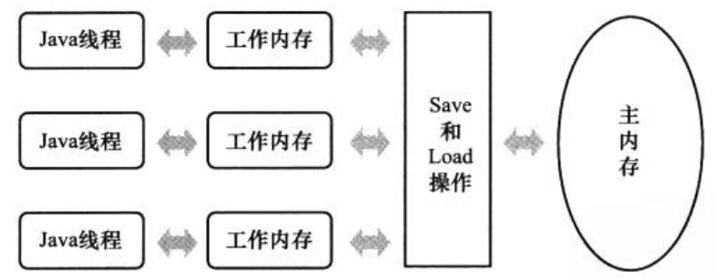
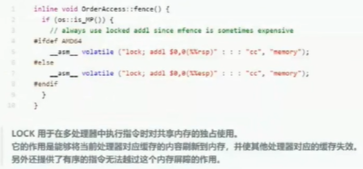
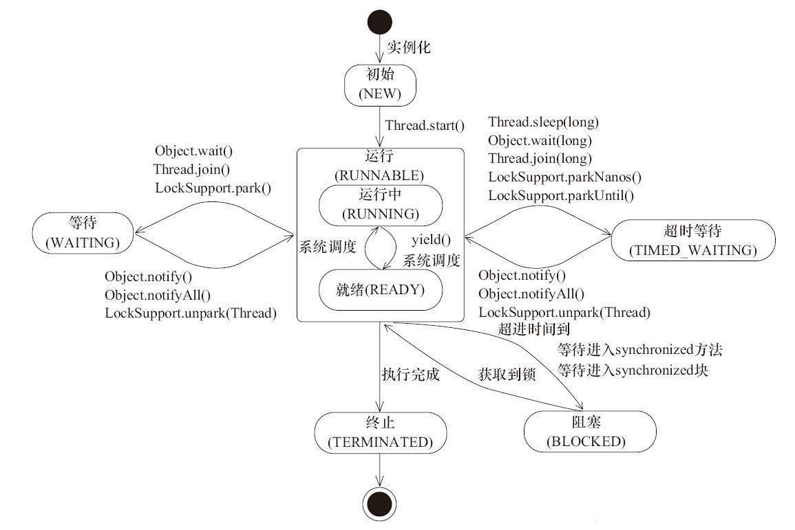
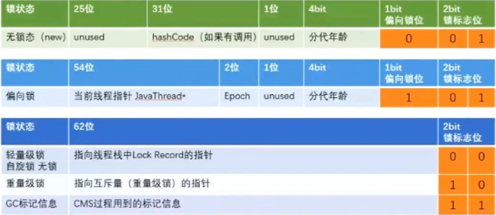
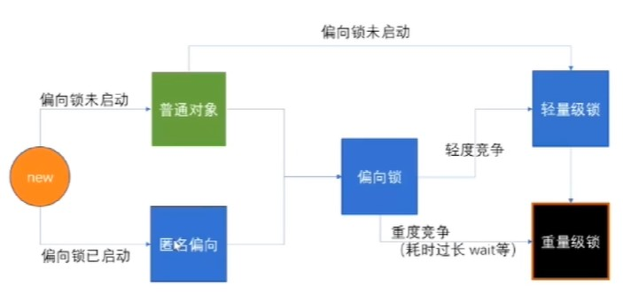

# 多线程

---

### 1. Java内存模型(JMM)

Java内存模型主要目标定义程序各个变量的访问规则，即在虚拟机中将变量存储到内存和从内存中取出变量这样的底层细节。此处变量指定的时线程共享的变量。

##### 1.1 主内存与工作内存

所有变量存储在主内存（类比物理内存）中，每个线程都有自己的工作内存（类比高速缓存）。工作内存保存了被该线程使用到的变量的主内存副本拷贝，线程对变量的所有操作都在工作线程中进行。线程不能直接读写主内存，线程间也无法访问对方的工作内存，线程间变量值得传递要通过主内存。



##### 1.2 内存间交互操作

Java内存模型中定义了以下8种操作来完成。Java虚拟机实现时必须保证每一种操作都是原子的、不可再分的（对于double和long类型的变量来说，load、store、read和write操作在某些平台上允许有例外）

* lock(锁定)：主内存变量标识为线程独占的状态。

* unlock(解锁)：主内存变量解锁，可以被其他线程锁定。

* read(读取)：主内存变量读取到工作内存中。

* load(载入)：把read到的变量值放到工作内存的副本中。

* use(使用)：将工作内存中变量传递给执行引擎使用。

* assign(赋值)：从执行引擎接收到的值赋给工作内存的变量。

* store(存储)：将工作内存的值传递给主内存。

* write(写入)：将store的值存入主内存变量中。

> 对于64位的数据类型(long和double)，在模型中特别定义了一条宽松的规定：允许虚拟机将没有被volatile修饰的64位数据的读写操作划分为两次32位的操作来进行， 即允许虚拟机实现自行选择是否要保证64位数据类型的load、store、read和write这四个操作的原子性，这就是所谓的"long和double的非原子性协定"(Non-Atomic Treatment of double and long Variables) 。

##### 1.3 对于volatile型变量的特殊规则

* 可见性：
  
  * 当一条线程修改了这个变量的值， 新值对于其他线程来说是可以立即得知的。
  
  * 由于volatile变量只能保证可见性，在不符合以下两条规则的运算场景中，我们仍然要通过加锁（使用synchronized、java.util.concurrent中的锁或原子类）来保证原子性：
    
    1. 运算结果并不依赖变量的当前值，或者能够确保只有单一的线程修改变量的值。  
    
    2. 变量不需要与其他的状态变量共同参与不变约束。
  
  * 底层通过CPU缓存一致性协议(MESI)实现。

* 禁止指令重排序：
  
  * 指令重排序：
    
    * 为了使处理器内部的运算单元能尽量被充分利用，处理器可能会对输入代码进行指令重排，重排后的代码与原指令的顺序未必一致。
    
    * as-if-serial语义：不管怎么重排序，保证串行语义的一致性。编译器、runtime和处理器都必须遵守as-if-serial语义。
    
    * happens-before原则：JVM规定重排序必须遵守的规则，针对于多线程，保证指令重排不会破坏原有的语义结构。
  
  * 禁止指令重排序：
    
    * 内存屏障是特殊指令：看到这种指令，前面的必须执行完，后面才能执行。
    
    * cpu级别的屏障源语，如intel：lfence，sfence，mfence(CPU特有指令)。
    
    * jvm中的内存屏障：逻辑屏障，所有jvm虚拟机必须实现4个屏障：LoadLoadBarrier、LoadStoreBarrier、StoreLoadBarrier、StoreStoreBarrier。
    
    * jvm层面实现细节：在对volitile修饰的变量进行写操作前，设置StoreStoreBarrier保证前面的写完再写它；在对volitile修饰的变量进行写操作后，设置StoreLoadBarrier保证后面的必须等它写完才能读它。在对volitile修饰的变量进行读作后，设置LoadLoadBarrier，LoadStoreBarrier保证变量读完，别人才能写和读。
    
    * hotSpot实现方式：锁主内存。
      
      

##### 1.4 原子性、 可见性与有序性

* 原子性（Atomicity）:
  
  如果需要一系列操作的原子性保证，Java内存模型还提供了lock和unlock操作来满足这种需求，尽管虚拟机未把lock和unlock操作直接开放给用户使用，但是却提供了更高层次的字节码指令monitorenter和monitorexit来隐式地使用这两个操作。这两个字节码指令反映到Java代码中就是同步块—synchronized关键字，因此在synchronized块之间的操作也具备原子性。

* 可见性（Visibility）：
  
  可见性就是指当一个线程修改了共享变量的值时，其他线程能够立即得知这个修改。volatile的特殊规则保证了新值能立即同步到主内存，以及每次使用前立即从主内存刷新。从而保证了可见性。synchronized和final可能保证可见性。synchronized同步块在unlock之前必须先把此变量同步回主内存中从而保证了可见性，而final关键字的可见性是指：被final修饰的字段在构造器中一旦被初始化完成，并且构造器没有把"this"的引用传递出去，那么在其他线程中就能看见final字段的值。

* 有序性（Ordering）
  
  Java语言提供了volatile和synchronized两个关键字来保证线程之间操作的有序性， volatile关键字本身就包含了禁止指令重排序的语义，而synchronized则是由"一个变量在同一个时刻只允许一条线程对其进行lock操作"这条规则获得的，这个规则决定了持有同一个锁的两个同步块只能串行地进入。

---

### 2. 线程的创建与实现

##### 2.1 线程方法创建

1. 实现Runnable接口，重写run()方法。

2. 继承Thread类，重写run()方法。

3. 实现Callable接口，重写call()方法。

##### 2.2 线程启动运行

归根到底都是通过调用Thread类start()方法，线程在调用Thread的run()方法实现。其他都是封装结果。  

1. new Thread(new Runnable(){...}).start();   

2. new Thread(){...}.start();  

3. new Thread(new FutureTask(new Callable(){...})，FutureTask实现RunnableFuture接口，RunnableFuture接口继承Runnable和Future接口，在FutureTask实现的run方法中，调用Callable方法call方法从而实现多线程。

##### 2.3 线程池ThreadPoolExecutor

1. 工作原理：
   
   1. 线程池首先当前运行的线程数量是否少于corePoolSize。如果是，则创建一个新的工作线程来执行任务。如果都在执行任务，则进入2。
   
   2. 判断BlockingQueue是否已经满了，倘若还没有满，则将线程放入BlockingQueue。否则进入3。
   
   3. 如果创建一个新的工作线程将使当前运行的线程数量超过maximumPoolSize，则交给RejectedExecutionHandler来处理任务。

2. 构造参数
   
   **corePoolSize**：核心线程数
   
   **maximumPoolSize**：指定了线程池中的最大线程数量
   
   **keepAliveTime**：当线程池中空闲线程数量超过corePoolSize时，多余的线程会在多长             时间内被销毁 
   
   **unit**：keepAliveTime的单位
   
   **workQueue**：用来保存等待被执行的任务的阻塞队列
   
   * SynchronousQueue：提交的任务不会被缓存，当执行任务的线程数量小于maximumPoolSize，则尝试创建新的进程，如果达到maximumPoolSize设置的最大值，则根据你设置的handler执行拒绝策略。
   
   * ArrayBlockingQueue：有界的任务队列，若有新的任务需要执行时，线程池会创建新的线程，直到创建的线程数量达到corePoolSize时，则会将新的任务加入到等待队列中。若等待队列已满，即超过ArrayBlockingQueue初始化的容量，则继续创建线程，直到线程数量达到maximumPoolSize设置的最大线程数量，若大于maximumPoolSize，则执行拒绝策略。
   
   * LinkedBlockingQueue：无界的任务队列，线程池的任务队列可以无限制的添加新的任务，而线程池创建的最大线程数量就是你corePoolSize设置的数量，也就是说在这种情况下maximumPoolSize这个参数是无效的，哪怕你的任务队列中缓存了很多未执行的任务，当线程池的线程数达到corePoolSize后，就不会再增了。
   
   * PriorityBlockingQueue是一个特殊的无界队列。
   
   **threadFactory**：线程工厂，用于创建线程，一般用默认即可。
   
   **handler**：拒绝策略，当任务太多来不及处理时，如何拒绝任务。
   
   * AbortPolicy策略：该策略会直接抛出异常，阻止系统正常工作; 
   
   * CallerRunsPolicy策略：如果线程池的线程数量达到上限，该策略会把任务队列中的任务放在调用者线程当中运行;  
   
   * DiscardOledestPolicy策略：该策略会丢弃任务队列中最老的一个任务，也就是当前任务队列中最先被添加进去的，马上要被执行的那个任务，并尝试再次提交;
   
   * DiscardPolicy策略：该策略会默默丢弃无法处理的任务，不予任何处理。当然使用此策略，业务场景中需允许任务的丢失。

3. Executors创建的线程池
   
   * newFixedThreadPool：
     
     ```java
     public static ExecutorService newFixedThreadPool(int nThreads) {
         return new ThreadPoolExecutor(nThreads, nThreads,
                                     0L, TimeUnit.MILLISECONDS,
                                     new LinkedBlockingQueue<Runnable>());
     }
     ```
     
     特点：一个可重用固定线程数的线程池，以共享的无界队列方式来运行这些线程。
     问题：由于使用了无界队列，堆积的请求队列可能会消耗非常大的内存，导致OOM
   
   * newSingleThreadExecutor：
     
     ```java
     public static ExecutorService newSingleThreadExeutor() {
         return new FinalizableDelegatedExecutorService
             (new ThreadPoolExecutor(1, 1,
                                     0L, TimeUnit.MILLISECONDS,
                                     new LinkedBlockingQueue<Runnable>()));
     }
     ```
     
     特点：创建一个使用单个worker线程的 Executor，以无界队列方式来运行该线程。
     
     问题：由于使用了无界队列，堆积的请求队列可能会消耗非常大的内存，导致OOM
   
   * newCachedThreadPool
     
     ```java
     public static ExecutorService newCachedThreadPool() {
         return new ThreadPoolExecutor(0, Integer.MAX_VALUE,
                                         60L, TimeUnit.SECONDS,
                                         new SynchronousQueue<Runnable>());
     }
     ```
     
     特点：线程池的线程数可达到Integer.MAX_VALUE，内部使用SynchronousQueue作为阻塞队列。
     
     问题：最大线程数是Integer.MAX_VALUE，可能会创建非常多的线程，导致OOM。

##### 2.4 推荐线程池使用方式

1. commons-lang3包
   
   ```java
   ScheduledExecutorService executorService = new ScheduledThreadPoolExecutor(1,
           new BasicThreadFactory.Builder().namingPattern("example-schedule-pool-%d").daemon(true).build());
   ```

2. com.google.guava包
   
   ```java
   ThreadFactory namedThreadFactory = new ThreadFactoryBuilder().setNameFormat("demo-pool-%d").build(;
   //Common Thread Pool
   ExecutorService pool = new ThreadPoolExecutor(5, 200, 0L, TimeUnit.MILLISECONDS, new LinkedBlockingQueue<Runnable>(1024), namedThreadFactory, new ThreadPoolExecutor.AbortPolicy());
   // excute
   pool.execute(()-> System.out.println(Thread.currentThread().getName()));
    //gracefully shutdown
   pool.shutdown();
   ```

3. spring配置线程池方式：自定义线程工厂bean需要实现ThreadFactory，可参考该接口的其它默认实现类，使用方式直接注入bean调用execute(Runnable task)方法即可
   
   ```java
   <bean id="userThreadPool" class="org.springframework.scheduling.concurrent.ThreadPoolaskExecutor">
       <property name="corePoolSize" value="10" />
       <property name="maxPoolSize" value="100" />
       <property name="queueCapacity" value="2000" />
       <property name="threadFactory" value= threadFactory />
       <property name="rejectedExecutionHandler">
           <ref local="rejectedExecutionHandler" />
       </property>
   </bean>
   //in code
   userThreadPool.execute(thread);
   ```

---

### 3. 线程调度和状态转换

##### 3.1 线程调度

线程调度是指系统为线程分配处理器使用权的过程，调度主要方式有两种，分别是协同式(Cooperative Threads-Scheduling)线程调度和抢占式(Preemptive Threads-Scheduling)线程调度。

* 协同式调度：
  
  线程的执行时间由线程本身来控制，线程把自己的工作执行完了之后，要主动通知系统切换到另外一个线程上去。
  
  优点：实现简单，而且由于线程要把自己的事情干完后才会进行线程切换，切换操作对线程自己是可知的，所以一般没有什么线程同步的问题。
  
  缺点：线程执行时间不可控制，甚至如果一个线程的代码编写有问题，一直不告知系统进行线程切换，那么程序就会一直阻塞在那里。

* 抢占式调度：
  
  每个线程将由系统来分配执行时间，线程的切换不由线程本身来决定。
  
  优点：线程的执行时间是系统可控的，也不会有一个线程导致整个进程甚至整个系统阻塞的问题。

##### 3.2 状态转换



Java语言定义了6种线程状态，在任意一个时间点中，一个线程只能有且只有其中的一种状态，并且可以通过特定的方法在不同状态之间转换。这6种状态分别是：

* 新建(New)：建立一个新的线程对象。

* 运行(Runnable)：包括操作系统线程状态中的Running和Ready，也就是处于此状态的线程有可能正在执行，也有可能正在等待着操作系统为它分配执行时间。

* 无限期等待(Waiting)：处于这种状态的线程不会被分配处理器执行时间，它们要等待被其他线程显式唤醒。以下方法会让线程陷入无限期的等待状态：
  
  * 没有设置Timeout参数的Object::wait()方法；
  
  * 没有设置Timeout参数的Thread::join()方法；
  
  * LockSupport::park()方法。

* 限期等待(Timed Waiting)：处于这种状态的线程也不会被分配处理器执行时间，不过无须等待被其他线程显式唤醒，在一定时间之后它们会由系统自动唤醒。以下方法会让线程进入限期等待状态：
  
  * Thread::sleep()方法；
  
  * 设置了Timeout参数的Object::wait()方法；
  
  * 设置了Timeout参数的Thread::join()方法；
  
  * LockSupport::parkNanos()方法；
  
  * LockSupport::parkUntil()方法。

* 阻塞(Blocked)：线程被阻塞了，"阻塞状态"与"等待状态"的区别是"阻塞状态"在等待着获取到一个排它锁，在程序等待进入同步区域的时候，线程将进入这种状态。

* 结束(Terminated)： 已终止线程的线程状态，线程已经结束执行。

##### 3.3 线程之间的协作

* join()
  
  在线程中调用另一个线程的 join() 方法，会将当前线程挂起，而不是忙等待，直到目标线程结束。

* wait() notify() notifyAll()
  
  调用 wait() 使得线程等待某个条件满足，线程在等待时会被挂起，当其他线程的运行使得这个条件满足时，其它线程会调用 notify() 或者 notifyAll() 来唤醒挂起的线程。只能用在同步方法或者同步控制块中使用，使用 wait() 挂起期间，线程会释放锁。

* await() signal() signalAll()
  
  java.util.concurrent 类库中提供了 Condition 类来实现线程之间的协调，可以在 Condition 上调用 await() 方法使线程等待，其它线程调用 signal() 或 signalAll() 方法唤醒等待的线程。

---

### 4. 线程安全与锁

##### 4.1 线程安全

1. 线程安全
   
   1. 不可变对象：
      
      不可变(Immutable)的对象一定是线程安全的，多线程环境下，应当尽量使对象成为不可变，来满足线程安全。
      
      不可变的类型：
      
      - final 关键字修饰的基本数据类型
      
      - String
      
      - 枚举类型
      
      - Number 部分子类，如 Long 和 Double 等数值包装类型，BigInteger 和 BigDecimal 等大数据类型。但同为 Number 的原子类 AtomicInteger 和 AtomicLong 则是可变的
      
      - 使用 Collections.unmodifiableXXX() 方法来获取一个不可变的集合
   
   2. 绝对线程安全：
      
      不管运行时环境如何，调用者都不需要任何额外的同步措施。
   
   3. 相对线程安全：
      
      相对线程安全需要保证对这个对象单独的操作是线程安全的，在调用的时候不需要做额外的保障措施。但是对于一些特定顺序的连续调用，就可能需要在调用端使用额外的同步手段来保证调用的正确性。
      
      在 Java 语言中，大部分的线程安全类都属于这种类型，例如 Vector、HashTable、Collections 的 synchronizedCollection() 方法包装的集合等。
   
   4. 线程兼容：
      
      线程兼容是指对象本身并不是线程安全的，但是可以通过在调用端正确地使用同步手段来保证对象在并发环境中可以安全地使用，我们平常说一个类不是线程安全的，绝大多数时候指的是这一种情况。Java API 中大部分的类都是属于线程兼容的，如与前面的 Vector 和 HashTable 相对应的集合类 ArrayList 和 HashMap 等。
   
   5. 线程对立
      
      线程对立是指无论调用端是否采取了同步措施，都无法在多线程环境中并发使用的代码。由于 Java 语言天生就具备多线程特性，线程对立这种排斥多线程的代码是很少出现的，而且通常都是有害的，应当尽量避免。

2. 线程安全的实现方法
   
   1. 互斥同步
      
      互斥同步中同步是指在多个线程并发访问共享数据时，保证共享数据在同一个时刻只被一条线程使用。而互斥是实现同步的一种手段，临界区、互斥量和信号量都是常见的互斥实现方式。因此在"互斥同步"这四个字里面，互斥是因，同步是果；互斥是方法，同步是目的。
      
      互斥同步手段：synchronized 和 ReentrantLock
      
      主要问题是进行线程阻塞和唤醒所带来的性能开销，因此这种同步也被称为阻塞同步（Blocking Synchronization）。
      
      互斥同步属于一种悲观的并发策略，总是认为只要不去做正确的同步措施，那就肯定会出现问题。无论共享数据是否真的会出现竞争，它都要进行加锁(这里讨论的是概念模型，实际上虚拟机会优化掉很大一部分不必要的加锁)、用户态核心态转换、维护锁计数器和检查是否有被阻塞的线程需要唤醒等操作。
   
   2. 非阻塞同步
      
      基于冲突检测的乐观并发策略，通俗地说就是不管风险，先进行操作，如果没有其他线程争用共享数据，那操作就直接成功了；如果共享的数据的确被争用，产生了冲突，那再进行其他的补偿措施，最常用的补偿措施是不断地重试，直到出现没有竞争的共享数据为止。这种乐观并发策略的实现不再需要把线程阻塞挂起，因此这种同步操作被称为非阻塞同步（Non-Blocking Synchronization），使用这种措施的代码也常被称为无锁（Lock-Free）编程。
      
      非阻塞同步手段：CAS
   
   3. 无同步方案
      
      要保证线程安全，并不是一定就要进行同步。如果一个方法本来就不涉及共享数据，那它自然就无须任何同步措施去保证正确性。
      
      * 栈封闭：多个线程访问同一个方法的局部变量时，不会出现线程安全问题，因为局部变量存储在虚拟机栈中，属于线程私有的。
      
      * 线程本地存储(Thread Local Storage)：把共享数据的可见范围限制在同一个线程之内，这样，无须同步也能保证线程之间不出现数据争用的问题。可以使用 java.lang.ThreadLocal 类来实现线程本地存储功能。
      
      * 可重入代码(Reentrant Code)：这种代码也叫做纯代码(Pure Code)，可以在代码执行的任何时刻中断它，转而去执行另外一段代码(包括递归调用它本身)，而在控制权返回后，原来的程序不会出现任何错误。
        
        可重入代码有一些共同的特征，例如不依赖存储在堆上的数据和公用的系统资源、用到的状态量都由参数中传入、不调用非可重入的方法等。

##### 4.2 锁

###### 4.2.1 锁的概念

* 乐观锁 VS 悲观锁：
  
  悲观锁：对于同一个数据的并发操作，悲观锁认为自己在使用数据的时候一定有别的线程来修改数据，因此在获取数据的时候会先加锁，确保数据不会被别的线程修改。Java中，synchronized关键字和Lock的实现类都是悲观锁。
  
  乐观锁：乐观锁认为自己在使用数据时不会有别的线程修改数据，所以不会添加锁，只是在更新数据的时候去判断之前有没有别的线程更新了这个数据。如果这个数据没有被更新，当前线程将自己修改的数据成功写入。如果数据已经被其他线程更新，则根据不同的实现方式执行不同的操作（例如报错或者自动重试）。

* 公平锁 VS 非公平锁：
  
  公平锁：公平锁是指多个线程按照申请锁的顺序来获取锁，线程直接进入队列中排队，队列中的第一个线程才能获得锁。公平锁的优点是等待锁的线程不会饿死。缺点是整体吞吐效率相对非公平锁要低，等待队列中除第一个线程以外的所有线程都会阻塞，CPU唤醒阻塞线程的开销比非公平锁大。
  
  非公平锁：非公平锁是多个线程加锁时直接尝试获取锁，获取不到才会到等待队列的队尾等待。但如果此时锁刚好可用，那么这个线程可以无需阻塞直接获取到锁，所以非公平锁有可能出现后申请锁的线程先获取锁的场景。非公平锁的优点是可以减少唤起线程的开销，整体的吞吐效率高，因为线程有几率不阻塞直接获得锁，CPU不必唤醒所有线程。缺点是处于等待队列中的线程可能会饿死，或者等很久才会获得锁。

* 可重入锁 VS 非可重入锁
  
  可重入锁：又名递归锁，是指在同一个线程在外层方法获取锁的时候，再进入该线程的内层方法会自动获取锁（前提锁对象得是同一个对象或者class），不会因为之前已经获取过还没释放而阻塞。Java中ReentrantLock和synchronized都是可重入锁，可重入锁的一个优点是可一定程度避免死锁。
  
  非可重入锁：当前线程只能获取一次锁，不可能再次获取。当前线程出现死锁，整个等待队列中的所有线程都无法被唤醒。

* 独享锁(排他锁) VS 共享锁
  
  独享锁(X锁)：也叫排他锁，是指该锁一次只能被一个线程所持有。如果线程T对数据A加上排它锁后，则其他线程不能再对A加任何类型的锁。获得排它锁的线程即能读数据又能修改数据。JDK中的synchronized和JUC中Lock的实现类就是互斥锁。
  
  共享锁(S锁)：是指该锁可被多个线程所持有。如果线程T对数据A加上共享锁后，则其他线程只能对A再加共享锁，不能加排它锁。获得共享锁的线程只能读数据，不能修改数据。

###### 4.2.2 锁优化

在jdk1.6中对锁的实现引入了大量的优化

* 锁消除
  
  通过运行时JIT编译器的逃逸分析来消除一些没有在当前同步块以外被其他线程共享的数据的锁保护，通过逃逸分析也可以在线程本的Stack上进行对象空间的分配(同时还可以减少Heap上的垃圾收集开销)。

* 锁粗化
  
  也就是减少不必要的紧连在一起的unlock，lock操作，将多个连续的锁扩展成一个范围更大的锁。

* 自旋锁与自适应自旋
  
  互斥同步对性能最大的影响是阻塞的实现，挂起线程和恢复线程的操作都需要转入内核态中完成，这些操作给Java虚拟机的并发性能带来了很大的压力。在很多情况下，共享数据的锁定状态只会持续很短的一段时间，为了这段时间去挂起和回复阻塞线程并不值得。在如今多处理器环境下，完全可以让另一个没有获取到锁的线程在门外等待一会(自旋)，但不放弃CPU的执行时间。等待持有锁的线程是否很快就会释放锁。为了让线程等待，我们只需要让线程执行一个忙循环(自旋)，这项技术就是所谓的自旋锁。
  
  自旋锁在JDK 1.4.2中就已经引入，只不过默认是关闭的，可以使用-XX： +UseSpinning参数来开启，在JDK 6中就已经改为默认开启了。自旋锁本质上与阻塞并不相同，先不考虑其对多处理器的要求，如果锁占用的时间非常的短，那么自旋锁的性能会非常的好，相反，其会带来更多的性能开销(因为在线程自旋时，始终会占用CPU的时间片，如果锁占用的时间太长，那么自旋的线程会白白消耗掉CPU资源)。因此自旋等待的时间必须要有一定的限度，如果自旋超过了限定的次数仍然没有成功获取到锁，就应该使用传统的方式去挂起线程了，在JDK定义中，自旋锁默认的自旋次数为10次，用户可以使用参数`-XX:PreBlockSpin`来更改。
  
  在JDK 6中对自旋锁的优化，引入了自适应的自旋。自适应意味着自旋的时间不再是固定的了， 而是由前一次在同一个锁上的自旋时间及锁的拥有者的状态来决定的。有了自适应自旋，随着程序运行时间的增长及性能监控信息的不断完善， 虚拟机对程序锁的状况预测就会越来越精准，虚拟机就会变得越来越“聪明”了。

###### 4.2.3 synchronized

原理：字节码层面`monitorenter`和`monitorexit`命令。

锁升级：无锁 → 偏向锁 → 轻量级锁 → 重量级锁 (此过程是不可逆的)



1. 无锁：未对对象进行锁定。

2. 偏向锁：
   
   偏向锁是JDK 6中引入的，启用参数-XX:+UseBiasedLocking，偏向锁是默认开启的，而且开始时间一般是比应用程序启动慢几秒，如果不想有这个延迟，那么可以使用-XX:BiasedLockingStartUpDelay=0。如果不想要偏向锁，那么可以通过-XX:-UseBiasedLocking = false来设置。

3. 轻量级锁：
   
   轻量级锁是JDK 6时加入的新型锁机制，它名字中的"轻量级"是相对于使用操作系统互斥量来实现的传统锁而言的。建立轻量级锁的时候，虚拟机首先将在当前线程的栈帧中建立一个名为锁记录(Lock Record)的空间，用于存储锁对象目前的Mark Word的拷贝，然后，虚拟机将使用CAS操作尝试把对象的Mark Word更新为指向Lock Record的指针。如果这个更新动作成功了，即代表该线程拥有了这个对象的锁，并且对象Mark Word的锁标志位将转变为"00"，表示此对象处于轻量级锁定状态。

4. 重量级锁：
   
   向操作系统申请资源，linux mutex，CPU从3级-0级系统调用，线程挂起，进入等待队列，等待操作系统调度，然后再映射回用户空间。对于重量级锁，监视器锁直接对应底层操作系统中的互斥量(mutex)。



锁升级过程：

当创建对象时，如果开启偏向锁，则对象Mark Word的锁标志位标记为"101"，如果未开启则标记为"001"，当线程1访问代码块并获取锁对象时，会在java对象头和栈帧中记录偏向的锁的threadID，因为偏向锁不会主动释放锁，因此以后线程1再次获取锁的时候，需要比较当前线程的threadID和Java对象头中的threadID是否一致，如果一致（还是线程1获取锁对象），则无需使用CAS来加锁、解锁；如果不一致（其他线程，如线程2要竞争锁对象，而偏向锁不会主动释放因此还是存储的线程1的threadID），那么需要查看Java对象头中记录的线程1是否存活，如果没有存活，那么锁对象被重置为无锁状态，其它线程（线程2）可以竞争将其设置为偏向锁；如果存活，那么立刻查找该线程（线程1）的栈帧信息，如果还是需要继续持有这个锁对象，那么暂停当前线程1，撤销偏向锁，升级为轻量级锁，如果线程1 不再使用该锁对象，那么将锁对象状态设为无锁状态，重新偏向新的线程。锁为轻量级锁时，有线程超过10次自旋-XX:PreBlockSpin，或者自旋线程超过CPU的一半，1.6之后，加入自适应自旋 Adapative Self Spinning，JVM自己控制。 升级重量级锁。

---

### 5. JUC


##### 5.1 CAS, Unsafe, LockSupport和原子类详解

1. CAS：
   
   CAS的全称为Compare-And-Swap。是一条CPU的原子指令，其作用是让CPU先进行比较两个值是否相等，然后原子地更新某个位置的值。CAS操作是原子性的。
   
   CAS问题：
   
   * ABA问题，解决思路就是使用版本号。Java 1.5开始，JDK的Atomic包里提供了一个类AtomicStampedReference来解决ABA问题。
   
   * 循环时间开销大，自旋CAS如果长时间不成功，会给CPU带来非常大的执行开销。
   
   * 只能保证一个共享变量的原子操作，有一个取巧的办法，就是把多个共享变量合并成一个共享变量来操作。比如，有两个共享变量i = 2，j = a，合并一下ij = 2a，然后用CAS来操作ij。从Java 1.5开始，JDK提供了AtomicReference类来保证引用对象之间的原子性，就可以把多个变量放在一个对象里来进行CAS操作。

2. UnSafe类：
   
   Unsafe是位于sun.misc包下的一个类，主要提供一些用于执行低级别、不安全操作的方法，如直接访问系统内存资源、自主管理内存资源等，这些方法在提升Java运行效率、增强Java语言底层资源操作能力方面起到了很大的作用。
   
   Unsafe的compareAndSwap*方法来实现CAS操作，它是一个本地方法，实现位于unsafe.cpp中，通过`Atomic::cmpxchg` 来实现比较和替换操作。

3. 原子类：

4. LockSupport：
   
   先调用unpark，再调用park时，仍能够正确实现同步，不会造成由wait/notify调用顺序不当所引起的阻塞。

##### 5.2 AQS详解

AQS是一个用来构建锁和同步器的框架，使用AQS能简单且高效地构造出应用广泛的大量的同步器。


AbstractQueuedSynchronizer类底层的数据结构是使用`CLH(Craig,Landin,and Hagersten)队列`是一个虚拟的双向队列(虚拟的双向队列即不存在队列实例，仅存在结点之间的关联关系)。AQS是将每条请求共享资源的线程封装成一个CLH锁队列的一个结点(Node)来实现锁的分配。其中Sync Queue，即同步队列，是双向链表，包括head结点和tail结点，head结点是一个空节点，里面不包含线程，主要用作后续的调度。而Condition Queue不是必须的，其是一个单向链表，只有当使用Condition时，才会存在此单向链表。并且可能会有多个Condition Queue。

##### 5.3 ReentrantLock详解

##### 5.4 ReentrantReadWriteLock详解

读写锁ReentrantReadWriteLock，它表示两个锁，一个是读操作相关的锁，称为共享锁；一个是写相关的锁，称为排他锁。同步状态state高16位表示读，低16位表示写。

当没有其他线程获取写锁时，当前线程可以获取读锁。**当前线程获取写锁时，当前线程可以获取读锁。**

当没有其他线程获取读锁和写锁时，当前可以获取写锁。**当前线程获取读锁时，当前线程获取不了写锁。**

特点：

1. 公平选择性：支持非公平（默认）和公平的锁获取方式，吞吐量还是非公平优于公平。

2. 重进入：读锁和写锁都支持线程重进入。

3. 锁降级：遵循获取写锁、获取读锁再释放写锁的次序，写锁能够降级成为读锁。

##### 5.5 ConcurrentHashMap详解

* JDK1.5-JDK1.7使用分段锁机制实现
  
  
  
  整个 ConcurrentHashMap 由一个个 Segment 组成，Segment 通过继承 ReentrantLock 来进行加锁，所以每次需要加锁的操作锁住的是一个 segment。Segment 内部是由 `数组（HashEntry）+链表` 组成的。
  
  初始化：
  
  * initialCapacity：初始容量，这个值指的是整个 ConcurrentHashMap中所有Segment中数组的初始容量，实际操作的时候需要平均分给每个 Segment。
  
  * loadFactor：负载因子，之前我们说了，Segment 数组不可以扩容，所以这个负载因子是给每个 Segment 内部使用的。
  
  * concurrencyLevel：Segment数量，默认为16，所以默认支持16个线程并发，segment数量一旦初始化以后，它是不可扩容的。如果设定concurrencyLevel值，Segment数量大于设定值的最小的2的次方数。

* JDK1.8使用Node数组+链表+红黑树数据结构和CAS原子操作实现
  
  
  
  ConcurrentHashMap选择了数组+链表+红黑树的方式实现，而加锁则采用CAS和synchronized实现。当值插入数组时通过CAS插入，当插入链表或者红黑树时通过synchronized插入。
  
  当一个链表中的元素达到8个时，会调用treeifyBin()方法把链表结构转化成红黑树结构。并非一开始就创建红黑树结构，如果当前Node数组长度小于阈值MIN_TREEIFY_CAPACITY，默认为64，先通过扩大数组容量为原来的两倍以缓解单个链表元素过大的性能问题。红黑树时间复杂度O(logN)。

##### 5.6 CopyOnWriteArrayList详解

ArrayList的一个线程安全的变体，其中所有可变操作（add、set 等等）都是通过对底层数组进行一次新的复制来实现的。

##### 5.7 ScheduledThreadPoolExecutor详解

##### 5.8 Fork/Join框架详解

ForkJoinPool 是JDK 7加入的一个线程池类。Fork/Join 技术是分治算法(Divide-and-Conquer)的并行实现，目的是为了帮助我们更好地利用多处理器带来的好处，使用所有可用的运算能力来提升应用的性能。

##### 5.9 CountDownLatch，CyclicBarrier和Semaphore详解

* CountDownLatch底层也是由AQS，用来同步一个或多个任务的常用并发工具类，强制它们等待由其他任务执行的一组操作完成。通过内部类Sync继承AQS从而使用共享锁来实现。

* CyclicBarrier用来协调多个子线程阻塞在同一个同步点，通过内部属性ReetrantLock和Condition来实现。CyclicBarrier构造函数可以指定在所有线程都进入屏障后的执行动作barrierAction，该执行动作由最后一个进行屏障的线程执行。
  
  ```
  CyclicBarrier(int parties, Runnable barrierAction)
  ```
  
  执行过程：线程1调用await方法，count减一，如果不是最后一个到达的线程则调用condition.await方法进入阻塞状态；如果是最后一个达到的线程则执行barrierAction方法并调用condition.signalAll方法唤醒所有线程。

* Semaphore底层是基于通过内部类Sync继承AQS来实现。Semaphore称为计数信号量，它允许n个任务同时访问某个资源，可以将信号量看做是在向外分发使用资源的许可证，只有成功获取许可证，才能使用资源。类似于共享锁。非重入锁。

##### 5.10 ThreadLocal详解

* ThreadLocal造成内存泄露的问题：
  
  如果用线程池来操作ThreadLocal 对象确实会造成内存泄露, 因为对于线程池里面不会销毁的线程, 里面总会存在着`<ThreadLocal, LocalVariable>`的强引用, 因为final static 修饰的 ThreadLocal 并不会释放, 而ThreadLocalMap 对于 Key 虽然是弱引用, 但是强引用不会释放, 弱引用当然也会一直有值, 同时创建的LocalVariable对象也不会释放, 就造成了内存泄露。为了避免出现内存泄露的情况, ThreadLocal提供了一个清除线程中对象的方法, 即 remove。

* ThreadLocal应用场景：
  
  1. 管理当前线程的session等信息
  
  2. 从数据库连接池中取到连接存放到ThreadLocal对象中，保证当前线程中取到的数据库连接保持一致。
